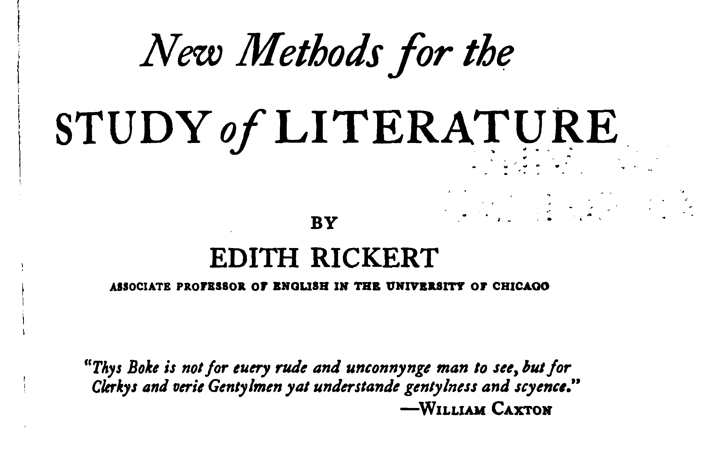

# Welcome to Data & Literary-Study

## Our Agenda

- Introductions
- Syllabus: https://sceckert.github.io/Data-and-Literary-Study-Spring2022/
-  What is the data of literary studies?
	- Rickert
- Next meeting

Note: This will only appear in the speaker notes window.

## Introductions

- What is your name? Year? Major?
- What are your academic interests?
- Where are you from?
- What is your experience in digital humanities?
- What brings you to the class?

## Syllabus

- https://sceckert.github.io/Data-and-Literary-Study-Spring2022/

## What *is* Data in Literary Studies?

## What *is* Data in Literary Studies?

Choose one of the following pieces to read:

- David Alworth, “Notes for ‘What Is Data?,’” https://arcade.stanford.edu/blogs/notes-what-data; 
- Eric Hayot, “Rough Notes for ‘What Is Data?,’” , https://arcade.stanford.edu/blogs/rough-notes-"what-data"
-  Heather Houser, “Description as Data in Literary Studies,”  https://arcade.stanford.edu/blogs/description-data-literary-studies
-  Lauren Klein, “Data: Three Provocations,” , https://arcade.stanford.edu/blogs/data-three-provocations; 
-  Peter Logan, “What Isn’t Data in Literary Studies?,” https://arcade.stanford.edu/blogs/what-isnt-data-literary-studies.

## For next class...

						