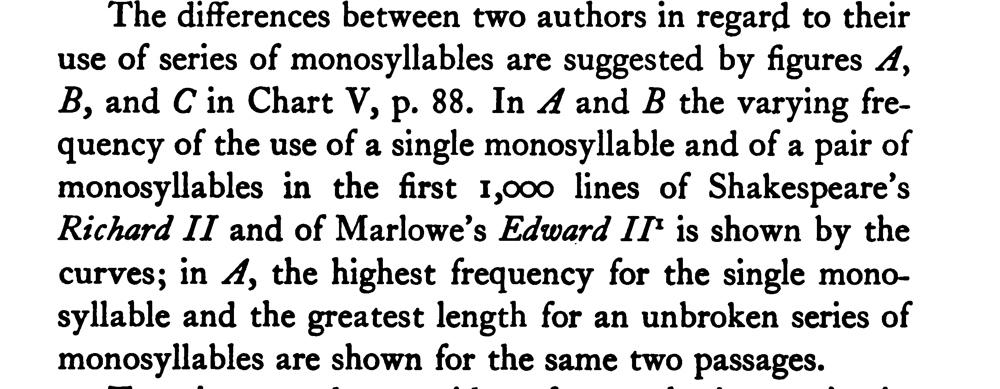

# Welcome to Data & Literary Study

## Our Agenda

- Introductions
- Syllabus: https://sceckert.github.io/Data-and-Literary-Study-Spring2022/
-  What is the data of literary studies?
	- Rickert
- Next meeting

Note: This will only appear in the speaker notes window.

## Introductions

- What is your name? Year? Major?
- Where are you from?
- What are your academic interests?
- What is your experience in digital humanities?
- What brings you to the class?

## Syllabus

- https://sceckert.github.io/Data-and-Literary-Study-Spring2022/

## What *is* Data in Literary Studies?

- data  |  datum  —  to give  |  rhetorical <!-- .element: class="fragment" data-fragment-index="1" -->
-  fact  |  facere  —  to do  |  ontological <!-- .element: class="fragment" data-fragment-index="2" -->
- evidence  |  videre  —  to see  |  epistemological <!-- .element: class="fragment" data-fragment-index="3" -->

> “…the meaning of data must always shift with argumentative strategy and context—and with the history of both.” <!-- .element: class="fragment" data-fragment-index="4" -->

Daniel Rosenberg, “Data Before the Fact,” in “Raw Data” Is an Oxymoron, ed. Lisa Gitelman (MIT Press, 2013) <!-- .element: class="fragment" data-fragment-index="4" -->

## What *is* Data in Literary Studies?

## What does data have to do with the study of literature?

- Rickert's *New Methods for the Study of Literature* (1927) <!-- .element: class="fragment" data-fragment-index="1" -->
- Waberski code  <!-- .element: class="fragment" data-fragment-index="2" -->

## Rickert's Method 

"On the hypothesis, then, that the soul of literature is inseparable from style, which is its body, the general method in this book is to analyze the complex of style into its several strands, which may be called Imagery, Words,  Thought Patterns, Rhythm, Tone Patterns, and—what is  often disregarded—Visual Devices; and for each of these to find graphical and statistical methods by which its varied manifestations in different pieces of writing may be— understood with a definiteness and a certainty impossible through reading alone." (7)

- What stood out to you when you read Rickert's analysis?
- What can we gain from studying a work of literature this way? What do we lose?

## Rickert's method

- 
- 

> The sky was a miracle of purity, a miracle of azure. The sea was polished, was blue, was pellucid, was sparkling like a precious stone, extending on all sides, all round to the horizon—as if the whole terrestrial globe had been one jewel, one colossal sapphire, a single gem fashioned into a planet.
> ––Joseph Conrad, *Youth* (1910)

> Every day and all day the same pale-blue sky and the unwinking sun over the moving speck. Every day and all day the same black-blue water world untouched by any known wind, smooth as a slab of syenite, colourful as an opal, stretched out and around and beyond and before and behind us, forever, illimitable, empty.
>–––Frank Norris, “The Ship That Saw a Ghost,” A Deal in Wheat (1903)

## Let's Count!

Visit the site below and take 5 minutes to complete the exercise:

[https://github.com/sceckert/Data-and-Literary-Study-Spring2022/blob/main/_week1/in-class-practicum.md)

## What *is* Data in Literary Studies?

Choose one of the following pieces to read:

- David Alworth, “Notes for ‘What Is Data?,’” https://arcade.stanford.edu/blogs/notes-what-data; 
- Eric Hayot, “Rough Notes for ‘What Is Data?,’” , https://arcade.stanford.edu/blogs/rough-notes-"what-data"
-  Heather Houser, “Description as Data in Literary Studies,”  https://arcade.stanford.edu/blogs/description-data-literary-studies
-  Lauren Klein, “Data: Three Provocations,” , https://arcade.stanford.edu/blogs/data-three-provocations; 
-  Peter Logan, “What Isn’t Data in Literary Studies?,” https://arcade.stanford.edu/blogs/what-isnt-data-literary-studies.

Note: How does the roundtable piece you read define data? What do we notice?

## For next class...

+ Complete: Introduction to programming (link on syllabus)
+ Read: Woolf, *A Room of One's Own* (1929)
						