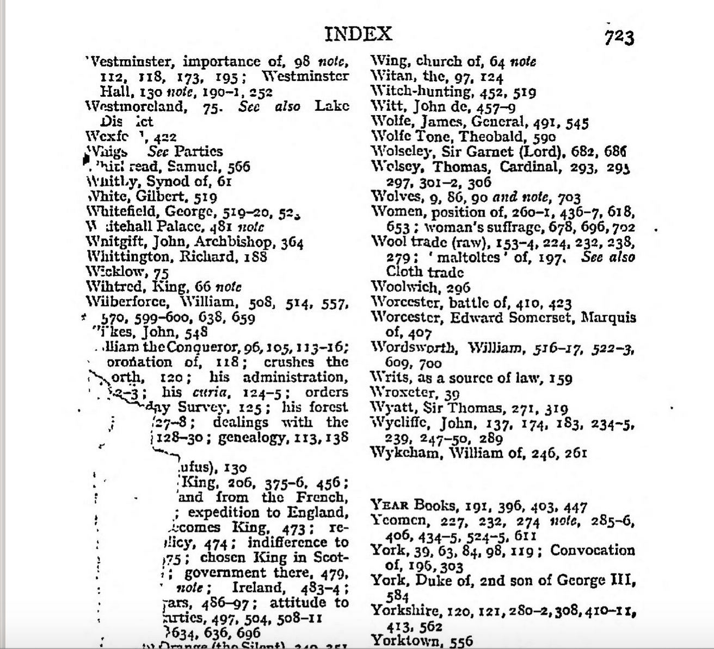
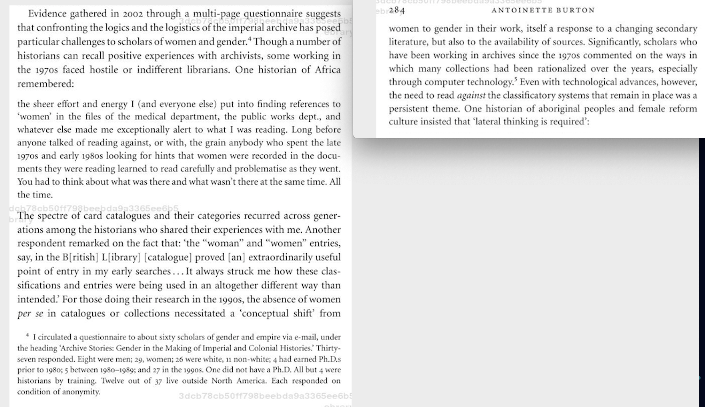
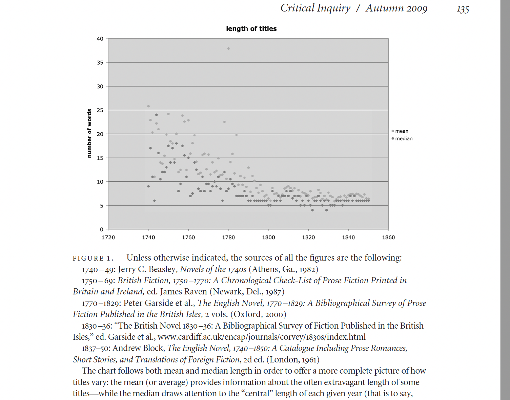
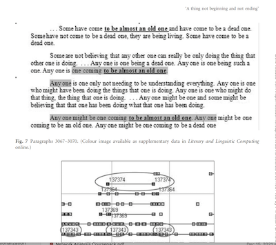
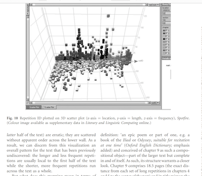

# Histories of Literary Study

## Agenda

+ Discuss Woolf's approach to literary history in *A Room of One's Own*
+ Woolf's reading techniques: indexes, catalogues, speculative fiction
+ What does it mean to read literary history "distantly"?
+ Introduce the command line + exercise in distant reading *A Room of One's Own*

## *A Room of One's Own* 

Note: Introductory remarks about Woolf and AROO. The book was originally given as a set of 2 lectures given on 20 and 26 October 1928 at Girton and Newnham and Girton (two women's colleges created in 1869 and1871 when women couldn't be admitted to Cambridge) and was published in Oct 1929 by the Hogarth Press in England, and by Harcourt Brace & Co. in the United States. In it, Woolf is supposed to be giving a lecture titled "Women and Fiction." Which according to Woolf could mean fiction written by women, fiction written about women, or some mixture of the two.  In this opening she raises some questions that we'll continue to think about over the semester: is a pattern like the absence of women writers related to the is it possible to get at the material conditions of fiction by looking at the words that were written? And what happens when there are no words to look at––when we're dealing with archival gaps and silences? What do we analyze when we are unable to read? 

+ What stood out to you about *A Room of One's Own* as an essay?

"For it is a perennial puzzle why no woman wrote a word of that extraordinary literature when every other man, it seemed, was capable of song or sonnet.
What were the conditions in which women 
lived, I asked myself; for fiction, imaginative work that is, is not 
dropped like a pebble upon the ground, as science may be; fiction is 
like a spider’s web, attached ever so lightly perhaps, but still attached 
to life at all four corners. Often the attachment is scarcely perceptible; 
Shakespeare’s plays, for instance, seem to hang there complete by 
themselves. But when the web is pulled askew, hooked up at the edge, 
torn in the middle, one remembers that these webs are not spun in 
mid-air by incorporeal creatures, but are the work of suffering human 
beings, and are attached to grossly material things, like health and 
money and the houses we live in. "  

 ––Virginia Woolf, *A Room of One's Own*, pg 41-42

Note:
- Read over this passage. What do you notice about the way Woolf talks about fiction?
- What do we think Woolf is getting at in this metaphor? 
- What do we think it means that the web is only visible when pulled askew?
- How would we characterize Woolf's attitude towards those "grossly material things"
- On the next page, she goes on to talk about the distinction between women in fiction and women in reality.

Note:
+ Later, Woolf TURNS TO FICTION and makes up a story about Shakespeare's fictional sister and author named Mary Carmichael. Why is she talking about made up women? 

+ Woolf opens with these meandering stories about two meals that she eats at Oxbridge and Fernham. Why include these details? What's Woolf up to?

+ Woolf says that there were no women Shakespeares (no women writers in the Elizabethan era). But in Chapter 4, she lists several authors. What's up with that?

+ And what about contemporary fiction? Why are there no contemporary authors? 

+ Is Woolf reconstructing a literary history? Or creating a counter-archive? 

+ Woolf talks a lot about anonymity and women's authorship. What kind of issues does the absence of a woman pose for her research? For ours?

Who are Woolf's authors? 
+ Take a minute to write down some of the names that stood out to you. 
+ What did notice about who she included? Didn't include?

On page 50, Woolf makes this really strange comparison between men who write their names on things or mark their ownership. What do we thing's going on here?

> "Anonymity
runs in their blood. The desire to be veiled still possesses them. They
are not even now as concerned about the health of their fame as men are,
and, speaking generally, will pass a tombstone or a signpost without
feeling an irresistible desire to cut their names on it, as Alf, Bert or
Chas. must do in obedience to their instinct, which murmurs if it sees a
fine woman go by, or even a dog, Ce chien est a moi. And, of course, it
may not be a dog, I thought, remembering Parliament Square, the Sieges
Allee and other avenues; it may be a piece of land or a man with curly
black hair. It is one of the great advantages of being a woman that one
can pass even a very fine negress without wishing to make an Englishwoman
of her.""

> 
 ––Virginia Woolf, *A Room of One's Own*, pg 50-51

## How Woolf Reads 

Index to George Trevelyan's<!-- .element: class="fragment" data-fragment-index="1" -->  *History of England,* p. 723 <!-- .element: class="fragment" data-fragment-index="1" --> 

 <!-- .element: class="fragment" data-fragment-index="1" -->

Note:
At the opening of Chapter 2, Woolf's narrator goes to the British Museum picks up a library CATALOG and reads all the titles of "books written about women in the course of one year". After this part of the opening to chapter 3, Woolf spends a long time talking about how she reads catalogs in the British museums or INDEX in Trevelayn's History of England. 

How would we characterize Woolf's reading practice?
What do we make of her research methods?<!-- .element: class="fragment" data-fragment-index="1" --> 

How does Woolf's use of the index compare to the way that Antoinette Burton talks about searching for "Women" in the catalog"?

<!-- .element: class="fragment" data-fragment-index="1" -->  

Note: 
Woolf's reading techniques: indexes, catalogues, speculative fiction

## What is "distant reading?" 

- Open up the link to the collective Google Doc: https://docs.google.com/document/d/1yYDDJ6uLd85I-7XSsnb-1UAwjztqQIwM5zSvLS7wHZc/edit

- "Distant reading", in Franco Moretti's 2009 essay "Style Inc." means analyzing just the titles of 7,000 British novels published between 1750 and 1850. 
- "Distant reading" in Tanya Clements 2008 essay, means analyzing patterns of smaller units of text (short repeated phrases, personal pronouns) that emerge when you visualize their patterns across a single text––Gertrude Stein's *The Making of the Americans* (1925) 

- "distant reading" can be formal (i.e. a close study of the patterns in words that make up a text) or historicist (i.e. a study of the advertising language language used in marketing fiction)

Anything else we want to add?

### Distant reading: many texts 

Franco Moretti, “Style, Inc. Reflections on Seven Thousand Titles (British Novels, 1740-1850,” *Critical Inquiry* 36, no. 1 (2009): 134–58. [https://www.jstor.org/stable/10.1086/606125](https://www.jstor.org/stable/10.1086/606125)

### Distant reading: a single text

Tanya E. Clement, “‘A Thing Not Beginning and Not Ending’: Using Digital Tools to Distant-Read Gertrude Stein’s The Making of Americans,” *Literary and Linguistic Computing* 23, no. 3 (September 1, 2008): 361–81, [https://doi.org/10.1093/llc/fqn020](https://doi.org/10.1093/llc/fqn020)

 

Could we consider reading with an index a kind of distant reading?

## Introduction to Command Line 

In *A Room of One's Own*, one of the big questions has to do with how little the insides of works can tell us about their conditions. For Woolf, Shakespeare or Austen's prose tell us very little about the "grossly material things" in the worlds these authors inhabit. So what *can* we glean from the material conditions of texts, if we're just looking at the insides or titles of works? Can looking at the  in this case, to specific authors tell us anything about Woolf's own historical moment?

To do this, we're going to do a little index-reading of our own. 

Navigate to the page with our introduction to the command line lesson: https://github.com/sceckert/Data-and-Literary-Study-Spring2022/blob/main/_week1/introduction-to-the-command-line.md

Note: 
How did the homework go? How was the pacing?

What other research questions could you see yourself asking with this method. 

Note:
We could explore personal pronouns!
What about all those sources in footnotes -- how might we ask a question about them?

## For next time:

+ Bourdieu and Raymond Williams (please read only the assigned parts of Bourdieu)
