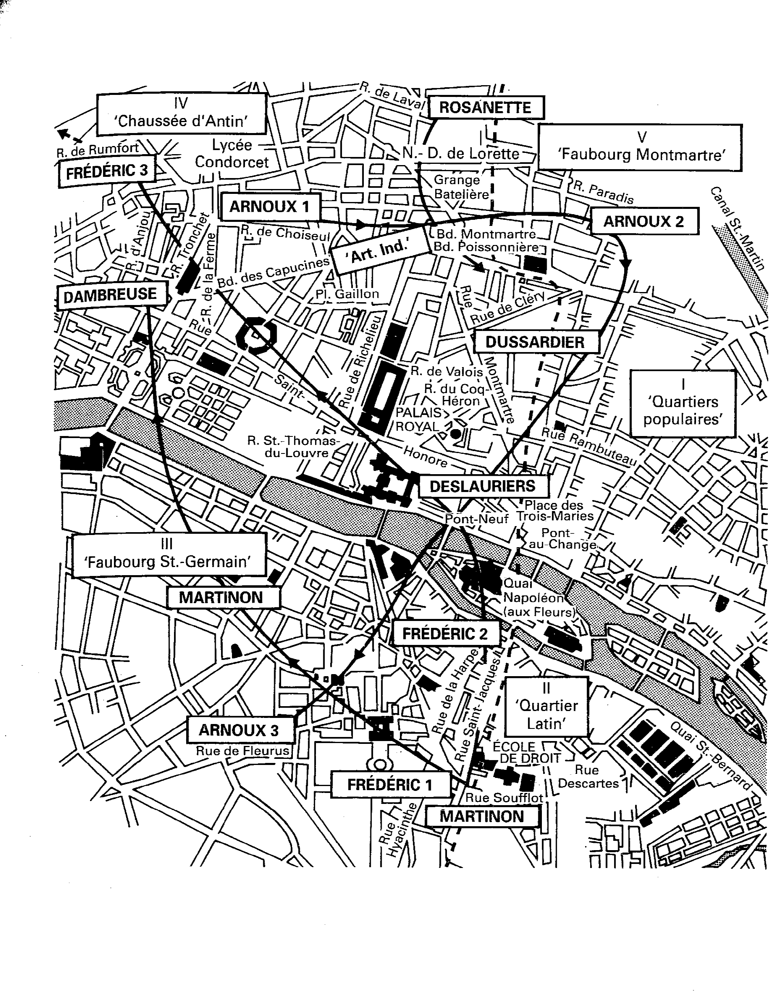

# Sociologies of Forms

## Our Agenda

- Checking in -- how are things going?
- Sociology of literature 
	- Williams
	- Bourdieu
- Case study in sociology of literature: the role of reviewers/literary critics 

Note: For today we read two of the key texts in what is sometimes called the "sociology of literature." Raymond Williams and Pierre Bourdieu. Both Williams and Bourdieu are interested in some of the questions that Virigina Woolf was interested in: how do we study works of arand conditions of literary production. But 

## Raymond Williams, *Marxism and LIterature*

“Literature” 

“Traditions, Institutions, and Formations” 

“Structures of Feeling,” 

“The Sociology of Culture,” 

“Forms”

What does sociology of culture look like for Williams?

Note:
Are there other terms that we want to define? 
Natalia:Williams writes his definition of literature as "the process and the result of formal composition within the social and formal properties of a language", grounding the concept in a material and social context as opposed to more vague and romantic ideas of literature. How does this affect our previous discussions of what data can be in the context of literary studies? In what ways can literary data be affected by/depend on different definitions of literature? 
Rachel: To what extent do the authors agree about the role of criticism in shaping literature (or the field of restricted production in the case of Bourdieu)? How do their discussions of criticism differ? According to the authors, what are the implications of criticism in literary studies more broadly?  

## Pierre Bourdieu, *The Rules of Art*

Note:
Background: Bourdieu's coming from sociology. Before doing this work, he conducted this big survey in the 1970s of the consumption patterns and habits of (mostly French) middle and 

From "The Field of Cultural Production" (1993)
The space of literary or artistic position-takings, i.e. the structured set of the manifestations of the social agents involved in’ the field — literary or artistic works, of course, but also political acts or pronouncements, manifestos or polemics, etc. — is inseparable from the space of literary or artistic positions defined by possession of a determinate quantity of specific capital (recognition) and, at the same time, by occupation of a determinate position in the structure of the distribution of this specific capital. The literary or artistic field is a field of forces, but it is also a field of struggles tending to transform or conserve this field of forces. (30)

Key pictures for understanding Bourdieu's method:

Note:
NOTE: THIS IS THE FIELD OF cultural production. This is Bourdieu trying to organize all of the idifferent literary producers in 19th century, around when the novel SENTIMENTAL EDUCATION was published. The X acts is how big a market, the Y axis is how consecrated it is (how recognized by the specific audience (be it mass or niche)). For Bouridue 
NOTE: Bourdieu also maps the onto the SPACES W/IN the novel. It's Flaubert's most meta-novel abpout this your guy from the provinces torn between the world of Art and the work of politics and businessWe read two sections from Bourdieu b/c Bourdieu's idea of the field is one that has to do with both RELATIONS between different agents in the world of cultural production and the way that that shapes a FORM

### Important terms for us:

"**Market for symbolic goods**" (pg. 141)

**Autonomy** 

**Field of cultural production**

"*life cycles of cultural production"** (p. 146-7)

Note:
- What does this phrase mean for Bourdieu? 

Note:
On pages 167 Bourdieu lays out this connection between  the artist who makes a work anon art, and this idea of the "ills, which  is a set of assumption which makes something like the artist possible. On the bottom of the page, what do we think Bourdieu means when he says "the artists who makes the work is ismself made, at the fcore of the field of production, by the whole ensemble of those who help to 'discover" him

How do Williams and Bourdieu compare to the method we see in Woolf?

Note:
Who produced books, who read them, what were they? 
What would we have to look at, if we were Bourdieu

Let's brainstorm together some applications of Bourdieu's method: 

## Case study in sociology of literature: the role of reviewers/literary critics

First, what are some questions we might ask:

Let's come up with two contemporary publications that we want to compare? 

Let's look at an example:

https://bit.ly/3ofW2p4

https://mybinder.org/v2/gh/sceckert/Data-and-Literary-Study-Spring2022/main?urlpath=lab/tree/_week2/python_demo.ipynb

https://www.goodreads.com/genres/fiction

## For next class...

+ Complete Research Exercise 2