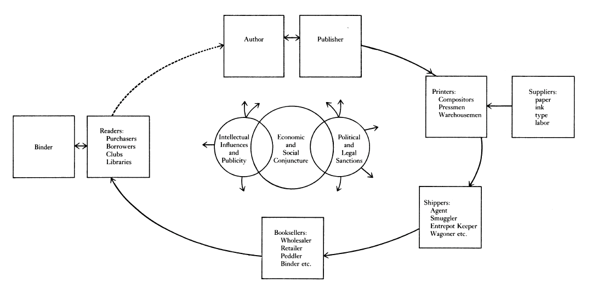
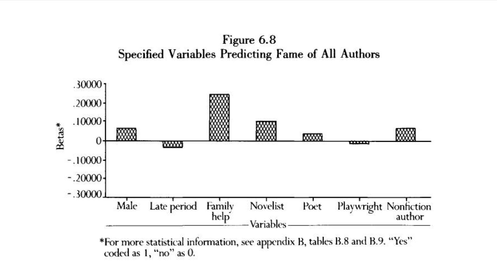
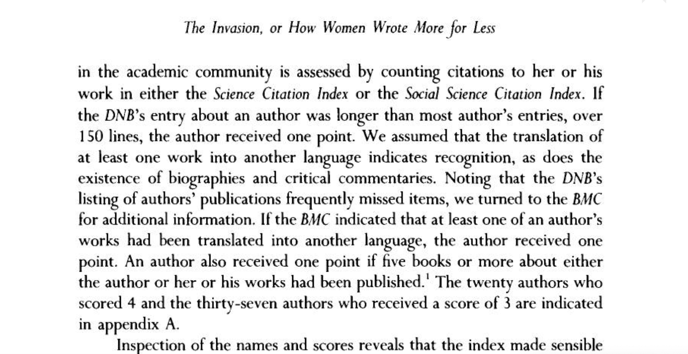

# Authors and the Field

## Agenda

+ Talk about research exercise 3: finding reviews
+ What is the history of books?  And what data do we use to tell that history?
+ What does it mean to "count" or "measure" an author's position in the field?
+ Go over the Introduction to Python, Continued

## Research Exercise 3

- How did it go?
- What things did you find
- What additional questions could we ask?

Note: 
Connecting back to Bourdieu and Williams on Reviews and criticism

## What is the history of books? And what data do we use to tell it?

Robert Darnton's "communication circuit" in, "What is the History of Books?" *Daedalus* 111, no. 3 (1982): 68)

Note:
The book historian Robert Darnton's made this visualization of what he called the communication circuit in 1982 

##  What does it mean to "count" or "measure" literary history? 

Gaye Tuchman's *Edging Women Out* (1989) and J.F Burrows' *Computation into Criticism* (19)

- What kinds of questions is Tuchman asking?
-  What kind of data does Tuchman work with?
-  What things did we like/ not like about Tuchman's study?

Note:
Why I assigned Gaye Tuchman and Nina Fortrin, a sociologist 
- Do we think that measurement is a useful way to frame what we do as scholars?
- Were there questions that came up for you in thinking about?
- Were there things that you didn't  

## Research Practicum from last week

Let's return to last week's research practicum: https://mybinder.org/v2/gh/sceckert/Data-and-Literary-Study-Spring2022/main?urlpath=lab/tree/_week2/introduction-to-python-continued.ipynb

## For next time:

+ Audiences and READERS
+ you

