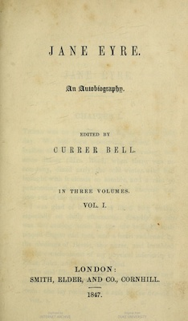
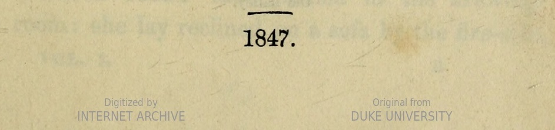

### What is a CSV? What is Bibliographic Data?

## What is a CSV?

## What is bibliographic data?

Note:
While book historians and humanists aren't used to thinking about the primary sources we work with as "data", we do work with data. Maybe you're a book historian who's working to develop a collection in quarantine. Consider this facsimile of Charlotte Brontë's Jane Eyre, stored in HathiTrust. If we were interested

Note:
While we can't glean as much as we could glean from examining a copy in person, this object gives us access to other kinds of book historical data. If we zoom in closer, we can see the watermark. Bibliographic descriptions becomes more complicated when we think about the status of this document. 

Jane Eyre: An Autobiography
https://catalog.hathitrust.org/Record/100123406.marc  
https://babel.hathitrust.org/cgi/pt?id=dul1.ark:/13960/t2d80k91c&view=1up&seq=7 

Note:
There are other forms. This is the MARC record--machine readable catalog record for Jane Eyre in HathiTrust. MARC contains a lot of rich biographic data that you can extract from a text like this. Notice how the catalog record captures some, but not the same data that we noticed examining the facimsilme. 

*The library of Morris L. Parrish: A Catalogue in typescript of the collection as of October 20, 1944*, photocopy

The library of Morris L. Parrish: A Catalogue in typescript of the collection as of October 20, 1944 ; xeroxed from the original, May 1978, page 56, http://libweb2.princeton.edu/rbsc2/parrish/04-Brontes.pdf

Note:
And there's a third form of book historical data:  bibliographic description is probably the most intensive and specialized form: notice how these catalog entries differ from the sorts of material captured in a MARC record. We can think about the usefulness of each different category

## Making bibliographic data "machine-readable"

| Call_number | Title | Place | Publisher |
| ---: | :---: | :--- | ---: | 
| HS2725.P5 P37 1939 | Events in the life of a club | Philadelphia | Philadelphia Club |

Note:
Why make bibliographic data machine readable? Because it allows us to ask questions across a wide swath of a print collection. does the way that we encode data matter so much? Think about the sort of research questions that you want
What questions can I explore with this dataset?
What questions do I want to explore, but are impossible with this dataset?
Is it possible to obtain the missing data I describe in question two? If so, how can I do it?
What kinds of manipulation will this dataset require? Am I (will I be) capable of doing this myself, or will I need help?

### Case study: Bressey's missing readers

[https://mybinder.org/v2/gh/sceckert/Data-and-Literary-Study-Spring2022/main?urlpath=lab/tree/_week4/in-class-practicum-wk4.ipynb](https://mybinder.org/v2/gh/sceckert/Data-and-Literary-Study-Spring2022/main?urlpath=lab/tree/_week4/in-class-practicum-wk4.ipynb)