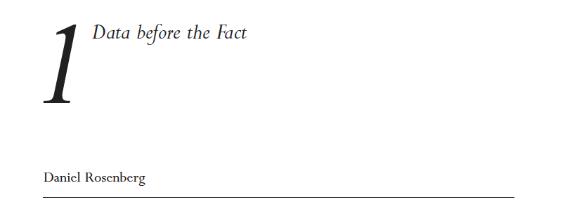
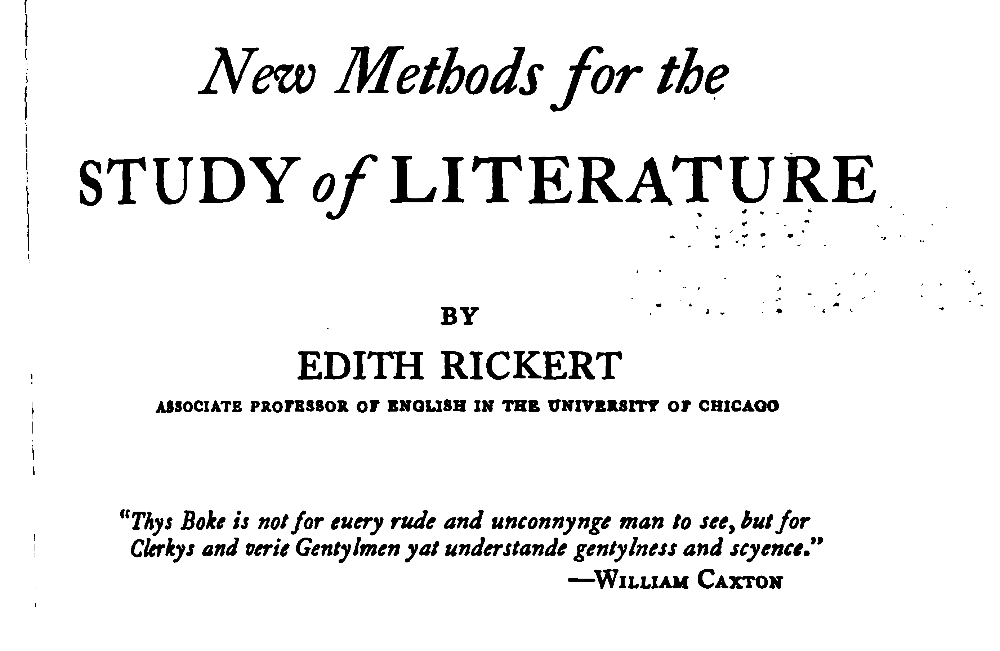

# Welcome to Introduction to DH

## Our Agenda

- Introductions
- Syllabus: https://sceckert.github.io/IntroDHFall22/
- What *is* "digital humanities + https://whatisdigitalhumanities.com/
- Next meeting

Note: This will only appear in the speaker notes window.

## Introductions

- What is your name?
- What are your academic interests?
- Where are you from?
- What is your experience in digital humanities?
- What is your previous experience in humanities or digital (whatever that means)?
- What year are you?
- Major?
-  What word did you mispronounce because you'd only encountered it in print?

## Syllabus

- https://sceckert.github.io/IntroDHFall2022/

Note: Go over: Course Description. Basic Course Structure, Assignments, and Course Policies

## What *is* Digital Humanities?

Visit[ https://whatisdigitalhumanities.com/](https://whatisdigitalhumanities.com/) 
Refresh the link a few times

## For next class...

						
