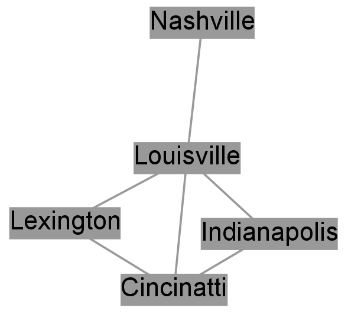
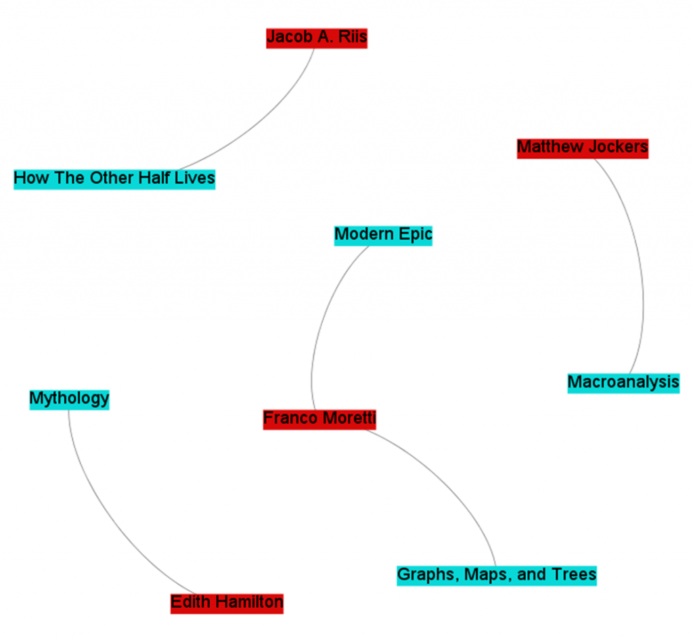
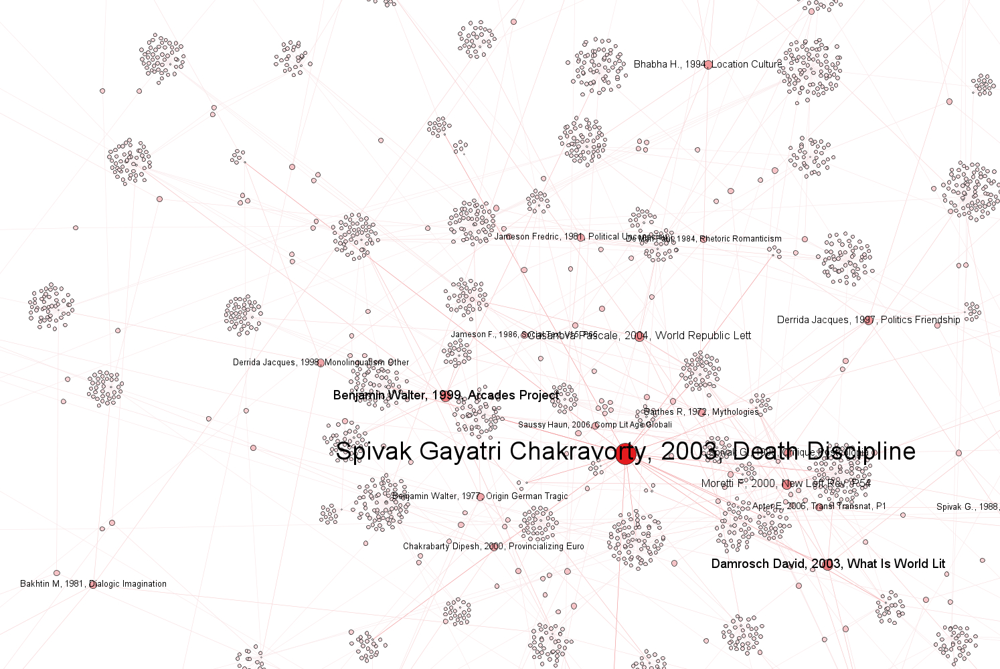
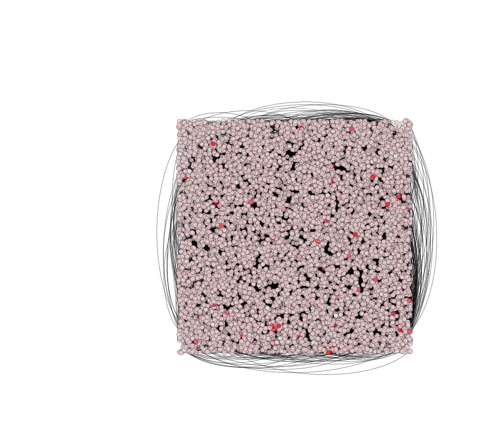
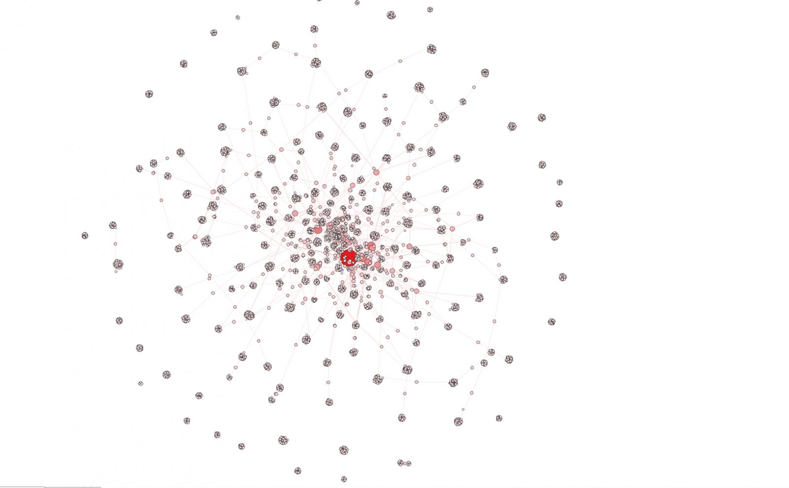
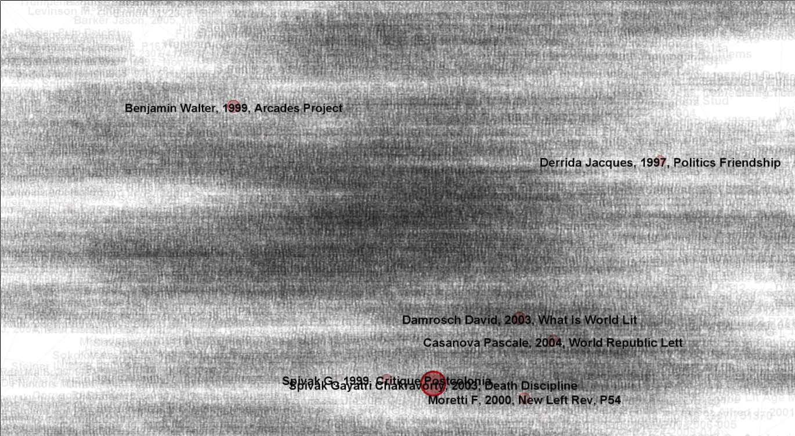

## Networks (and Maps, and Time Series)
### Week 10: Thursday, November 17, 2022

## Agenda

- Quick lecture: What are networks?
- Overview of Altair and interactive visualization tools
- Choose-Your-Own Data Visualization adventure
- Recording areas for review next week

## Network Analysis

- Networks are all about RELATIONSHIPS 

- Nodes
- Edges

- Important Terms
	- Node Degree
	- "Centrality" 
		- Betweenness Centrality
	- Communities (or Modules)

## The Importance of Clustering

The following 4 images are all from the same dataset of citations in the journal *Comparative Literature* between 2004 and 2014

"Formally, the network is comprised of “nodes” and “edges.” A node represents a single text: one either appearing in the corpus directly (published in Comparative Literature) or one merely referenced in the journal.""

–––Dennis Tenen's "Digital Displacement": https://stateofthediscipline.acla.org/entry/digital-displacement

- What's Weingart's big argument about networks? Should we use them? If not, why?
- What are the important warnings for thinking about NETWORKS with more than one type of node?
- Were there other interesting aspects fo networ
- k analysis?
	- Could you see yourself using network analysis? What might we want to use it for?

### Introduction to Data Visualization in Altair

Type the following URL to access our Jupyter Notebook: [tinyurl.com/IntroDataVizAltair](https://mybinder.org/v2/gh/sceckert/introdhFall2022/main?urlpath=lab/tree/_week10/introduction-to-data-visualization-in-altair.ipynb)

STATIC VERSION: [https://github.com/sceckert/IntroDHFall2022/blob/main/_week10/introduction-to-data-visualization-in-altair.ipynb](https://github.com/sceckert/IntroDHFall2022/blob/main/_week10/introduction-to-data-visualization-in-altair.ipynb)

## Choose Your Own Data Visualization Adventure

For the next part of the lesson, you'll choose one of the following

- Mapping: [tinyurl.com/MappingNotebook](https://mybinder.org/v2/gh/sceckert/introdhFall2022/main?urlpath=lab/tree/_week10/mapping.ipynb)
- Network Analysis: [tinyurl.com/NetworksNotebook](https://mybinder.org/v2/gh/sceckert/introdhFall2022/main?urlpath=lab/tree/_week10/network-analysis.ipynb)
- Topic Modeling Time Series: [tinyurl.com/TopicModelsTime](https://mybinder.org/v2/gh/sceckert/introdhFall2022/main?urlpath=lab/tree/_week10/topic-modeling-time-series.ipynb)

Note -- if your final project group is interested in topic modeling a CSV file, like a CSV file of tweets and their metadata (rather than a collection of .txt files), you should try the topic modeling time series exercise! For more on NetworkX: https://networkx.org/documentation/stable/tutorial.html

To download the notebooks to your own machines:  the static GitHub versions:

- https://github.com/sceckert/IntroDHFall2022/blob/main/_week10/mapping.ipynb
- https://github.com/sceckert/IntroDHFall2022/blob/main/_week10/network-analysis.ipynb
- https://github.com/sceckert/IntroDHFall2022/blob/main/_week10/topic-modeling-time-series.ipynb

What did you find?
What do you think the other groups should know about the method you learned?

## Review exercise: taking stock of where we are

 Navigate: COURSE RESOURCES page:

https://sceckert.github.io/IntroDHFall2022/resources/

- Take a minute to look back over the material we've covered so far. 
- On the whiteboard, write one topic that you'd like us to review next week (or put a star next to a topic someone else has written)