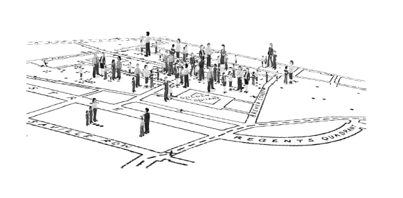
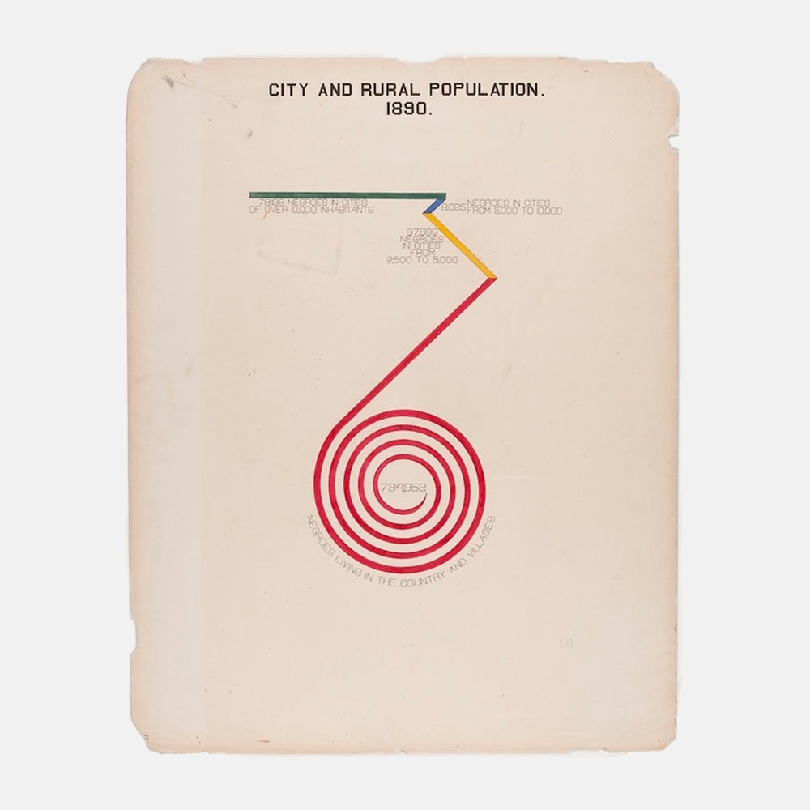
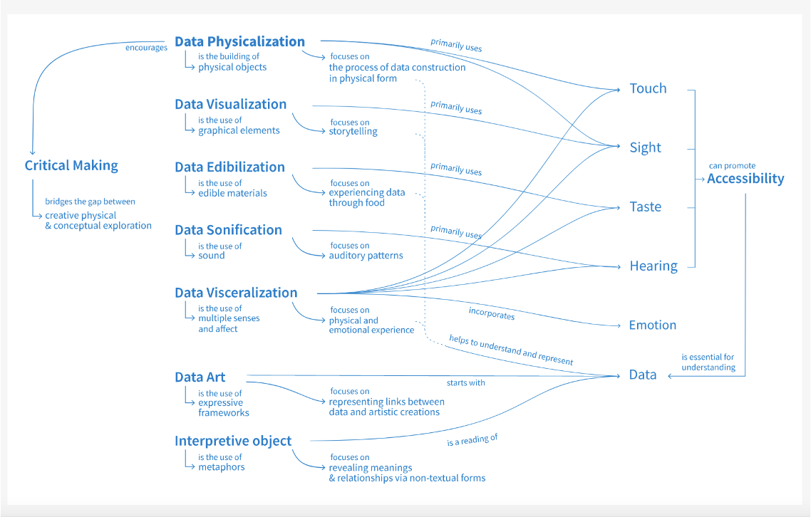

# Week 10
## A humanities approach to graphs, maps, and charts

## Agenda
- What is humanities data visualization?
	- What does it mean to visualize data "critically"? (Three approaches)
- Discussion of data visualization and methods
- Exercise: review what we've learned so far in data visualization

## Data vs. Capta

- What does Joanna Drucker when she distinguishes "data" and "capta"? What's the difference between the two terms? Do we agree?

"Capta is “taken” actively while data is assumed to be a “given”
able to be recorded and observed. From this distinction, a world of
differences arises. Humanistic inquiry acknowledges the situated,
partial, and constitutive character of knowledge production, the
recognition that knowledge is constructed, taken, not simply given
as a natural representation of pre-existing fact." (Drucker)

##### Johanna Drucker, "Humanities Approaches to Graphical Design"

Note:
What are the underlying assumptions baked into this visualization of population statistics of men and women in various countries (A-F)?

# 

Note:
How does this chart compare?

What are the differences between these charts?

What are the differences between these charts? How does this relate to the concept of knowledge as "observer-independent" vs. knowledge as observer co-dependent?

 

#### Drucker's "Humanities Approaches to Graphical Display"
#### & Lupi's "Data Humanism"
-  What does "critical" data visualization look like for each of them? How do Lupi and Drucker compare? (How is Lupi's data "humanism" different from Drucker's?)
- What did we make of each of their approaches?
- Are there drawbacks to Lupi's call to embrace "complexity" (or Drucker's situated vsiaulaizaitons)

Note: 
- When might we NOT want to make a complex visualization (SIMEEL)
- Should data visualizations be EASY or STREAMLINED?  Intuitive to Read
- What's at stake in "simple" vs complex visualizations"
- Hope, "PEAK INFOGRPHAICS: "false claim that ta couple of pictograms and a few big numbers have the innate power to simplify complexity" (Luip 3)
- Concept of "counter visualization" -- need to engage with the social ct of producing data 
- What are examples of Visualizing this compelxit(Grady)

### Lee, Yang, Inchoco, Jones and Satyanararan

## Data Visualization and Methods

#### Types of Data Visualizations

https://rawgraphs.io/

## Another example: DuBois's Data Visualizations 
https://www.loc.gov/collections/african-american-photographs-1900-paris-exposition/?fa=subject:exhibitions+%26+displays

https://www.loc.gov/collections/african-american-photographs-1900-paris-exposition/?fa=subject:exhibitions+%26+displays

https://www.loc.gov/collections/african-american-photographs-1900-paris-exposition/?fa=subject:exhibitions+%26+displays

https://www.loc.gov/collections/african-american-photographs-1900-paris-exposition/?fa=subject:exhibitions+%26+displays

In groups, discuss the visualization choices in one of the following:

- Preservation of Favoured Traces (https://fathom.info/traces/)
- Wind Map (http://hint.fm/wind/)
- Dear Data (https://www.dear-data.com/theproject)
- W.E.B. DuBois's data Visualizations for the 1900 World Expo (https://tinyurl.com/yeywxj63)

## Beyond the Data Visualization

All data visualizations are exercises in making data *sensible* -- that is, they are rhetorical devices that make legible patterns of different and similarity. 

What if we considered other senses beyond vision for communicating and representing data?<!-- .element: class="fragment" data-fragment-index="1" -->

"Tasting Data" workshop at the CDH, 2019

https://startwords.cdh.princeton.edu/issues/1/data-beyond-vision/

### Data Sonification

https://derridas-margins.princeton.edu

https://derridas-margins.princeton.edu/references/histogram/de-la-grammatologie/

Read Rebecca Sutton Koeser's blog post about sonifying Derrida's references:
https://rlskoeser.github.io/2019/12/30/sonifying-derridas-references/

## Review exercise: visualization in Python

- Python and pandas in class practicums and homework with VISUALIZATIONS:
	- [Introduction to Python (Continued)](https://github.com/sceckert/IntroDHFall2022/blob/main/_week4/introduction-to-python-continued.ipynb) | [interactive version](https://mybinder.org/v2/gh/sceckert/introdhFall2022/main?urlpath=lab/tree/_week4/introduction-to-python-continued.ipynb) 
		- Making a simple data visualization
	- [Introduction to Python: Pandas](https://github.com/sceckert/IntroDHFall2022/blob/main/_week5/python-continued.ipynb) | [interactive version](https://mybinder.org/v2/gh/sceckert/introdhFall2022/main?urlpath=lab/tree/_week5/python-continued.ipynb)
		- Making simple bar and pie charts using pandas data
	- Hunches, Hypotheses, and Exploratory Data Analysis with Pandas
		- [Making simple scatter plots (3 examples)](https://github.com/sceckert/IntroDHFall2022/blob/main/_week7/exploratory-data-analysis-with-pandas.ipynb) | [interactive version](https://mybinder.org/v2/gh/sceckert/introdhFall2022/main?urlpath=lab/tree/_week7/exploratory-data-analysis-with-pandas.ipynb)
		- Making more complex static scatter plots (scroll down to bottom)
		- Making an interactive scatter plot using Altair
	- Introduction to Topic Modeling, visualizing topic models
		- [Making a heat map to visualize topics in a set of texts](https://github.com/sceckert/IntroDHFall2022/blob/main/_week9/introduction-to-topic-modeling.ipynb) | [interactive version](https://mybinder.org/v2/gh/sceckert/introdhFall2022/main?urlpath=lab/tree/_week9/introduction-to-topic-modeling.ipynb) (Scroll down to the bottom)

## Preparing for Thursday: data visualization practicum

Look back at data visualizations on THIS course resources page: https://sceckert.github.io/IntroDHFall2022/resources/

- Group 1:  Hunches, hypotheses, and exploratory data analysis
	- - [Making simple scatter plots (3 examples)](https://github.com/sceckert/IntroDHFall2022/blob/main/_week7/exploratory-data-analysis-with-pandas.ipynb) | [interactive version](https://mybinder.org/v2/gh/sceckert/introdhFall2022/main?urlpath=lab/tree/_week7/exploratory-data-analysis-with-pandas.ipynb)
-  Group 2: Introduction to Topic Modeling, visualizing topic models
		- [Making a heat map to visualize topics in a set of texts](https://github.com/sceckert/IntroDHFall2022/blob/main/_week9/introduction-to-topic-modeling.ipynb) | [interactive version](https://mybinder.org/v2/gh/sceckert/introdhFall2022/main?urlpath=lab/tree/_week9/introduction-to-topic-modeling.ipynb)