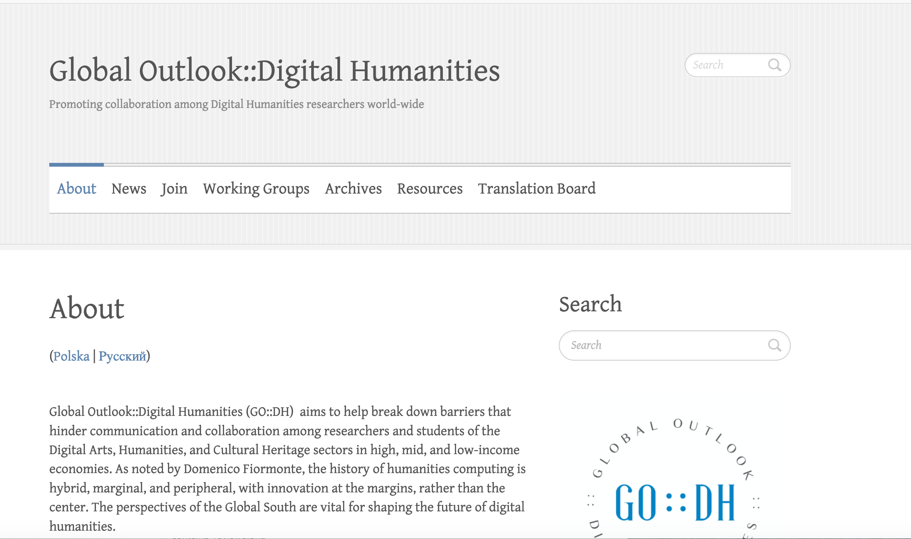
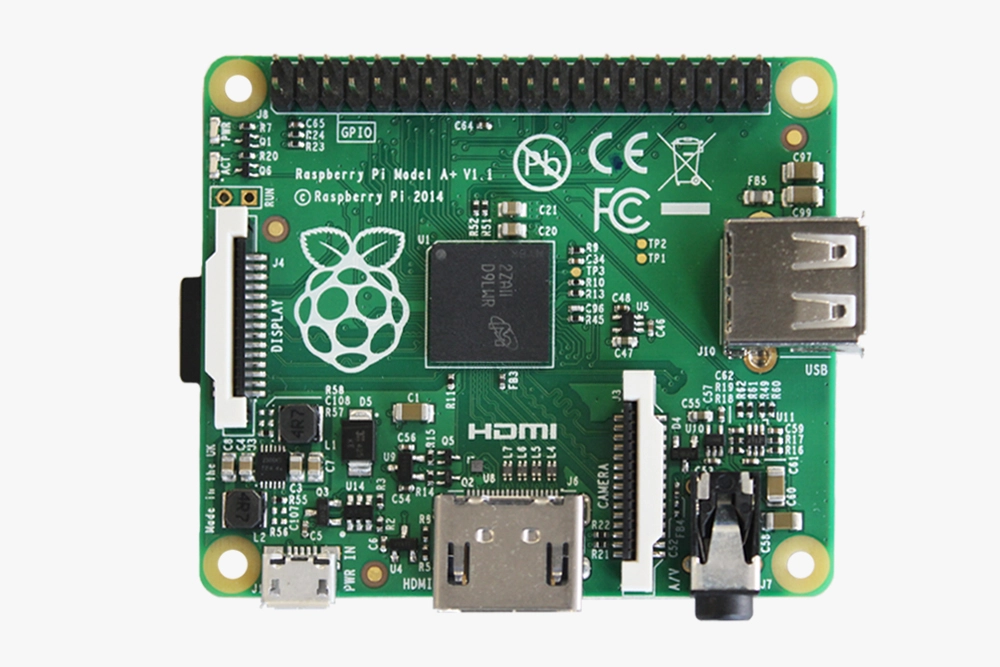
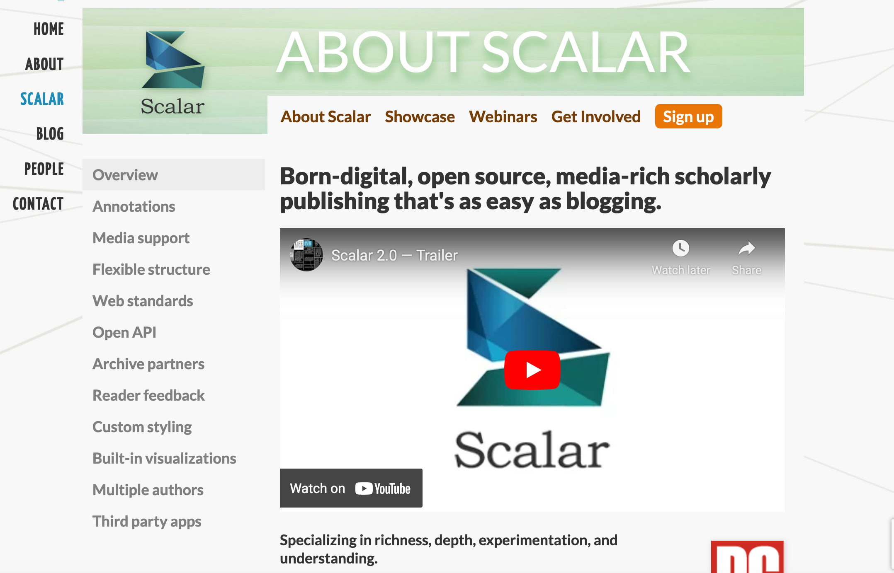
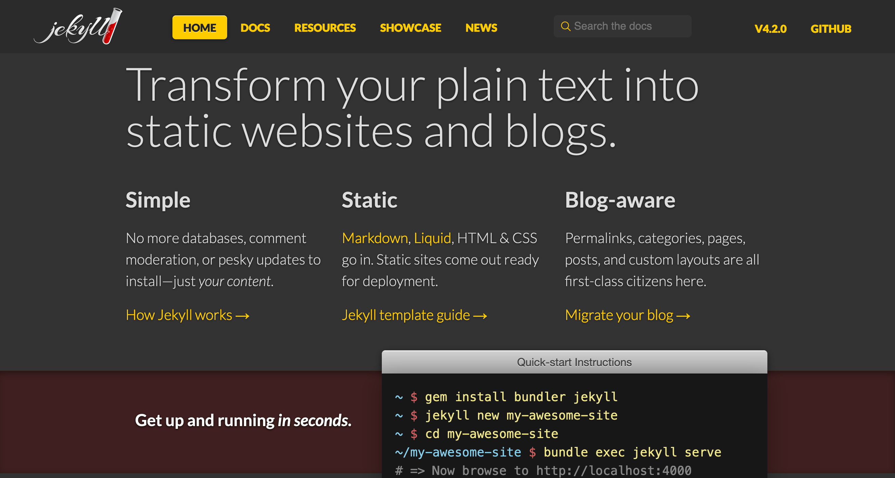
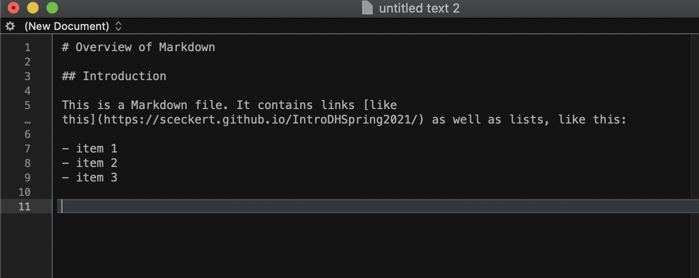

## Week 11: DH and global information infrastructures
#### Access, Maintenance, Sustainability, and Preservation 
### Tuesday, Nov. 29 2022

## Agenda

- Discuss the question of how to think about sustainability and infrastructure in DH
	-  What does it mean to do DH "sustainably"?
	-  What does sustainability look like?
	- What does it mean to do "local" DH? 
- What is minimal computing?
- We'll think about what this means in the context of our own work
- Project clinic
- Quick overview of the guidelines for your project presentations next week 

Note:
This week is about *work* and about the infrastructures of DH. We'll be thinking about it in the context of the readings we did for today and our projects

## Keyword exercise: 

We have two pieces on the docket: Kate Crawford and Vladan Jolers "Anatomy of an AI System" (https://anatomyof.ai/) and Alex Gil and Elika Ortega's "Global Outlooks in DH" 

- What key concepts and ideas stood out to you in these pieces?
	- On the board, take a marker and jot down some of the keywords and concepts

Note:
- A number of you were interested in this question: 
	- NOAH: : Why is  Why is it that the tech industry is labeled as a key to a green future despite the high carbon footprint of the industry? 
	- LOIS: How can we navigate this understanding of global flows of exploitation and resource extraction without simply feeling doomed and trapped in this system?
	- GRADY: I wonder if there is a way to allow individuals to still maintain control of the data that is sourced from them?
	- CECILIA: How do Crawford and Joler’s discussion of nature–from lithium plateaus to “the cloud”–draw attention to the natural, material elements at the base of the supply chain that fuel all things digital. Is this a connection that gets left behind in most digital humanities scholarship and in this increasingly ephemeral age?
	- HOPE: Who is this for? Isn't everything "from the earth"?

## 

https://anatomyof.ai/

## What is minimal computing?

Note:
Elika Ortega, Prof at UC colorado and Alex Gil, a DH librarian at Columbia are the others of this piece and some of the cofounders of Global Outlooks in DH founded in 2013 at the big international DH conference

## What is minimal computing?

- minimal design <!-- .element: class="fragment" data-fragment-index="1" -->
- minimal consumption & use <!-- .element: class="fragment" data-fragment-index="2" -->
- minimal maintenance <!-- .element: class="fragment" data-fragment-index="3" -->
- minimal obsolesce <!-- .element: class="fragment" data-fragment-index="4" -->
- minimal barriers (technological, cultural, social and economic) <!-- .element: class="fragment" data-fragment-index="5" -->

Note:
- HAZEL: asked what the study of AI has to do with DH?
- FAITH: 
- How does the idea of minimal connect or diverge from ideas in Crawford and Joler's piece?

Scalar vs Jekyll

For more, see: https://programminghistorian.org/en/lessons/building-static-sites-with-jekyll-github-pages

Plain text vs. proprietary

For more on authorship in plain text, see: https://programminghistorian.org/en/lessons/sustainable-authorship-in-plain-text-using-pandoc-and-markdown

Note:
Why plain text?  "user-friendly interfaces" Even though word or googledogcs shows you a mockup of what you're writing as it is typeset "When you use MS Word, Google Docs, or Open Office to write documents, what you see is not what you get. Beneath the visible layer of words, sentences, and paragraphs lies a complicated layer of code understandable only to machines. Because of that hidden layer, your .docx and .pdf files depend on proprietary tools to be rendered correctly. Such documents are difficult to search, to print, and to convert into other file formats. "

- minimal design <!-- .element: class="fragment" data-fragment-index="1" -->
- minimal consumption & use <!-- .element: class="fragment" data-fragment-index="2" -->
- minimal maintenance <!-- .element: class="fragment" data-fragment-index="3" -->
- minimal obsolesce <!-- .element: class="fragment" data-fragment-index="4" -->
- minimal barriers (technological, cultural, social and economic) <!-- .element: class="fragment" data-fragment-index="5" -->

## What does it mean to think about DH in local, regional and globe contexts?

https://arounddh.org/

https://ticha.haverford.edu/en/

- Can we think of examples of local DH projects?
- How does the piece we read by Crawford and Joler complicate this question?

### Project Clinic 
#### 

1.  Write down one question or issue that you're grappling with in your project. 

2. With your group room partner, take 10 min to share & brainstorm ways to address each question/problem area

Note:
- The questions/problems can be technical (I'm having trouble manipulating data in pandas) or methodological (am I asking the right kinds of questions about this data? Could I visualize this better?), or scope (I'm not sure what the best forum for sharing this project is)
- In responding to your partner's question/issue, you don't need to *solve* the problem for them. 
You can think about helping your partner clarify their project's goals and scope, or develop realistic schedule for the work that they'll have to do. 

## Final Project Presentations

### What to prepare:

- A 7-10 minute presentation covering:
	- overview of your research question
	- the dataset(s) that you're working with
	- the methods you used (and why you chose them)
	- your results (and anything else that came up along the way)
	- your intended audience
	- the larger stakes of the project
	- what you're still working on (and why)
	- any future directions for this project