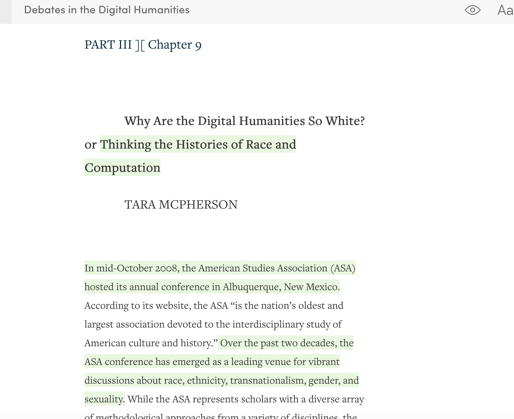
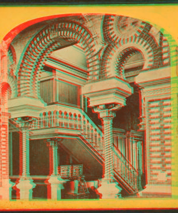
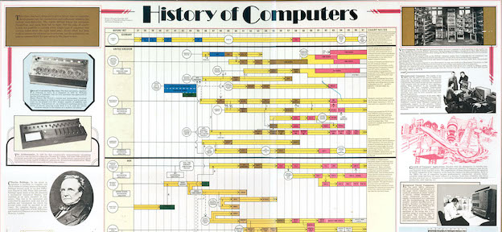
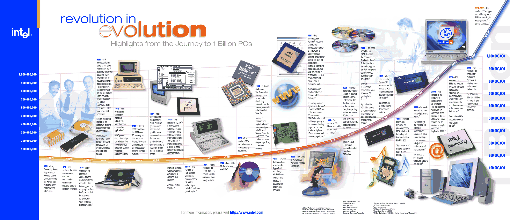
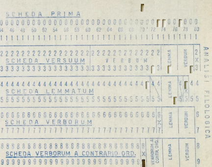
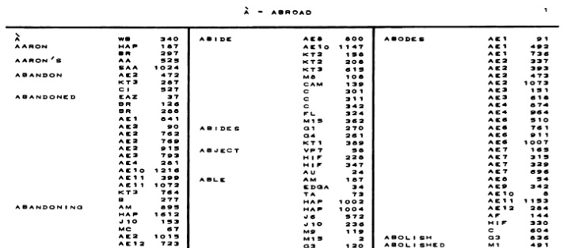
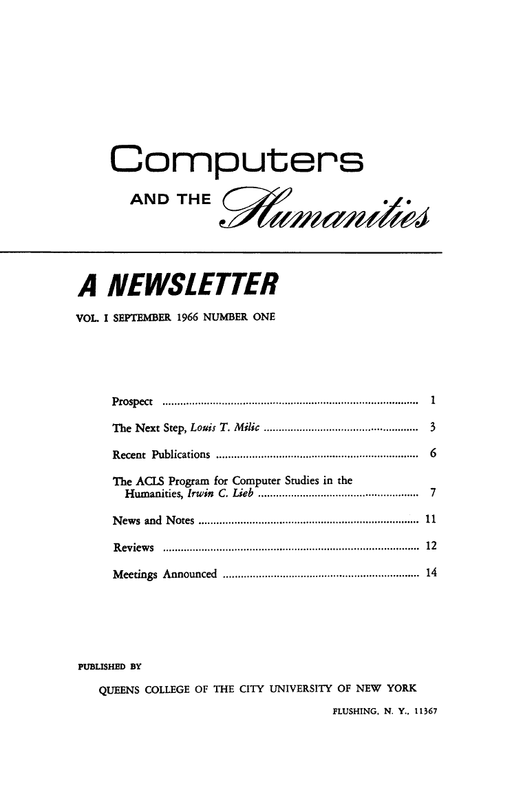
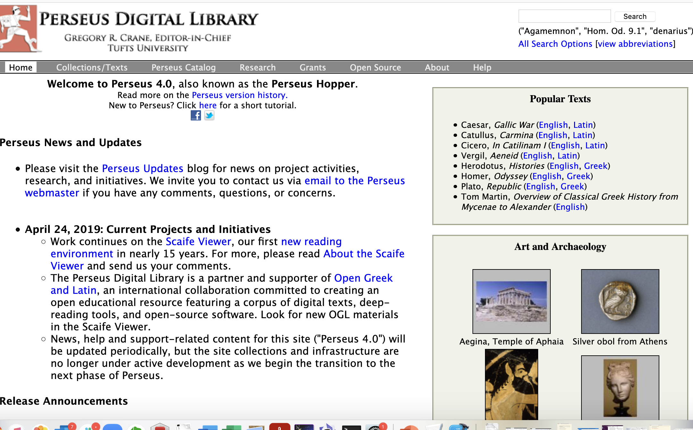
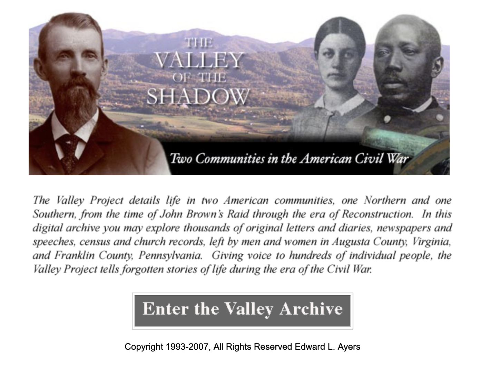
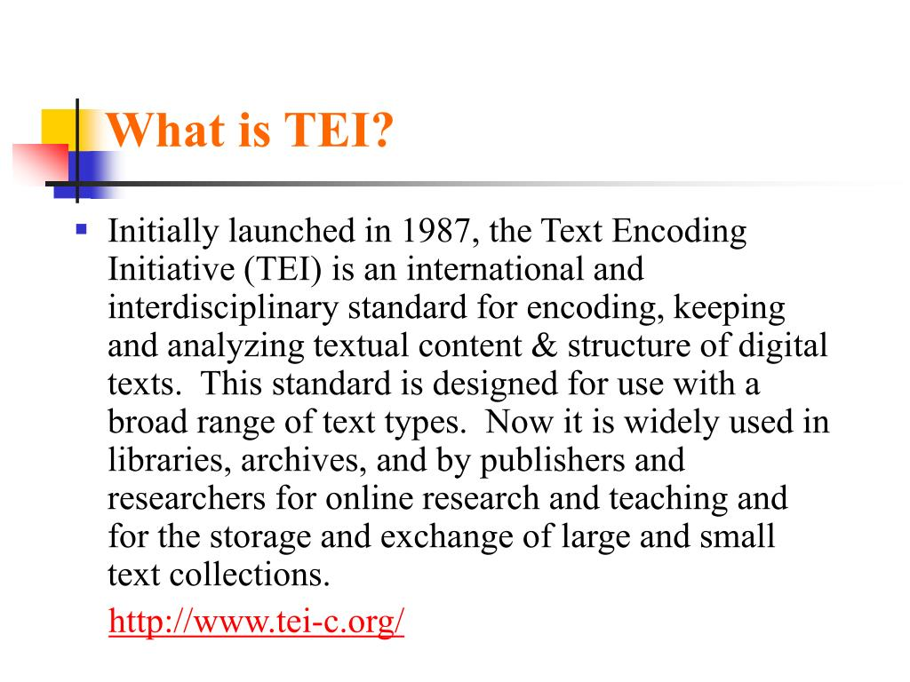

# Origins and Histories of Digital Humanities

## Agenda

- Cultures of Computation
	- Tara McPherson, "Why Are the Digital Humanities So White?: Thinking the Histories of Race and Computation" (2012)
	- Ruha Benjamin"Introduction: The New Jim Code" from *Race after Technology*(2019) 
- What does "race" have to do with ideas about data, computation, and "the digital"?
- A Brief History of Humanities Computing
- Threads & connections + preparing for Thursday 

## Picking up from last class

- What is data in the humanities?<!-- .element: class="fragment" data-fragment-index="1" -->
- What does it mean to "read" a text (literary) or otherwise? <!-- .element: class="fragment" data-fragment-index="2" -->

TODAY: <!-- .element: class="fragment" data-fragment-index="3" -->
- Computation ---- > Culture <!-- .element: class="fragment" data-fragment-index="4" -->
- Computation  < ---  Culture<!-- .element: class="fragment" data-fragment-index="5" -->

## Cultures of Computation
Tara Mcpherson's "Why are the Digital Humanities So White?: Thinking the Histories of Race and Computation" (2012)

#### What were some keywords that stood out from McPherson's piece?

Note:
You can type them in the chat or raise your hand!

- What are some things McPherson says about these keywords and concepts? How does she support it? <!-- .element: class="fragment" data-fragment-index="1" -->
- What historical trends does she explore?<!-- .element: class="fragment" data-fragment-index="2" -->
- What is the idea of modularity? What are some examples that McPherson gives?<!-- .element: class="fragment" data-fragment-index="2" -->

### **Lenticular**....  vs .... **Stereoscopic**

 

"In short, I suggest that these two moments are deeply interdependent. In fact, they coconstitute one another, comprising not independent slices of history but instead related and useful lenses into the shifting epistemological registers driving U.S. and global culture in the 1960s and after.

Might we ask whether there is not something particular to the very forms of electronic culture that seems to encourage just such a movement, a movement that partitions race off from the specificity of media forms?" (McPherson)

*UNIX logice*

input | output

*UNIX philosophy, according to Eric Raymond:*

Rule of Modularity: Write simple parts connected by clean interfaces.

Rule of Clarity: Clarity is better than cleverness.

Rule of Composition: Design programs to be connected to other programs.

Rule of Separation: Separate policy from mechanism; separate interfaces from engines.

Rule of Simplicity: Design for simplicity; add complexity only where you must.

Rule of Parsimony: Write a big program only when it is clear by demonstration that nothing else will do.

Rule of Transparency: Design for visibility to make inspection and debugging easier.

Rule of Robustness: Robustness is the child of transparency and simplicity.

Rule of Representation: Fold knowledge into data so program logic can be stupid and robust. 

Note:
- How does McPherson's take on code and tech compare to Benjamin's? 
- How does McPherson's vision for DH converge/diverge with Rosenberg's vision? Or from Rickert's?
- What lingering questions are you left with about the piece?
- REPRESTnation vs Rogranization of capital. What do we think she means (comes from the end -- about shifting from.what's represented/visible to what's invisible?
- HOPE asked; what does slower process look like? What might an alter to unix lok like?
- Noah: How can we discoevelop common language when it's critiquing coding itself 
- MIKALA: noted M's discussion of "the humaniiites
- HAZEL noted her discussion of THE MACHINE seems to take agency away
- SYDNEY: computing operating sisytmeps
- RAFAEL: what would an ethics version look like?

## Benjamin's "New Jim Code"

- What is the "new Jim Code"?
- What were some other keywords, key concepts?

Note:
- Why do we think Benjamin's first example of "code" is a name? 
- How doe each of them definite the concept of modularity
- What is "the nNew Jim Code"  -- (page 5/ page 3 for them)
- What does Benjamin mean by "race itself as a kind of tool" (17/11)
- Why
- How does Benjamin's set of concepts compare with McPherson's?
- - What would it mean to practice Thin Description?

## Timelines of Computing

- History of Computers, from the Science Museum, London 1975

- History of Computing Timline from Intel Corp., circa 2009

## A (Very Brief) History of Humanities Computing

- 1951: Father Busa + his team of punchcard operators work on the *Index Thomisticus*  in a partnership with IBM

 

- 1957 Josephine Miles + her team of women graduate students created massive concordances of Dryden's poetry--  Electrical Engineering department at Berkeley, and contracting with their computer lab and its IBM tabulation machine

- 1966 *Computers and the Humanities* founded

- 1970s: Work in statistical history, literary style, development of humanities programming languages like SNOBOL

- 1980s/1990s Another branch; web-based platforms for sharing collections of texts, images and scans of primary documents

Oxford Text Archive, founded in 1978 by Susan Hocky and Lou Burnay

Perseus Project, started 1985

Valley of the Shadow, 1993

Blake Archive, 1996

- Text Encoding Initiative, founded 1987

- 1990s/200s: centers founded, like MITH and CHNM
	- Example: the two centers McPherson talks about
		- Maryland Institute for Technology in the Humanities 
		- The Roy Rozenrweig Center for History and New Media

- 2014 - Princeton's Center for Digital Humanities founded
	- early project, the [Princeton Prosody Archive](https://prosody.princeton.edu/prosody/)

So what? Why should we care about this history?

## Wrap-up

- For Thursday, we'll be learning some about UNIX and the command line, which is the foundation for communicating directly with your computer's operating system.