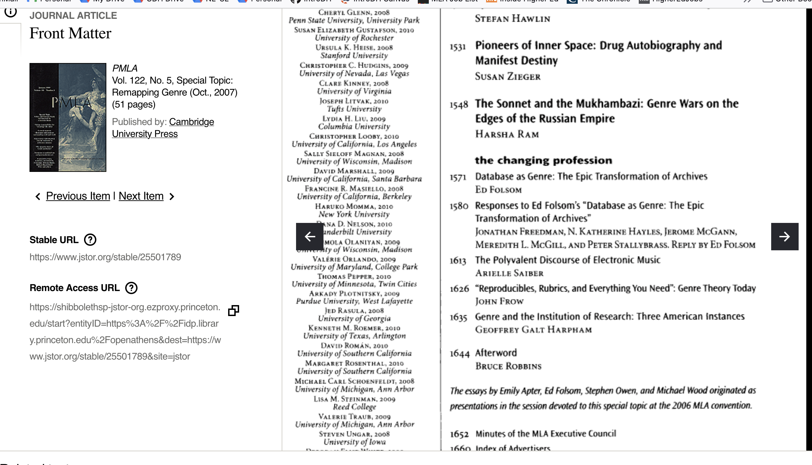

# Archives, Datasets, and Public Humanities

### Tuesday Oct 25, 2022

## Agenda

- Checking in
- What is the role & theory of archives in digital humanities?
	- What do we mean by "archive"?
	- Klein and Caswell's perspectives on "archives" (digital and physical)
- Reverse engineering a research question:
	- How do we move from specific research questions into computational work?
- Brainstorm: 
	- Discuss potential datasets of final project and some of the difficulties in finding data, as well as potential research questions
	- *** We're going to be workshopping and brainstorming some more ideas soon! 

## Checking in

How are things going? 

Note:
A few announcements: Updated syllabus includes readings on network analysis and data visualization, and a last week on digital ecologies and truth claims in digital culture.

Data biographies are coming back soon!

These community-based archives serve as an alternative venue for
communities to make collective decisions about what is of enduring value to
them and to control the means through which stories about their past are constructed. 31

## What do we mean by "Archive"?

Archive as in institutional record repository?  
Archive as in “The Papers of So and So”?  
Archive as in “Right Click -> add to Archive”  
Archive as in web archive?  
Archive as in digital archive?  
Archive as in The Archive?  

Trevor Owen, “What Do you Mean by Archive? Genres of Usage for Digital Preservers,” The Signal - Library of Congress(blog), Library of Congress, February 27, 2014 

## The history of digital archives within the history of DH

[1980s & 1990s push for "digital archives"](https://sceckert.github.io/presentations/slides/IntroDH-F22-wk2-tues.html#/5/5)

 

## What is the role & theory archives in digital humanities?

- What different approaches and theories of the archive do we see in Klein and Caswell?<!-- .element: class="fragment" data-fragment-index="1" -->
- What is "silent" in the archive? <!-- .element: class="fragment" data-fragment-index="2" -->
- Layers of the archive––who archives the archivists?<!-- .element: class="fragment" data-fragment-index="3" -->
- Role of communities in archiving: Community archives vs. mainstream archives? <!-- .element: class="fragment" data-fragment-index="4" -->
	- Post-custodial archives -- what does this mean? What are its limits/affordances? <!-- .element: class="fragment" data-fragment-index="4" -->
	- What does "responsible stewardship of digital assets" look like? <!-- .element: class="fragment" data-fragment-index="4" -->
- How does our discussion of archives change when we think about funding?<!-- .element: class="fragment" data-fragment-index="5" -->

Note:
- What is the role of archives in digital humanities?
	- How does Klein approach the question of archives and archival absence?
- How does CASWELL? How would you compare Klein's approach and Caswell's?
	- Caswell talks about "post-custodial" archives. What does that mean? 
		- Does it work for other archives (NOAH)
		- What are the limits (GRADY)
- What is "silent" in the archive? 
	- How  should we deal with them? (Should we aim the fill in the voides)
	- What theory of the archive might NOT be applicable (CECILIA)
	-  What is the difference between thinking of archival gaps as "absences" vs "ghosts"? What effects do each approach produce?
	-  Are these approaches too small to change the culture of erasure?
	-  IS SILENCE The only way in (FAITH)
	-  What about other silent GHOSTS, like EDITORS (ANIKA)
-  Layers of the archive
	-  Not just the physical but also the digital archive -- What responsibility do we have to ARCHIVE ARCHIVES? (GRADY)
	-  	- What does "responsible stewardship fo digital assets" look like? (HAZEL)
	-  What role should editors then play in shaping the archival contours of a text? (ANIKA)
- Role of communities in archiving: Community archives vs. mainstream archives
	- "digital participatory microhistory project"s
	- In community driving project, Does it matter who is doing the work to collect data? Should "scholars" be the main archivists or should it be left to the community itself? Who do we consider scholars?
	- What is the long term vision of a community archive -- is the aim to be mainstream?(Lindsay?)
	- What kind of a POLITICAL act is this (WILL)
- Digital literary history and Public Humanities approaches to archives
	- Do we think there's a difference between the way digital history and public humanities?
	- Do cultural heritage collections tend towards affirmation? What happens when the everyday experience involves trauma? (HIEN)
- Community archives vs. mainstream institutional archives
	- What obstacles exist in locating archives (digital and physical) in mainstream repositories?
	- How does this connect to our own digital humanities projects?
	- SOPHIE (what barriers might a more crowdsourced approach to the Jefferson papers open up)
	- DAVID: are all internet users inchoate 'community archivists?'
- How does an archive's mission shape the the kind of stories they record
	- AMBER point about the limits of recovery projects that privilege finding "recognizable human" stoiries
	- HIEN: the challenge of representing everyday life & pain

- How does our discussion of archives change when we think about FUNDING:
	- AUSTIN: How does the budget of an archive affect the work it does? 
	- How does the budget manifest itself within the archive? 
	- GRACE asked: Is there more that is lost by electing to remain independent than simply consistent funding, like access to certain resources or the broader audience a larger institution can attract?

Ex: the University of Central Florida Libraries budget lists cost of ECCO and National Geographic archives as  $119,800 
https://www.gale.com/primary-sources/eighteenth-century-collections-online

https://library.ucf.edu/about/technology-fee-funded-projects/ecco-natgeo/

## How do we move from specific research questions into computational research?

- What **IS* a research question? 
- How do you get from a dataset to specific ways of analyzing it? 

Let's look at research questions in the context of the pieces we read today. <!-- .element: class="fragment" data-fragment-index="1" -->

### From Specific Research Questions to Computational Methods

### Let's look at an example:

With your group, look back at Lauren Klein's "The Image of Absence: Archival Silence, Data Visualization, and James Hemings" and discuss how she moved from ***specific research questions*** to ***computational methods*.**

- Discuss :
	- What was her starting research question?
	- How did she translate that question into specific methods? What specific steps does she take to transform and analyze her data? 
	- How do Klein's ideas about archives shape the methods she uses? The argument she makes? 
	- What role does data visualization play in her argument?
	- What *questions* do we have about her methods?
	- What assumptions might be at play in each of these steps?

Reconvene: what can we say about Klein's computational methods?

How can we connect them to our own practices?

## Brainstorming final project ideas

- Questions about your final projects?

## Let's explore some potential datasets & research questions

Datasets links sheet: [https://github.com/sceckert/IntroDHSpring2021/blob/main/_datasets/datasets.md](https://github.com/sceckert/IntroDHSpring2021/blob/main/_datasets/datasets.md)

Datasets from our course: [https://github.com/sceckert/IntroDHSpring2021/blob/main/_datasets/](https://github.com/sceckert/IntroDHSpring2021/blob/main/_datasets/)

- In your groups, discuss the datasets and research questions you could explore as a final project
- Record your brainstorming ideas here (along with your names): https://bit.ly/2OYSMzT

We're going to be workshopping and brainstorming some more ideas soon! 