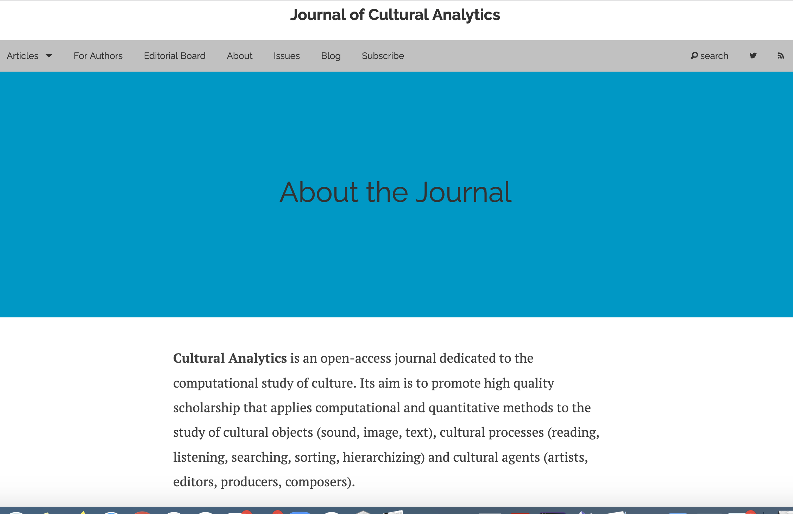

# Cultural Analytics:
## Distant Reading
### Week 8

## Agenda

- Announcements
- Lightning overview: 
	- What is cultural analytics? What is distant reading? 
- Groupwork: 
	- What is a "model"? What kinds of things does distal reading do? 
	- What's Underwood saying in these two pieces? How does it relate to the methods we've seen before
	- Discuss the "Life of Genres" -- what we thought worked/didn't work
- Go over the guidelines on Final Project Proposals
- Looking ahead: GitHub & Git for Thu

### What is Cultural Analytics? 

## What is "Distant Reading"?

"Distant reading" = a term from early 2000s, used to describe: 

- a method of reading by small parts and patterns of many works (like just the words in the titles of 2,000 novels)
- a method of studying world literature (by reading works of secondary criticism in English on, say, the novel in Italy, the novel in Nigeria, the early Chinese novel)

"Distant reading is simply a new scale of description." (Underwood xvii)<!-- .element: class="fragment" data-fragment-index="1" -->

"The point of distant reading is not to recover a complete archive of all published works but to understand the contrast between samples drawn from different periods or social contexts" (Underwood xx)<!-- .element: class="fragment" data-fragment-index="2" -->

### What is Text Analysis?

(From Underwood, "Seven Ways Humanists are Using Computers to Understand Texts" (2015))

1. Visualize a single text (ex: Randall Munroe's infographics of movie plots)<!-- .element: class="fragment" data-fragment-index="1" -->
2. Choose a few features or words (ex: Google Ngram Viewer)<!-- .element: class="fragment" data-fragment-index="2" -->
3. Identify distinctive vocabulary (ex: Matt Lavin's use of tf-idf to study the most distinctive words in a collection of  NYTimes historic obituaries)<!-- .element: class="fragment" data-fragment-index="3" -->
4. Find or visualize relationships between works (ex: Natalie Houston's networks of connections between poets and publishing houses, maps visualizing references to places or places of publication)<!-- .element: class="fragment" data-fragment-index="4" -->
5. Model literary forms or genres [supervised] (ex: Francesca Benatti and Justin Tonra's stylistics analysis of anonymous authored 19th-century literary reviews)<!-- .element: class="fragment" data-fragment-index="5" -->
6. Model social boundaries [supervised] models (ex: Ted Underwood and Jordan Seller's model of what poetry was reviewed in elite periodicals)<!-- .element: class="fragment" data-fragment-index="6" -->
7. Unsupervised models (ex: Micki Kaufman's use of topical modeling algorithms to organize the text of Kissinger papers by finding clusters or patterns of words that appear together.)<!-- .element: class="fragment" data-fragment-index="7" -->

https://tedunderwood.com/2015/06/04/seven-ways-humanists-are-using-computers-to-understand-text/

### Distantly Reading Texts

Let's turn to Underwood's "Preface" of *Distant Horizons*
In groups, discuss the following. Make sure at least 1 person documents the conversation:

- First, what *is* a "**model**"? How does Underwood seem to define it?
	- What does it mean to "model" a literary text––for Underwood? How does it square with other ways of reading? Why might we want (or need) to model texts?
- What do we think Underwood means "perspectival modeling" (xv)? What does this concept have to do with reading? (Or with machine learning)? 
-  How does it compare to other ways of thinking about humanities data?
-  Take a look at page xvii, where Underwood writes:
	-    "One concern, in particular, may spring to mind the moment you open this book and see a graph: that quantitative methods seek to strip away the interpretative dimension of the humanities in order to produce objective knowledge [....] To make a long story short: numbers are not inherently more or less objective than ours. Numbers are just signs created by human bings to help us reason about questions of degree. Like other arguments about the past, a statistical model is a tentative interpretation of evidence." (xviii) -- What do we think Underwood means? Do we agree?

### Text Analysis in DH

- What is Underwood's argument in "The Life Spans of Genres"? What's he trying to model? Why is "genre" such a tricky thing to study over time?<!-- .element: class="fragment" data-fragment-index="1" -->
- What parts of his argument did we have questions about?<!-- .element: class="fragment" data-fragment-index="1" -->
- How does he layout his analysis?<!-- .element: class="fragment" data-fragment-index="1" -->
-  What findings does he describe? <!-- .element: class="fragment" data-fragment-index="2" -->
-  Did you find his argument compelling or not? <!-- .element: class="fragment" data-fragment-index="4" -->

### Perspectives on "perspectival modeling"

### Or, The Politics of Distant Reading

- Think back to Roopika Risam's essay we read last week on the digital cultural record. How might Risam's point about the uneven distribution of digital cultural record complicate some of these methods?

In small groups, discuss the short excerpt from Katherine Bode's review of *Distant Horizons*: 
- Link to excerpt: https://tinyurl.com/ycyvsvv7
- How does Bode's approach to "perspective" compare to Underwood's? What other points does she bring up?
- Do we agree with her argument?

## Another definition of modeling

"Models are statistical, graphic, or physical objects, and
their primary quality is that they can be manipulated. Scientists and
social scientists use them to think about the social or natural worlds
and to represent those worlds in a simplified manner. Statistical models,
which dominate the social sciences, particularly in economics,
are typically equations with response and predictor variables. Specifically,
a researcher seeks to understand some social phenomenon,
such as the relation between students’ scores on a math test and how
many hours the students spent preparing for the exam. To predict
or describe this relation, the researcher constructs a quantitative
model with quantitative inputs (the number of hours each student
spent studying) and outputs (each student’s test score). The researcher
hopes that the number of hours a student spent preparing for the
exam will correlate with the student’s score. If it does, this quantified
relation can help describe the overall dynamics of test taking."
 
–– Richard Jean So, "'All Models are Wrong'" (668)

### Another definition of modeling

To model = to try and represent some complex larger object (texts, images, other cultural artifacts) using a simpler smaller proxy

Models take some kind of INPUT (eg the frequencies in patterns in words) and produce an OUTPUT (can be a classification––a qualitative output-–or a quantitative output) in order to make a "prediction" (about what category that object falls in, or how similar/dissimilar that object is in relation to other objects)

## Quantification as a means of describing patterns

So what? Why quantify? 

+ Underwood's perspective: quantification gives us a way of describing patterns and dynamics in a large group of texts
+ Bode: Modeling is *not* useful because quantification doesn't capture the nuances of context or perspective. Or worse, actively encodes them

+ ANOTHER way of thinking about modeling: not as the end result but as one step in identifying areas for further exploratory analysis (pointing out patterns or areas of a larger dataset that you might want read or analyze using other methods)

### Final Project Proposal 

The final project proposal is the first stage of the project. It will take the form of a short write-up that will clearly and concretely describe your questions, data, methods and plan for the next few weeks.

- What are your initial research questions?
- What scholarship does your research draw upon and further? (This could be digital humanities scholarship, or broader questions in relevant humanities fields)
- How you will translate your research questions into hypotheses?
- Which methods and datasets do you plan to use?
- How do you plan to communicate your results? 

This write-up should be **2-3 pages** and should lay the groundwork for the project, including a **timeline** to completion and **how you plan to divide the work** required to make the project.

NOTE: "Project" is deliberately left open-ended. Your project's "results" could be preliminary exploratory data analysis and your communication forum could be a visualization or a poster (or a simple GitHub website). We'll be learning how to set up and use git-hub for doing collaborative analytical work on your projects and for sharing your results.