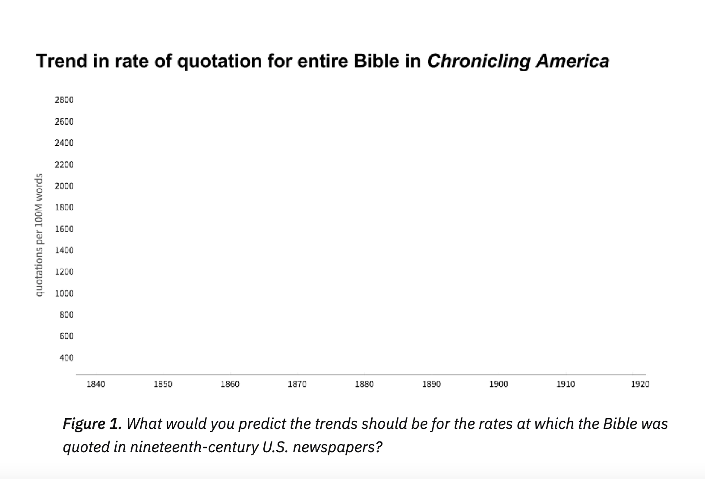
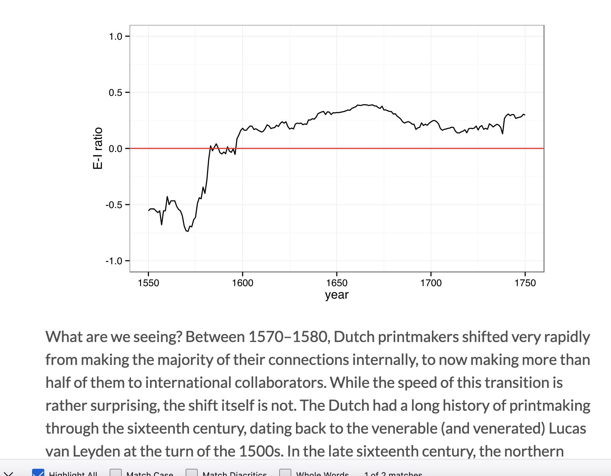
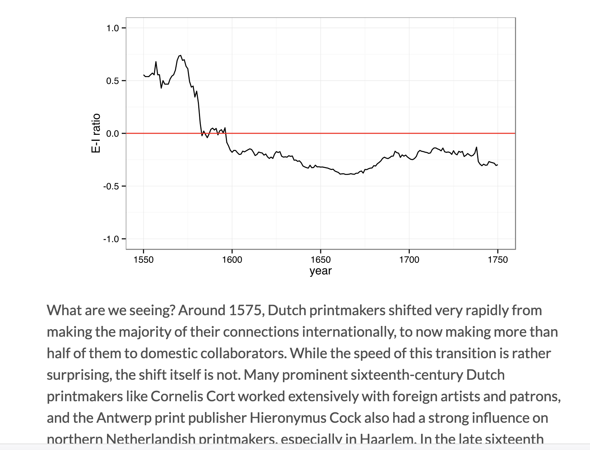

## Week 9: Text Analysis, Machine Learning, and Natural Language Processing

## Agenda

 
- Making arguments with data
	- Confabulations and just-so stories
	- How do we reason with data? 
- What is topic modeling?
- Hands-on work with a browser-based LDA topic model 
- Project Proposal

Note:
We have on the docket today three readings about how to make ARGUMENTS with data & and data viz and one piece that is a sneak preview of a new method for analysis of texts.  I thought we'd talk today about how to.
Last class we talked about MODELS. We're going to look at one specific kind of model. 

## Confabulations and "Just-So" Stories: three perspectives

Note:
- Why does Lincoln Mullen show a blank slide?
- What's Matthew Lincoln doing when shows two different graphs of his "data" (and two different explanations?) Do you agree?
- What is a "confabulation" or a just-so story?
- How do all three these authors approach sharing data?

## Building research projects

From Weingart's "Argument Clinic"

1) have a dataset but don't know what to do with it or 
2) have a humanistic question that you don' know how to make computationally tractable

## Data to questions

1.  Start with data:  <!-- .element: class="fragment" data-fragment-index="1" -->
	- Describe the data: how many records? What are the fields/ What ere the values in each? <!-- .element: class="fragment" data-fragment-index="2" -->
	- What do expect? <!-- .element: class="fragment" data-fragment-index="3" -->
2. Visualize your data:  <!-- .element: class="fragment" data-fragment-index="4" -->
3. Contextualize your data:  <!-- .element: class="fragment" data-fragment-index="5" -->
	- Compare it to other data (eg: compare word frequencies to base frequencies in other collections, compare networks to random networks, compare to data on the number of items, persons) <!-- .element: class="fragment" data-fragment-index="6" -->
	- Make INTERNAL comparisons with your data (rather than broad claims)  <!-- .element: class="fragment" data-fragment-index="7" -->
		- For instance, compare numbers of to other datasets <!-- .element: class="fragment" data-fragment-index="8" -->
	- Look for: deviations from expectation, or deviations from internal consistency.  <!-- .element: class="fragment" data-fragment-index="9" -->

## Questions to data

1. Set an agenda: (describe your hypothesis) <!-- .element: class="fragment" data-fragment-index="1" -->
2. Find a testable hypothesis (think: what makes a hypothesis testable?)  <!-- .element: class="fragment" data-fragment-index="2" -->
3. Match hypotheses to approaches (eg methods, proxies, datasets, statistical tests)  <!-- .element: class="fragment" data-fragment-index="3" -->
4. Specify your proxies  <!-- .element: class="fragment" data-fragment-index="4" -->
5. Find data  <!-- .element: class="fragment" data-fragment-index="5" -->
6. Collect data  <!-- .element: class="fragment" data-fragment-index="6" -->

## Important notes about argument

"Even if no alternate hypothesis presents itself, and all of your tests agree with your hypothesis, you still do not have causal proof." 
--- Scott Weingart, "Argument Clinic"

## What is topic modeling?

- What is topic modeling? <!-- .element: class="fragment" data-fragment-index="1" -->
- What are the possible uses of LDA? What are its limits? <!-- .element: class="fragment" data-fragment-index="2" -->
- When could you see yourself using it? <!-- .element: class="fragment" data-fragment-index="3" -->

Note:
Topic modeling is a method for finding and tracing clusters of words (called “topics” in shorthand) in large bodies of texts.  When we topic model, we’re going to identify *clusters of words* that tend show up together in statistically meaningful ways throughout the corpus. A “topic” can be understood as a collection of words that have different probabilities of appearing.

What makes a topic model a MODEL? It's "modeling" -- representing by one variabe––topics in a text. For this kind of model, a topic is a collection of words that appear together

Why are topic models useful? The y can be very useful for getting a sense of a corpus (what sorts of subjects appear in journal articles, or in a collection of ads, or novels). Topic models can also be self fo tracing themes over time, or finding clusters of texts that share the same or similar "topic." One of the dangers for out of the box topic modeling tools is that you can produce results without knowing what you're doing or what the results mean.

There are a lot of kinds of topic models, but the method that Underwood talks about is LD  (latent Dirichlet allocation). The math is a little complicated, if you're interested, I'd recommend David Blei's article on it: https://dl-acm-org.ezproxy.princeton.edu/doi/pdf/10.1145/2133806.2133826

1) ) LDA is an Unsupervised Algorithm
This means it is not trained on labeled data. ou could train it with a bunch of pictures of cats that were clearly labeled CAT and a bunch of pictures of dogs that were clearly labeled DOG.  Because LDA is an unsupervised algorithm, we don’t tell our topic model which words or topics to look for. We only tell the topic model how many topics (or clusters of words) that we want returned

2) LDA is a probabilistic model
 Rather than calculating precise and unchanging metrics about a given corpus, a topic model makes a series of very sophisticated guesses about the corpus. These guesses will change slightly every time we run the topic model.

So, when we tell a topic model to extract 15 topics in a corpus of US inaugural addresses, here is what themdoel does: 

The topic model starts off with a slightly silly, backwards assumption. The topic model assumes that every single one of the 58 addresses in the corpus was written by someone who exclusively drew their words from 15 mystery topics, or 15 clusters of words. To spin it in a slightly different way with a different medium, the topic model assumes that there was one master artist with 15 different paints on her palette, who created all the US inaugurals by dipping her brush into these 15 paints alone, applying and blending them onto each canvas in different proportions. The topic model is trying to discover the 15 mystery topics that created all the US inaugural addresses, as well as the mixture of these topics that makes up each individual presidential address.

The topic model begins by taking a completely wild guess about the 15 topics, but then it iterates through all the words in all the documents and makes better and better guesses. If the word “energy” keeps showing up with the words “nuclear” and “coal,” and if all three words keep showing up in the same kinds of inaugural addresses, then the topic model starts to suspect that these three words should belong to the same topic. If the word “education” keeps showing up with “schools” and “teach,” then the topic model suspects that they should belong to the same topic, too. The topic model finally arrives at its best guesses for the 15 topics that most likely created all the US inaugural addresses.

What we call a “topic” is really just a list of the most probable words for that topic, which are sorted in descending order of probability. 

Topics can be far more ambiguous than the above examples, as well, which makes the business of interpretation even more significant. We’ll discuss the ambiguity of topics and topic labels in more depth in the next lessons.

## Hands-on work with a browser-based LDA topic model 

Let's look how topic modeling works in MALLET (MaAhine Learning for LanguagE Toolki), a Java software package for topic modeling and other natural language processing techniques

MALLET was It’s maintained by David Mimno, a Cornell professor in Information Science. We'll be using a version of this Java package modified for Python use in our Thursday practicum. (Here's the MALLET link: http://mallet.cs.umass.edu/index.php)

David Mimno also made a web-based browser for his LDA topic modeling toolkit, which you can run on your browser using a demo corpus of US inaugural addresses. 

https://mimno.infosci.cornell.edu/jsLDA/

Run 150 iterations.<!-- .element: class="fragment" data-fragment-index="1" -->

Change the number of topics. How did it affect the composition of topics?<!-- .element: class="fragment" data-fragment-index="2" -->

## Review:

- What are some of the critical things to remember when cleaning data? 
- What did you notice?

---------

## MIni-Practicum: NLTK

Last week we learned some NLTK features. On Thursday, we're going to be learning more about how to do Topic modeling

### What can we do with NLP?

### Named Entity Recognition

Named Entity Recognition is useful for extracting key information from texts. You might use NER to identify the most frequently appearing characters in a novel or build a network of characters (something we’ll do in a later lesson!). Or you might use NER to identify the geographic locations mentioned in texts, a first step toward mapping the locations (something we’ll also do in a later lesson!).

To perform named' entity recognition, we use a python library called spaCy to identifiy "named enitites". These are Persons, organizations, locations  as well as dates, money, organizations, and works of art (the latter are a little squiffier)

The English-language spaCy model that we’re going to use in this lesson was trained on an annotated corpus called “OntoNotes”: 2 million+ words drawn from “news, broadcast, talk shows, weblogs, usenet newsgroups, and conversational telephone speech,” which were meticulously tagged by a group of researchers and professionals for people’s names and places, for nouns and verbs, for subjects and objects, and much more. (Like a lot of other major machine learning projects, OntoNotes was also sponsored by the Defense Advaced Research Projects Agency (DARPA), the branch of the Defense Department that develops technology for the U.S. military.)

spaCy offers models for other languages including German, French, Spanish, Portuguese, Italian, Dutch, Greek, Norwegian, and Lithuanian. Languages such as Russian, Ukrainian, Thai, Chinese, Japanese, Korean and Vietnamese don’t currently have their own NLP models (there's a whole project at Princeton working on tihis.). However, spaCy offers language and tokenization support for many of these language with external dependencies — such as PyviKonlpy for Korean or Jieba for Chinese.)

