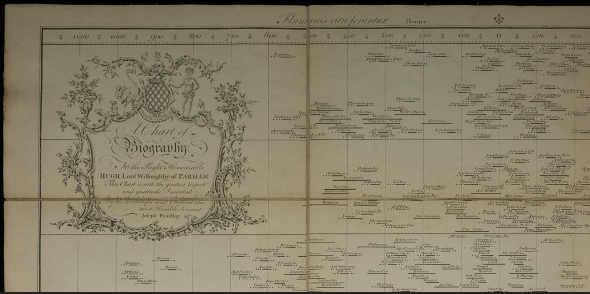
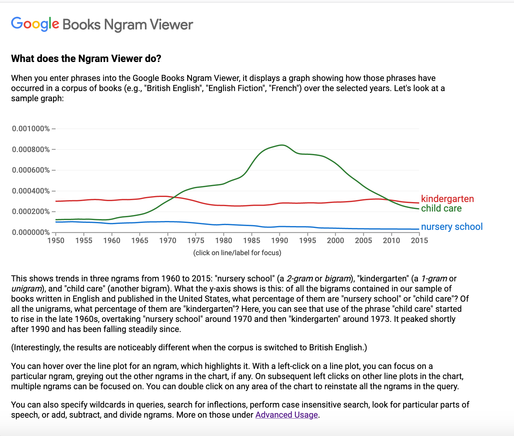
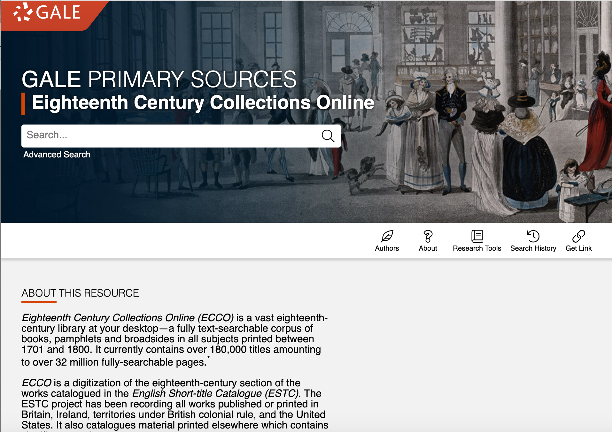
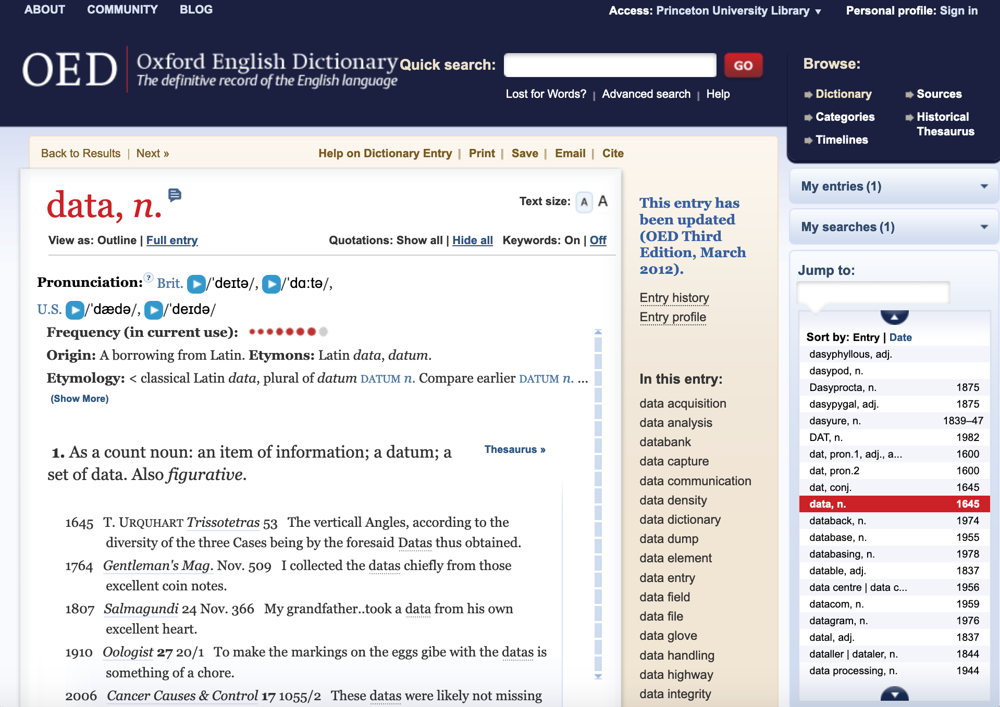
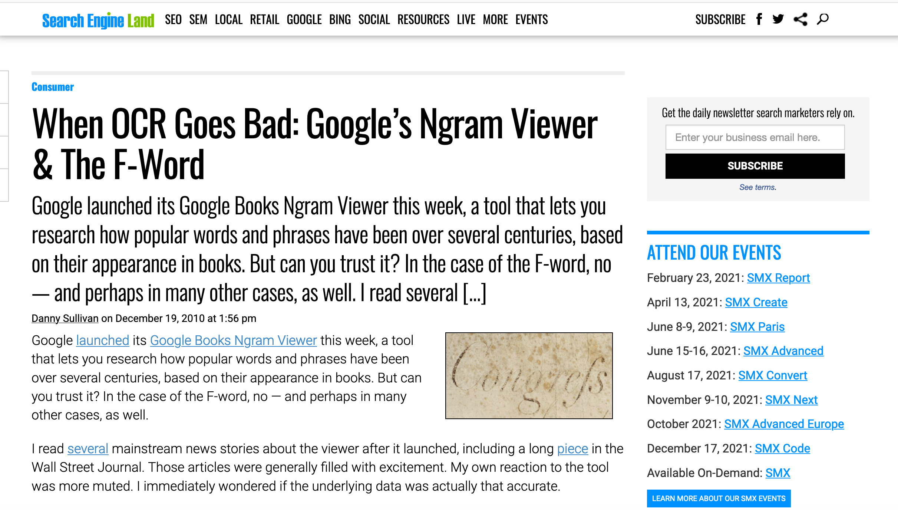
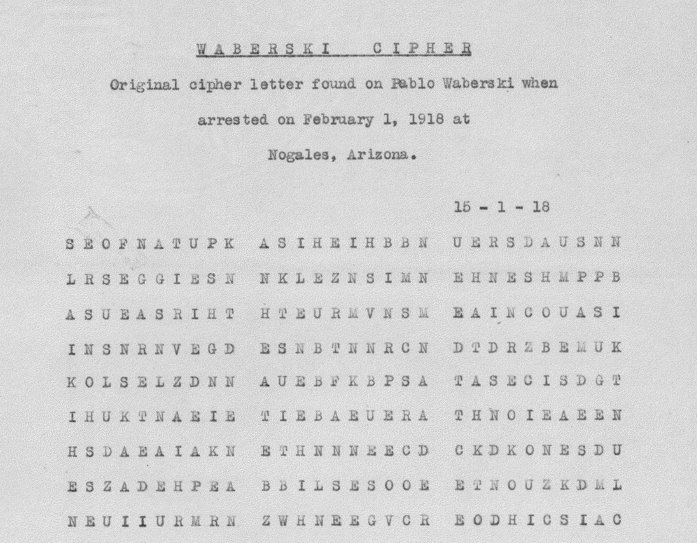
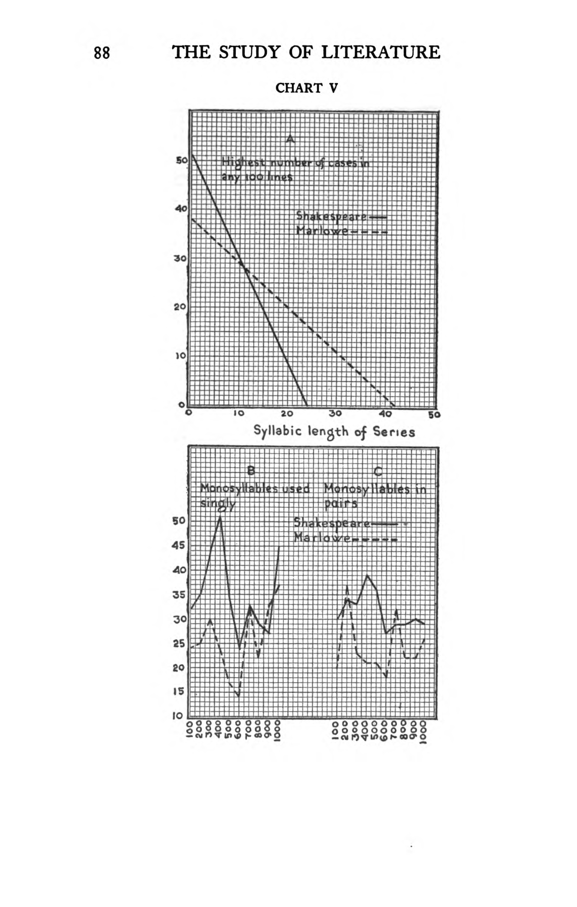
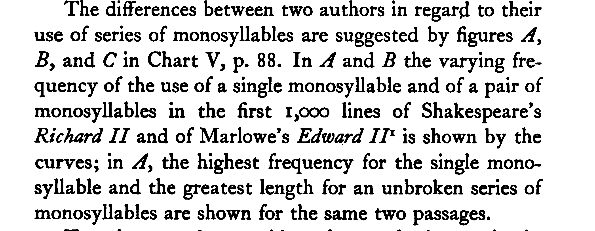

## Our Agenda

1. What is the history of data and how do we tell it?
	- Rosenberg's "Data before the Fact"
	- Ways of searching for "data": GoogleNGrams and ECCO
2. What does data have to do with the study of literature?
	- Edith Rickert's *New Methods for the Study of Literature* (1927)
3. Practice: counting by hand as a way to study literary & historical texts
4. Data: our definitions 

## What is the history of "data"?

Rosenberg's "Data before the Fact" (2013)

## What is the history of "data"?

Rosenberg's "Data before the Fact" (2013)

 

## What is the "history of data" (according to Rosenberg)?

- What's up with these early use of the word data in the 1700s?
- Did anything in Rosenberg's research surprise you?

"Without changing meaning, during the eighteenth century data changed connotation. It went from being reflexively associated with those things that are outside of any possible process of discovery to being the very paradigm of what one seeks through experiment and observation." (36)<!-- .element: class="fragment" data-fragment-index="2" -->

##  How do we tell the "history of data"?

How does Rosenberg tell this history?

CORPUS 

- **Corpus**: fancy word for a collection of writings or recorded materials. (The plural is corpora)<!-- .element: class="fragment" data-fragment-index="1" -->
- "To facilitate research, Google has been making its book corpus accessible in two new ways: the raw data, abstracted from individual works, can be downloaded for analysis according to the interests of individual researchers, or it can be searched through a simple online interface called the Google Books Ngram Viewer." (23-24)<!-- .element: class="fragment" data-fragment-index="2" -->

##  How do we tell the history of "data"?

What are Rosenberg's sources?

-  

##  How do we tell the history of "data"?

What are Rosenberg's sources?

- 

##  How do we tell the history of "data"?

What are Rosenberg's sources?

- 

##  How do we tell the history of "data"?

How does Rosenberg tell this history?

- NGRAMS <!-- .element: class="fragment" data-fragment-index="1" -->
- **"An “ ngram ” is a phrase consisting of a defined number of words (n):**<!-- .element: class="fragment" data-fragment-index="2" -->
 the Ngram Viewer allows corpus searches on these phrases and returns statistical results." (23-24)<!-- .element: class="fragment" data-fragment-index="2" -->

## Searching for "data": Google Ngram Viewer

- What was it like to work with the GoogleNGram Viewer?<!-- .element: class="fragment" data-fragment-index="1" -->
- What did you notice in your exploratory searches?<!-- .element: class="fragment" data-fragment-index="1" -->
- What implications might this have how we make arguments with the GoogleBooks corpus or Ngram Viewer?<!-- .element: class="fragment" data-fragment-index="2" -->
- Can you think of other examples of searches that might be complicated by search terms?<!-- .element: class="fragment" data-fragment-index="2" -->

## Google Ngram fails

- OCR can do funny things when you're dealing with printed text. In the 18th century, the letter s was often printed as both a s and a character that looked more like an F. <!-- .element: class="fragment" data-fragment-index="1" -->
- <!-- .element: class="fragment" data-fragment-index="2" -->

## Searching for "data": ECCO's "data"

- What stood out to you when you read about Rosenberg's research with ECCO? <!-- .element: class="fragment" data-fragment-index="1" -->
- Rosenberg: "the first and most pervasive problem that has turned up in this work is that a majority of usages of “ data,” even in the English language books in the [ECCO] database, turn out to be Latin. Often the Latin word data appears in quotations, footnotes, or conventional phrases such as data desuper (given from above) included in longer English texts. Other hits refer to the title of Euclid’s book Data. Still others turn out to be scanning errors. In one instance, the search engine pulled up a reference to a certain King Data, a giant who fattened his twenty-five children by feeding them on puddings stuffed with enchanted herbs.  As a consequence it has been useful to examine hits individually, to sort the good from the bad and to code them, to engage in the constructive process of data making so well described in recent ethnographies of scientific practice. My own data may once have been raw, but by the time I began any serious interpretation, I had cooked it quite well." (30)<!-- .element: class="fragment" data-fragment-index="2" -->

## What does data have to do with the study of literature?

- Rickert's *New Methods for the Study of Literature* (1927) <!-- .element: class="fragment" data-fragment-index="1" -->
- Waberski code  <!-- .element: class="fragment" data-fragment-index="2" -->

## Rickert's Method 

"On the hypothesis, then, that the soul of literature is inseparable from style, which is its body, the general method in this book is to analyze the complex of style into its several strands, which may be called Imagery, Words,  Thought Patterns, Rhythm, Tone Patterns, and—what is  often disregarded—Visual Devices; and for each of these to find graphical and statistical methods by which its varied manifestations in different pieces of writing may be— understood with a definiteness and a certainty impossible through reading alone." (7)

- What stood out to you when you read Rickert's analysis?
- What can we gain from studying a work of literature this way? What do we lose?

## Rickert's method


- 
- 

> The sky was a miracle of purity, a miracle of azure. The sea was polished, was blue, was pellucid, was sparkling like a precious stone, extending on all sides, all round to the horizon—as if the whole terrestrial globe had been one jewel, one colossal sapphire, a single gem fashioned into a planet.
> ––Joseph Conrad, *Youth* (1910)

> Every day and all day the same pale-blue sky and the un-
winking sun over the moving speck. Every day and all day the same black-blue water world untouched by any known wind, smooth as a slab of syenite, colourful as an opal, stretched out and around and beyond and before and behind us, forever, illimitable, empty.
>–––Frank Norris, “The Ship That Saw a Ghost,” A Deal in Wheat (1903)

## Let's Count!

Visit the site below and take 5 minutes to complete the exercise:

[https://github.com/sceckert/IntroDHSpring2021/blob/main/_week1/in-class-practicum.md](https://github.com/sceckert/IntroDHSpring2021/blob/main/_week1/in-class-practicum.md)

## Final Questions

1. How do (and should) we tell the history of data? What might a future of "data" look like?
2. What does *our* data look like? 
	- Make a list of all the forms of data you interact with on a daily basis.
	-  What things did you consider data? What does data mean for humanists (and computer scientists, social scientists)? How might a historian or literary scholar or a computer scientist or an anthropologist approach that data differently?
