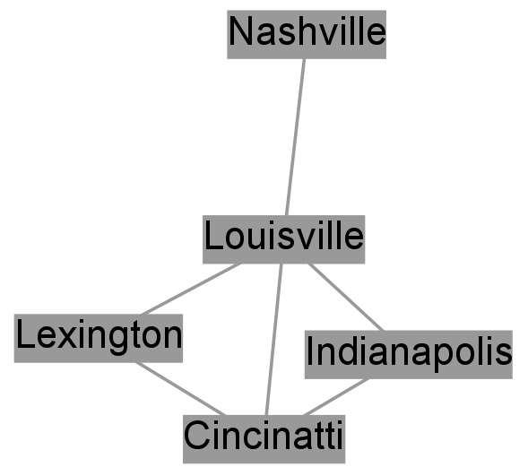
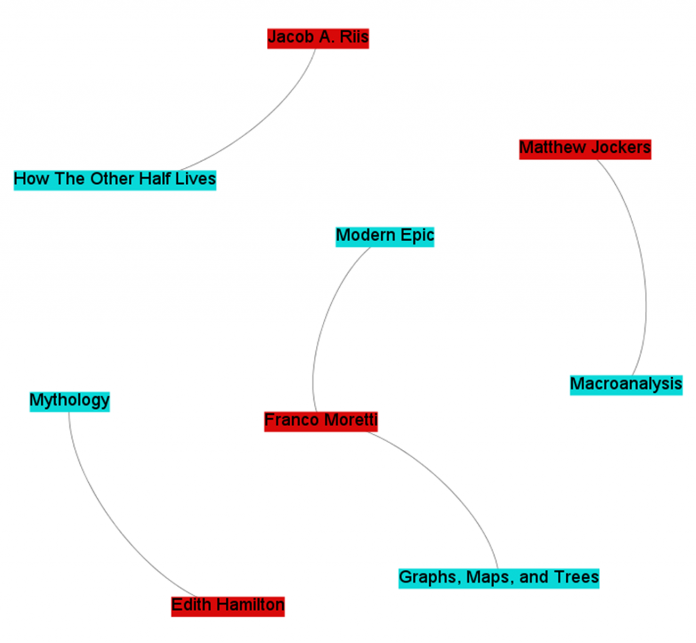
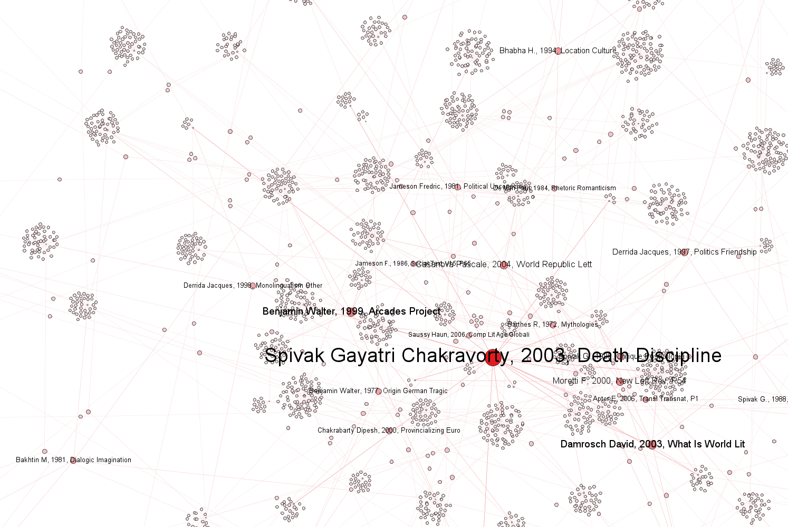
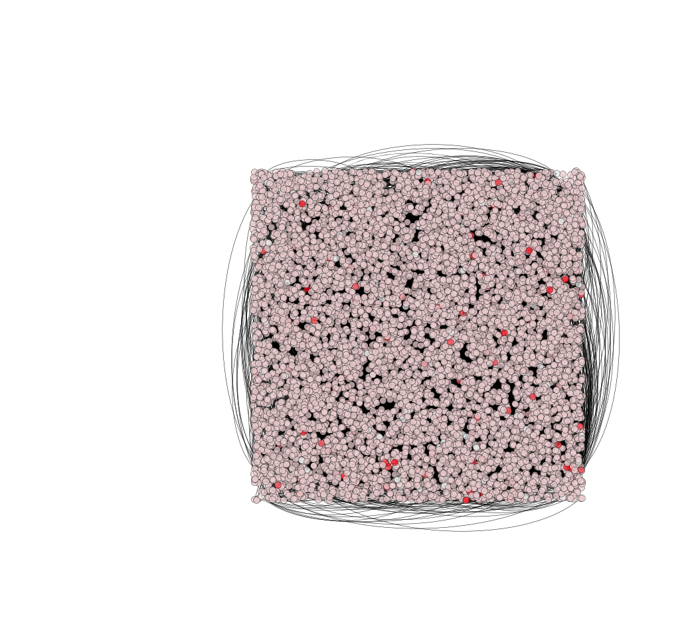
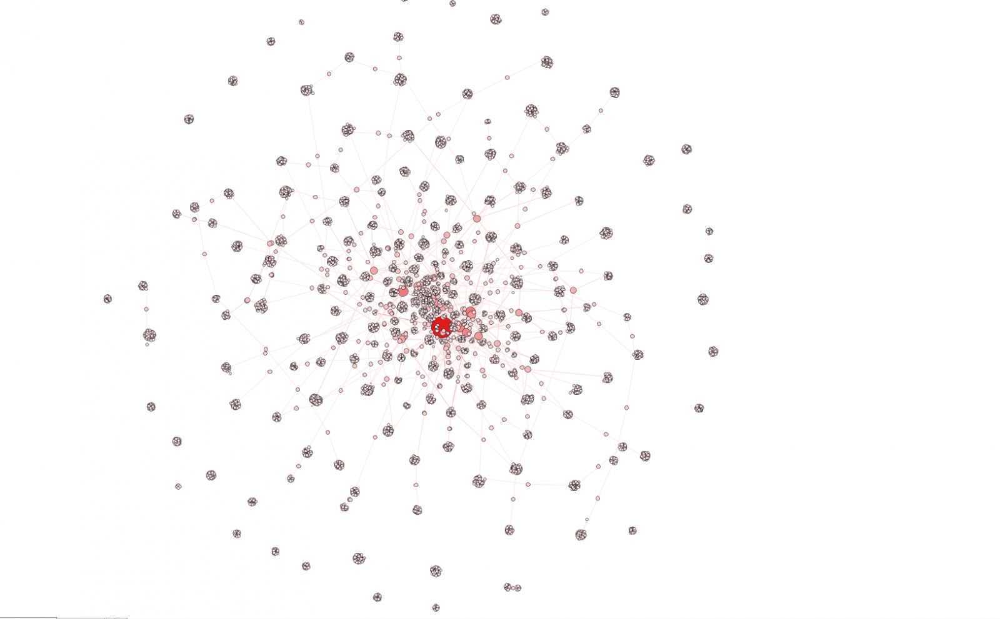

# Week 10
# Data Visualization
### Thursday, April 15, 2021

## Agenda

- What are networks?
- Overview of Altair and interactive visualization tools
- Choose-Your-Own Data Visualization adventure

## Network Analysis

- Networks are all about RELATIONSHIPS 

- Nodes
- Edges

- Important Terms
	- Node Degree
	- "Centrality" 
		- Betweenness Centrality
	- Communities (or Modules)

## The Importance of Clustering

The following 4 images are all from the same dataset of citations in the journal *Comparative Literature* between 2004 and 2014

"Formally, the network is comprised of “nodes” and “edges.” A node represents a single text: one either appearing in the corpus directly (published in Comparative Literature) or one merely referenced in the journal.""

–––Dennis Tenen's "Digital Displacement": https://stateofthediscipline.acla.org/entry/digital-displacement

- What's Weingart's big argument about networks? Should we use them? If not, why?
- What are the important warnings for thinking about NETWORKS with more than one type of node?
- Were there other interesting aspects fo networ
- k analysis?
	- Could you see yourself using network analysis? What might we want to use it for?

## Introduction to Data Visualization in Altair

Visit: https://mybinder.org/v2/gh/sceckert/introdhspring2021/main?urlpath=lab/tree/_week10/interactive-data-visualization-in-altiar.ipynb

STATIC VERSION: https://github.com/sceckert/IntroDHSpring2021/blob/main/_week10/interactive-data-visualization-in-altiar.ipynb

## Choose Your Own Data Visualization Adventure

For the next part of the lesson, you'll choose one of the following

- Mapping: https://mybinder.org/v2/gh/sceckert/introdhspring2021/main?urlpath=lab/tree/_week10/mapping.ipynb
- Network Analysis: https://mybinder.org/v2/gh/sceckert/introdhspring2021/main?urlpath=lab/tree/_week10/network-analysis.ipynb
- Topic Modeling Time Series: https://mybinder.org/v2/gh/sceckert/introdhspring2021/main?urlpath=lab/tree/_week10/topic-modeling-time-series.ipynb

Note for the network analysis crew -- You will have to uncomment NetworkX to run it on the server.

To download the notebooks to your own machines:  the static GitHub versions:

- https://github.com/sceckert/IntroDHSpring2021/blob/main/_week10/mapping.ipynb
- https://github.com/sceckert/IntroDHSpring2021/blob/main/_week10/network-analysis.ipynb
- https://github.com/sceckert/IntroDHSpring2021/blob/main/_week10/topic-modeling-time-series.ipynb

What did you find?
What do you think the other groups should know about the method you learned?