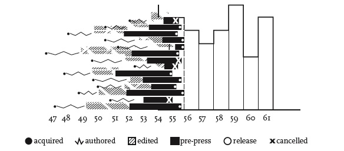

# Week 10

## Agenda
- What is humanities data visualization?
- Discussion of Data Visualization and methods
- Exercise: review what we've learned so far in data visualization

## Data vs. Capta

- What does Joanna Drucker when she distinguishes "data" and "capta"? What's the difference between the two terms? Do we agree?

"Capta is “taken” actively while data is assumed to be a “given”
able to be recorded and observed. From this distinction, a world of
differences arises. Humanistic inquiry acknowledges the situated,
partial, and constitutive character of knowledge production, the
recognition that knowledge is constructed, taken, not simply given
as a natural representation of pre-existing fact." (Drucker)

### Drucker, Humanities Approaches to Graphical Design

What were some of the issues in this kind of chart?

What are the differences between these charts?

What are the differences between these charts? How does this relate to the concept of knowledge as "observer-independent" vs. knowledge as observer co-dependent?

 

- How do Lupi and Drucker compare? (How is Lupi's data "humanism" different from Drucker's?)
- How do each of them handle uncertainty and ambiguity in data visualization?
- It seemed like you all saw difference in the way Lupi and Drucker handled complexity?

Note: 
 - Can all data be represented in this more fluid/abstract style? Does introducing visual ambiguity create the risk of a different type of visual misinterpretation of the ambiguity itself? (SOPHIE)
- Does adding more data and context really aid in humanistic Interpretation( GRANT)
- What would it look like to create a "parallax" view (HIEN)
- Could we think about alternative techniques for visualizing these questions?
	- What about techniques for visualizing undertaintiy and ambiguity? 
	- Some of you brought up the question of CLARITY, and I was really interested in this. Do we think there are issues that come up in trying to visualize complexity? (GRACE, HIEN)

## Data Visualization and Methods

## Exercise: Discussing Data visualizations

In groups, discuss the visualization choices in one of the following:

- Preservation of Favoured Traces (https://fathom.info/traces/)
- Wind Map (http://hint.fm/wind/)
- Dear Data (https://www.dear-data.com/theproject)

## Types of Data Visualizations

https://rawgraphs.io/

## Review exercise: visualization in Python

- Python and pandas in class practicums and homework with VISUALIZATIONS:
	- [Introduction to Python (Continued)](https://github.com/sceckert/IntroDHSpring2021/blob/main/_week4/introduction-to-python-continued.ipynb) | [interactive version](https://mybinder.org/v2/gh/sceckert/introdhspring2021/main?urlpath=lab/tree/_week4/introduction-to-python-continued.ipynb) 
		- Making a simple data visualization
	- [Introduction to Python: Pandas](https://github.com/sceckert/IntroDHSpring2021/blob/main/_week5/python-continued.ipynb) | [interactive version](https://mybinder.org/v2/gh/sceckert/introdhspring2021/main?urlpath=lab/tree/_week5/python-continued.ipynb)
		- Making simple bar and pie charts using pandas data
	- Hunches, Hypotheses, and Exploratory Data Analysis with Pandas
		- [Making simple scatter plots (3 examples)](https://github.com/sceckert/IntroDHSpring2021/blob/main/_week7/exploratory-data-analysis-with-pandas.ipynb) | [interactive version](https://mybinder.org/v2/gh/sceckert/introdhspring2021/main?urlpath=lab/tree/_week7/exploratory-data-analysis-with-pandas.ipynb)
		- Making more complex static scatter plots (scroll down to bottom)
		- Making an interactive scatter plot using Altair
	- Introduction to Topic Modeling, visualizing topic models
		- [Making a heat map to visualize topics in a set of texts](https://github.com/sceckert/IntroDHSpring2021/blob/main/_week9/introduction-to-topic-modeling.ipynb) | [interactive version](https://mybinder.org/v2/gh/sceckert/introdhspring2021/main?urlpath=lab/tree/_week9/introduction-to-topic-modeling.ipynb) (Scroll down to the bottom)

## Review Exercise: visualization 

In groups, look back at data visualizations 

- Group 1:  Hunches, hypotheses, and exploratory data analysis
	- - [Making simple scatter plots (3 examples)](https://github.com/sceckert/IntroDHSpring2021/blob/main/_week7/exploratory-data-analysis-with-pandas.ipynb) | [interactive version](https://mybinder.org/v2/gh/sceckert/introdhspring2021/main?urlpath=lab/tree/_week7/exploratory-data-analysis-with-pandas.ipynb)
-  Group 2: Introduction to Topic Modeling, visualizing topic models
		- [Making a heat map to visualize topics in a set of texts](https://github.com/sceckert/IntroDHSpring2021/blob/main/_week9/introduction-to-topic-modeling.ipynb) | [interactive version](https://mybinder.org/v2/gh/sceckert/introdhspring2021/main?urlpath=lab/tree/_week9/introduction-to-topic-modeling.ipynb)