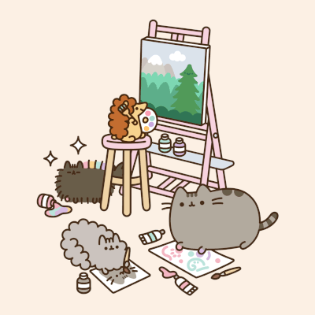

# Week 11

### Thursday, April 22, 2021

## Agenda

- Announcements
- Glitches, ephemerality, and digital memory
	- Discuss Chun and Hill
- Data Preservation
- Final Projects Workshop
	- Part1: Project Brainstorm (by topic in groups)
	- Part 2: Project Clinic (in pairs)

## Glitches, ephemerality, and digital memory

Notes:
- What did you think of Chun's piece? Did you find anything interesting?
- What do we think Chun means when she says that memory is the problem of digital media?
"Digitalmediaisdegenerative,forgetful,
eraseable. Thisdegenerationmakesitbothpossibleandimpossibleforitto
imitate analogmedia.Itisperhapsahistory"
- Memory =/= storage
- What is the "enduring ephemeral"? 
- Were there connections you noticed between Chun's piece and inching else we've read?
- Did anything in Wendy Chun's piece change how you thought about your final project?
- Should DH projects be ephemeral?

## Project Documentation and Data Preservation

- How many of you plan to develop a website or web-component for sharing your project findings?
	- Why did you chose a website?
	- For those of you who didn't, why did you choose not to? 
	- Where will your projects live (and for how long)

- Who is your audience?
- How are you handling 

### What is Project Documentation?

Written material describing the decisions made in the project's life <!-- .element: class="fragment" data-fragment-index="1" -->

Information about: <!-- .element: class="fragment" data-fragment-index="2" -->

- your sources! <!-- .element: class="fragment" data-fragment-index="3" -->
- your research questions! <!-- .element: class="fragment" data-fragment-index="4" -->
- what you did! <!-- .element: class="fragment" data-fragment-index="5" -->
	- your choices (big and small) in dataset curation (and things that changed as a part of the) <!-- .element: class="fragment" data-fragment-index="6" -->
	- your choices (big and small) in how you analyzed your data (and interesting observation) <!-- .element: class="fragment" data-fragment-index="7" -->
	- your choices (big and small) in how you visualized or shared your findings <!-- .element: class="fragment" data-fragment-index="8" -->
	- your choices (big and small) in how you preserved your project <!-- .element: class="fragment" data-fragment-index="9" -->
- what you found! <!-- .element: class="fragment" data-fragment-index="10" -->
- what your audience should know/do with the findings! <!-- .element: class="fragment" data-fragment-index="11" -->

Note:
As we move into the last stages of the final projects, you should be thinking about project documentation. Think of project documentation as a kind of how to guide––somewhere between a data biography and a close reading of your own choices in the project. 

## Final Projects Workshop

### 

### Part 1: Documenting Your Project
Imagine someone were to drop into your desktop folder containing the working files for your final project. What would they need to know to understand your project? What questions might they have?

YOUR TASK: 1) Select ONE PART of the final project that you're working on (data collection, analysis, or visualization and communication). 2) Join the matching breakout room. 3) Take 20 minutes, work on developing this part project into a form that you might be able to share (something we'll do in Part 2). It could take the form of a snippet of code, a marked up Jupyter notebook, a CSV and data dictionary, a visualization with annotations––just make sure that it's some concrete aspect of the project. Feel free to use your breakout room-mates as a resource.

- Room 1: Data Collection and Curation (data cleaning, web-scraping, etc)
- Room 2: Data Analysis  (pandas, text analysis, topic modeling, etc)
- Room 3: Data Visualization, Communication, and Preservation (data viz, jupyter notebooks, websites, git, GitHub)

Note:
You can use this time however you want, but the goal is to produce something CONCRETE that you'll be able to walk a partner. It can be something from  Think about what some would need to know if they were to stumble on your project working files.

### Part 2: Project Clinic (in pairs or groups of 3)
### 

1.  In your breakout rooms, share what you developed in Part 1
2.  Partners: your job is to give feedback on the work in progress:
	- How much context is given for the project?
	- What questions do you have about the research question? About the methods and choices?
	- What aspects are interesting? Are there other directions (in analysis, visualization, discussion) that the project could expand on?
	- What aspects aren't clear (and could be made clearer)?
