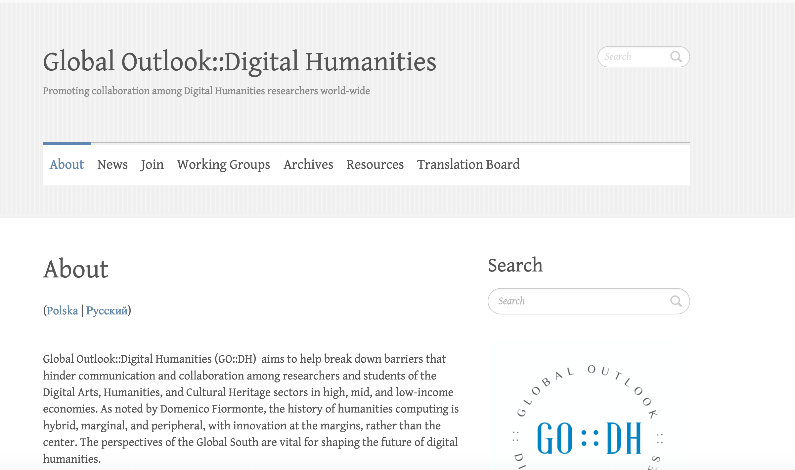
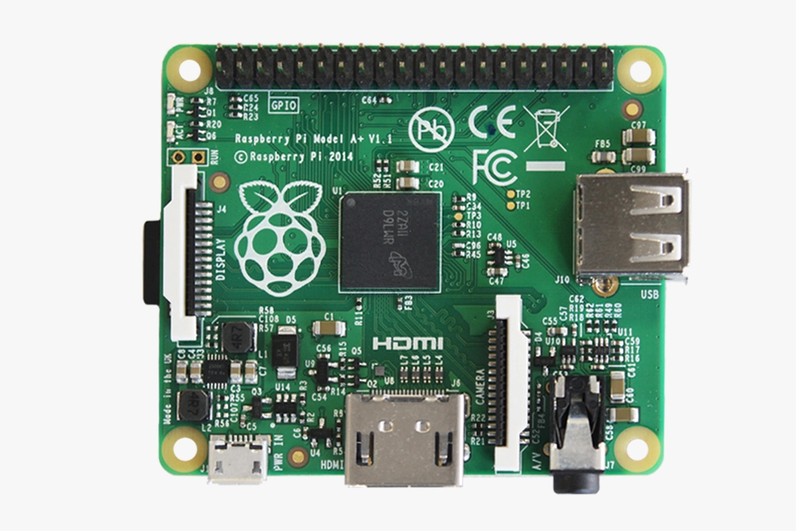
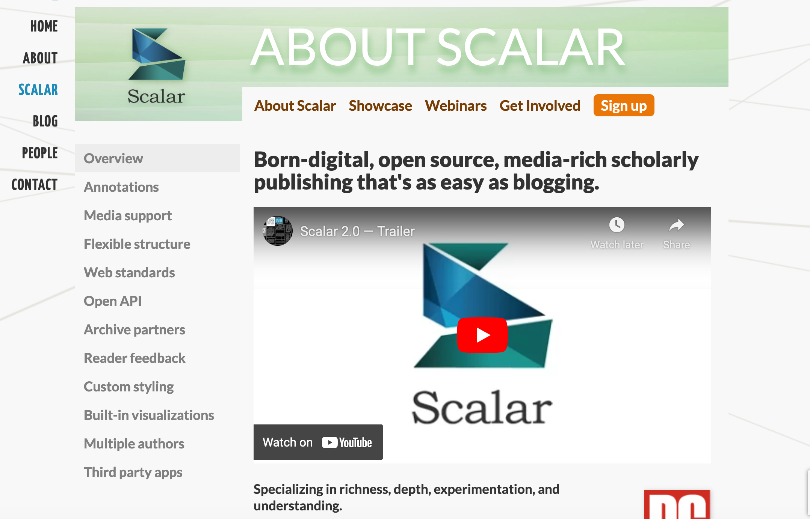
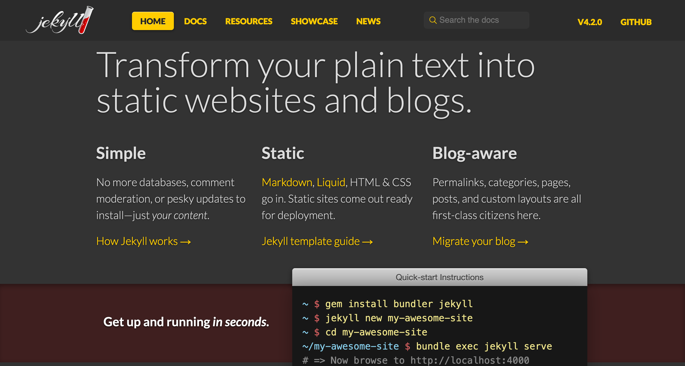
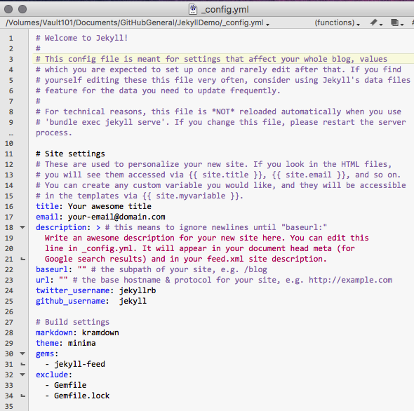
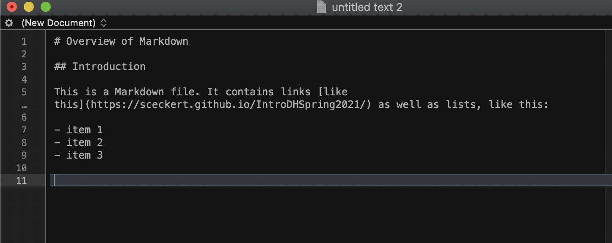
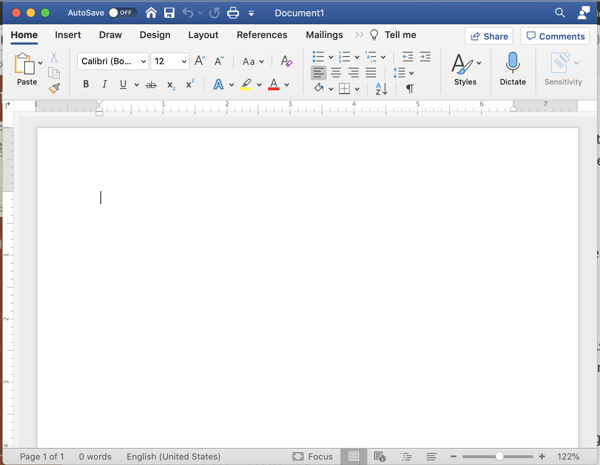

# Week 11

### Tuesday, April 20 2021

## Agenda

- What is minimal computing?
	- What does access look like in the world of DH?
	- What does sustainability look like?
	- What does it mean to do "local" DH? 
	- We'll think about what this means in the context of our own work
- Project clinic
- Quick overview of the guidelines for your project presentations next week 

Note:
This week is about *work* and about the infrastructures of DH. We'll be thinking about it in the context of the readings we did for today and our projects

## What is minimal computing?

Note:
Elika Ortega, Prof at UC colorado and Alex Gil, a DH librarian at Columbia are the others of this piece and some of the cofounders of Global Outlooks in DH founded in 2013 at the big international DH conference

## What is minimal computing?

- minimal design <!-- .element: class="fragment" data-fragment-index="1" -->
- minimal consumption & use <!-- .element: class="fragment" data-fragment-index="2" -->
- minimal maintenance <!-- .element: class="fragment" data-fragment-index="3" -->
- minimal obsolesce <!-- .element: class="fragment" data-fragment-index="4" -->
- minimal barriers (technological, cultural, social and economic) <!-- .element: class="fragment" data-fragment-index="5" -->

Note:
- Can we think of instances where some of these values might be in conflict?
- How does the idea of minimal connect or diverge from ideas in Crawford and Joler's piece?

Scalar vs Jekyll

For more, see: https://programminghistorian.org/en/lessons/building-static-sites-with-jekyll-github-pages

Plain text vs. proprietary

For more on authorship in plain text, see: https://programminghistorian.org/en/lessons/sustainable-authorship-in-plain-text-using-pandoc-and-markdown

Note:
Why plain text?  "user-friendly interfaces"Even though word or googledogcs shows you a mockup of what you're writing as it is typeset "When you use MS Word, Google Docs, or Open Office to write documents, what you see is not what you get. Beneath the visible layer of words, sentences, and paragraphs lies a complicated layer of code understandable only to machines. Because of that hidden layer, your .docx and .pdf files depend on proprietary tools to be rendered correctly. Such documents are difficult to search, to print, and to convert into other file formats. "

- minimal design <!-- .element: class="fragment" data-fragment-index="1" -->
- minimal consumption & use <!-- .element: class="fragment" data-fragment-index="2" -->
- minimal maintenance <!-- .element: class="fragment" data-fragment-index="3" -->
- minimal obsolesce <!-- .element: class="fragment" data-fragment-index="4" -->
- minimal barriers (technological, cultural, social and economic) <!-- .element: class="fragment" data-fragment-index="5" -->

## What does accessibility look like in DH?

- Do we think accessibility means writing in minimal computing ways (like plain tex)? 
- Or do we think accessibility should be question of barriers to entry? Internet accessibility? Storage preservation?
- How does the piece we read by Crawford and Joler complicate this question?

Note:
- JOSE PABLO:  how can we marry the goal of minimal computing with the leading edge of digital humanities work without sacrificing too much of one or the other? What is the appropriate balance we should strive to achieve between these seemingly at odds things?
- AMBER: how do we prerserve local networks?
What do we do if some of these values are in tension

## What does sustainability look like in DH?

Note:
- A number of you were interested in this question: 
	- SOPHIE: Can anything be done to inject a sense of digital sustainability into people's relationship with technology, just as many have attempted to do with plastic use, food waste, and other pressing environmental concerns? Will people be willing to give up some of this newfound convenience of semi-automation for the sake of the seemingly abstract preservation of resources? [SOPHIE]
	- KAI: For an action as simple as turning on a light, will there ever be a way to automate this action that requires less net work than simply physically flipping a switch? 
	- GRANT: I wonder if there is a way to allow individuals to still maintain control of the data that is sourced from them?
	- DAVID: What are the implications of such a system?
	- HIen: I'm conflicted about whether some of these demonstrably negative (and should definitely be remedied) issues are ought to happen, as they're also offering a degree of good to the world 

## What does it mean to think about DH in local, regional and globe contexts?

https://arounddh.org/

https://ticha.haverford.edu/en/

- Can we think of examples of local DH projects?
- How does the piece we read by Crawford and Joler complicate this question?

Note:
- AMBER: how does DH maintain accessibility?
I noticed one of the questions about the Crawford and Joler piece taking 
What does it mean for us to learn DH method remotely

## What does this mean for our work and projects?

### Project Clinic 
#### 

1.  Write down one question or issue that you're grappling with in your project. 

2. With your breakout room partner, take 10 min to share & brainstorm ways to address each question/problem area <!-- .element: class="fragment" data-fragment-index="1" -->

Note:
- The questions/problems can be technical (I'm having trouble manipulating data in pandas) or methodological (am I asking the right kinds of questions about this data? Could I visualize this better?), or scope (I'm not sure what the best forum for sharing this project is)
- In responding to your partner's question/issue, you don't need to *solve* the problem for them. 
You can think about helping your partner clarify their project's goals and scope, or develop realistic schedule for the work that they'll have to do. 

## Final Project Presentations

### What to prepare:

- A 7-10 minute presentation covering:
	- overview of your research question
	- the dataset(s) that you're working with
	- the methods you used (and why you chose them)
	- your results (and anything else that came up along the way)
	- your intended audience
	- the larger stakes of the project
	- what you're still working on (and why)
	- any future directions for this project