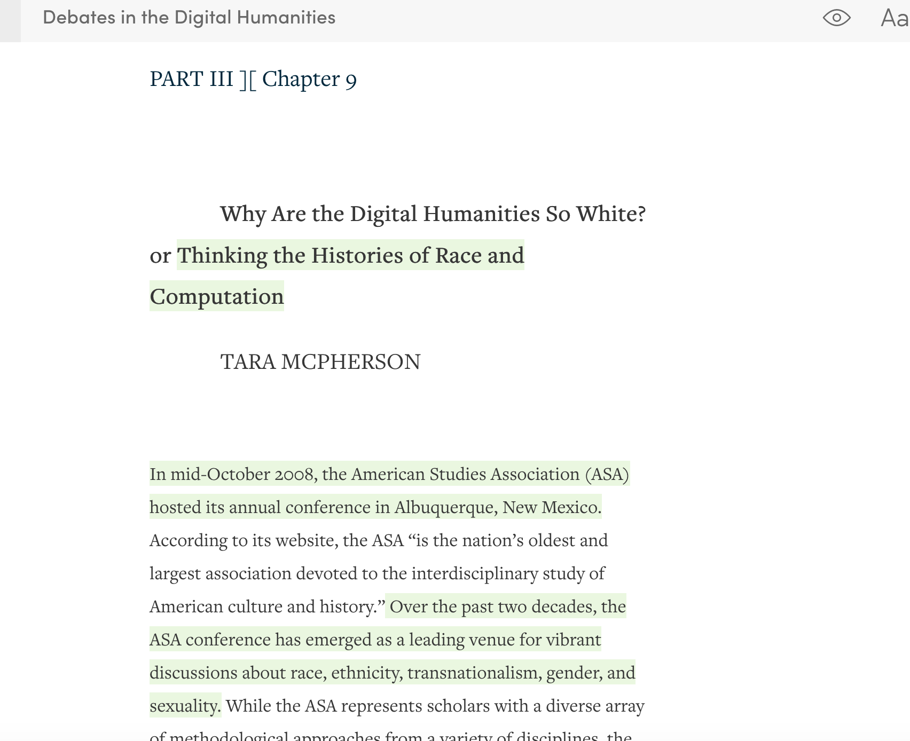
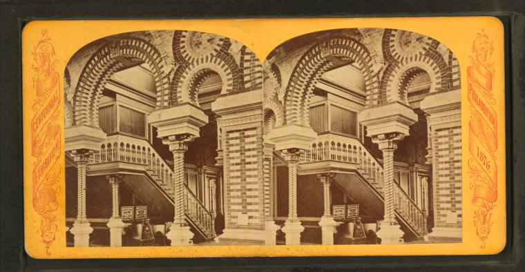
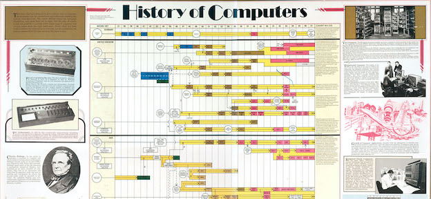
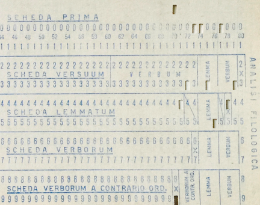
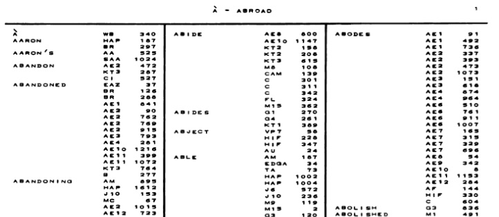
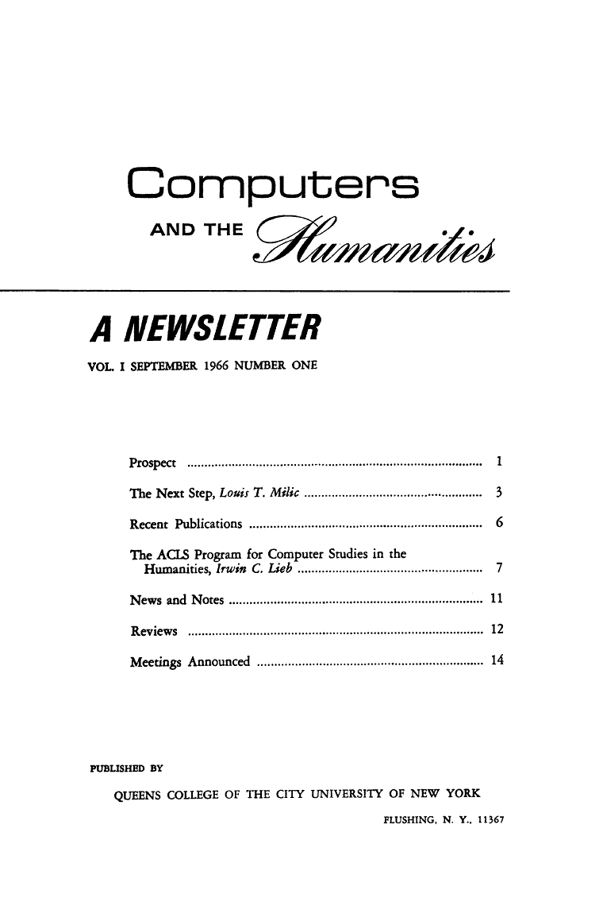

# Origins and Histories of Digital Humanities

## Agenda

- Cultures of Computation
	- Tara McPherson, "Why Are the Digital Humanities So White?: Thinking the Histories of Race and Computation" (2012)
	- Another Perspective: Computation as Material Infrastructure
- Thinking about Computation in 1966
- A Brief History of Humanities Computing
- Threads & connections + preparing for Thursday 

## Picking up from last class

- What is data in the humanities?<!-- .element: class="fragment" data-fragment-index="1" -->
- Computation < --- Culture <!-- .element: class="fragment" data-fragment-index="2" -->
- Computation  ---- > Culture<!-- .element: class="fragment" data-fragment-index="3" -->

## Cultures of Computation
Tara Mcpherson's "Why are the Digital Humanities So White?: Thinking the Histories of Race and Computation" (2012)

- What is McPherson's argument? How does she support it? <!-- .element: class="fragment" data-fragment-index="1" -->
- What historical trends does she explore?<!-- .element: class="fragment" data-fragment-index="2" -->
- What terminology did McPherson use? What is the idea of modularity?<!-- .element: class="fragment" data-fragment-index="2" -->

### **Lenticular**....  vs .... **Stereoscopic**

 

"In short, I suggest that these two moments are deeply interdependent. In fact, they coconstitute one another, comprising not independent slices of history but instead related and useful lenses into the shifting epistemological registers driving U.S. and global culture in the 1960s and after.

Might we ask whether there is not something particular to the very forms of electronic culture that seems to encourage just such a movement, a movement that partitions race off from the specificity of media forms?" (McPherson)

*UNIX philosophy, according to Eric Raymond:*

Rule of Modularity: Write simple parts connected by clean interfaces.

Rule of Clarity: Clarity is better than cleverness.

Rule of Composition: Design programs to be connected to other programs.

Rule of Separation: Separate policy from mechanism; separate interfaces from engines.

Rule of Simplicity: Design for simplicity; add complexity only where you must.

Rule of Parsimony: Write a big program only when it is clear by demonstration that nothing else will do.

Rule of Transparency: Design for visibility to make inspection and debugging easier.

Rule of Robustness: Robustness is the child of transparency and simplicity.

Rule of Representation: Fold knowledge into data so program logic can be stupid and robust. 

- How does McPherson's vision for DH converge/diverge with Rosenberg's vision? Or from Rickert's?
- What lingering questions are you left with about the piece?

### Another Perspective: Thinking about Computation

From Brian Kernighan's *D is for Digital* (2012)

"We don't see and usually don't think about the computers that lurk within appliances, cars, airplanes and the pervasive electronic gadgets that we take for granted — cameras, video recorders, DVD players, tablets, GPS navigators, games."

"The pervasive nature of computing affects us in unexpected ways. Although we are from time to time reminded of the growth of surveillance systems, incursions into our privacy, and the perils of
electronic voting, we perhaps do not realize the extent to which they are enabled by computing and communications."

"The purpose of this book is to remove any vestige of magic, so you understand how such systems operate" 

- Kernighan's approach to material format of computational media: "A disk is a good example of the difference between logical structure and physical implementation. We see disk contents organized as a hierarchy of folders and files when we run a program like Explorer in Windows or Finder in Mac OS X. But the data is stored on rotating machinery, integrated circuits with no moving parts, or something else entirely. The particular kind of “disk” in a computer doesn't matter. Hardware in the disk itself and a significant part of the operating system called the file system create the organizational structure." <<!-- .element: class="fragment" data-fragment-index="2" -->

### Thinking about Computation in 1966

Louis Milic, "Next Steps," first issue of *Computers and the Humanities* (1966)

- How does Milic talk about computing?
- How does Milic's vision of computing in the 1960s compare to McPherson's? 

## Timelines of Computing

- History of Computers, from the Science Museum, London 1975

- History of Computing Timline from Intel Corp., circa 2009

## A (Very Brief) History of Humanities Computing

- 1951: Father Busa + his team of punchcard operators work on the *Index Thomisticus*  in a partnership with IBM

 

- 1957 Josephine Miles + her team of women graduate students created massive concordances of Dryden's poetry--  Electrical Engineering department at Berkeley, and contracting with their computer lab and its IBM tabulation machine

- 1966 *Computers and the Humanities* founded

- 1970s: Work in statistical history, literary style, development of humanities programming languages like SNOBOL

- 1980s/1990s Another branch; web-based platforms for sharing collections of texts, images and scans of primary documents

Oxford Text Archive, founded in 1978 by Susan Hocky and Lou Burnay

Perseus Project, started 1985

Valley of the Shadow, 1993

Blake Archive, 1996

- Text Encoding Initiative, founded 1987

- 1990s/200s: centers founded, like MITH and CHNM
	- Example: the two centers McPherson talks about
		- Maryland Institute for Technology in the Humanities 
		- The Roy Rozenrweig Center for History and New Media

So what? Why should we care about this history?

## Wrap-up

