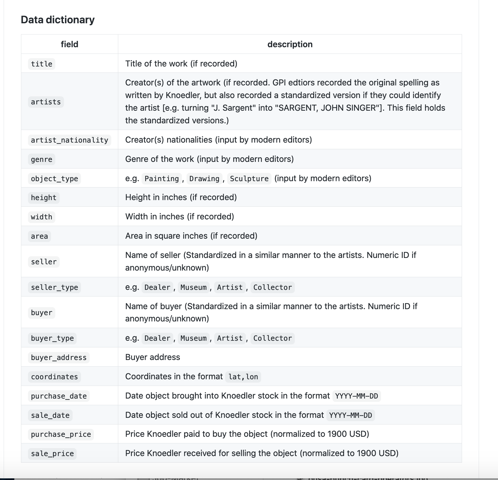

# Introduction to Metadata (and Python)

## Agenda

- Warm-up: Working with humanities data in spreadsheets
	- Exercise #1
- What IS metadata?
	- Exercise #2
- Putting it together: Using metadata to explore a dataset in Python
	- Exercise #3

### Working with Humanities Data in Spreadsheets

- We need neatly structured data to perform quantitative analysis of texts
- But humanities data are often WAY messier and more complicated!

[We saw this last class with classifications!]

### What we learned from our reading:

- How to structure spreadsheets
	- One variable per column
	- One observation per row
	- Be consistent
	- Choose clear names for your fields
	- Create "data dictionaries"

But you could probably guess, this can be difficult

### Uncertainty, Messy Data, Missing Data

Dealing historical and cultural objects means dealing with uncertainty and missing data 

So what do we do?

DO: 

- Choose categories that matter for YOUR research question
- Record what you know about what you don't know
- Make a vocabulary for recording uncertain categories: 
	- missing, illegible, approximated
- Add a column for context! 
	- Ex: you might have a column called `date` and a column called `date uncertainty`, where you might record the level of uncertainty
- Include a general "notes column"
- Create "data dictionaries" explaining what your fields (your column labels) mean and how they were deprived

DON'T

- Just leave fields blank
- Use different ways of indicating precision
- Be imprecise about what
	- Ex: including a column called `uncertainty` -- tell us what

Example:

### Exercise #1 

The Evelyn College Course Catalogue (1890-1897)

- Link to the facsimile of the catalogue:  https://bit.ly/2ZrhSJk 
- Group 1:  https://tinyurl.com/5cotzuob
- Group 2: https://tinyurl.com/3obrj5jg

Working in groups, draft a data scheme for encoding this series of seven course catalogs. Record the scheme on the Google spreadsheet for your group. As you work, think about the following:

- What do we do with information that is present in one catalogue, but not in others?
- What are the different ways we could categorize this curricular information?

## What *is* Metadata?

Metadata is “data about data.”

Metadata can tell us

- Who created the data
- What the data file contains
- When the data were generated
- Where the data were generated
- Why the data were generated
- How the data were generated

Note:
We've encountered metadata before! Remember ls -lh from the Introduction to Bash Command Line Tutorial? This showed us information about the file.

Metadata can be embedded within files, like this XML file:

Or it can look more like a spreadsheet:

It can look like the machine-readable catalog record:

We also encounter metadata in the wild

Metadata is structured.

| Metadata type | Example fields |
| --- | --- |
| Descriptive | Title, Author, Subject, Genre, Publication date |
| Technical | File type, File size, Creation date/time |
| Rights | Copyright status, License terms, Rights holder |
| Provenance | Owner, Institutional repository, Location |

### Exercise #2: Data Dictionaries

Look at the following data dictionary that Matthew Lincoln created. It's a small subset of 4,100 sales by the fine art dealer M. Knoedler & Co. between roughly 1870-1970, as documented in data encoded from the handwritten stockbooks by staff at the Getty Provenance Index. 

[https://github.com/mdlincoln/mapping-knoedler-palladio#data-dictionary](https://github.com/mdlincoln/mapping-knoedler-palladio#data-dictionary)

[https://github.com/mdlincoln/mapping-knoedler-palladio#data-dictionary](https://github.com/mdlincoln/mapping-knoedler-palladio#data-dictionary)

1. This dataset was create from 21st century editors who were transcribing from handwritten books (much like you did with the print catalogs). What kinds of choices did the editors make? How could it affect the kinds of questions we can responsibly ask you about this data?
2. Are there other things you notice that might be mediating our data?
3. What about all of those "(if recorded)" notes? How might that change the kinds of question we can ask?

## Putting it together: Using metadata to explore a dataset in Python

## Exercise #3

- Navigate to: https://tinyurl.com/1kgqgic1

Full link: https://mybinder.org/v2/gh/sceckert/introdhspring2021/main?urlpath=lab/tree/_week3/introduction-to-metadata.ipynb 

