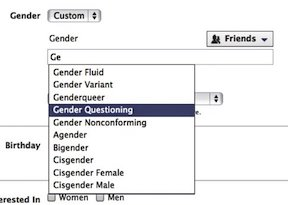
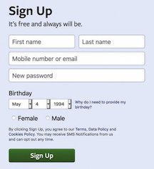
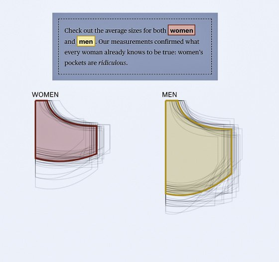
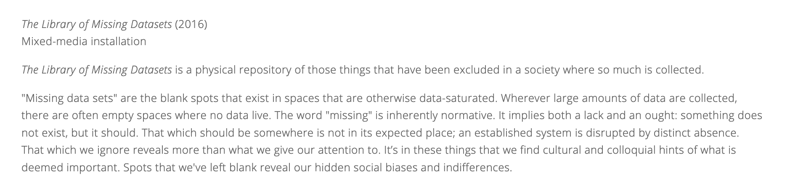
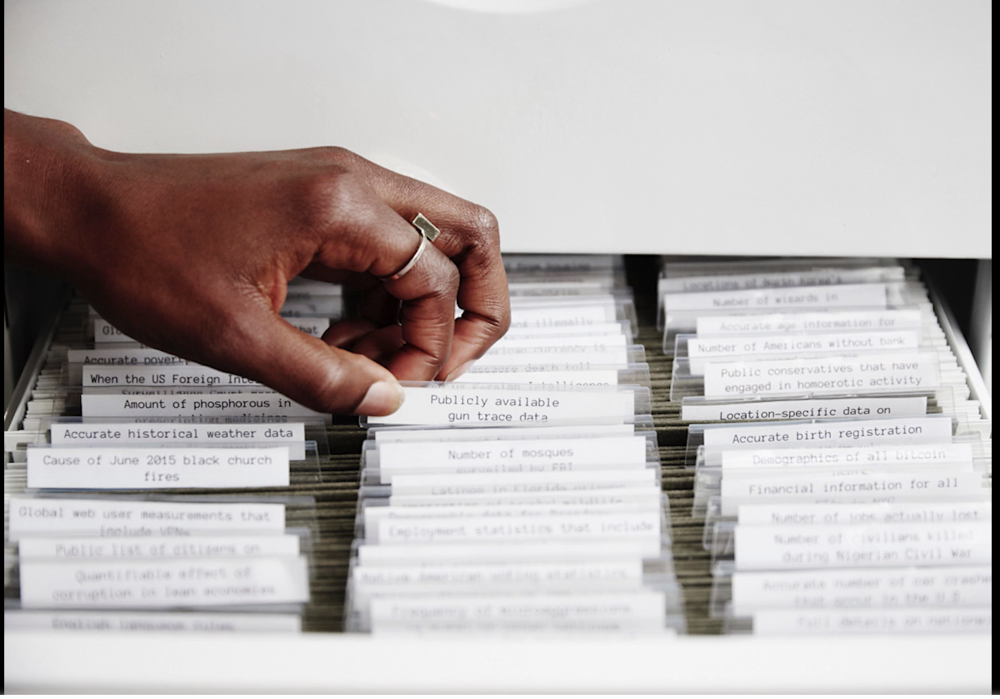
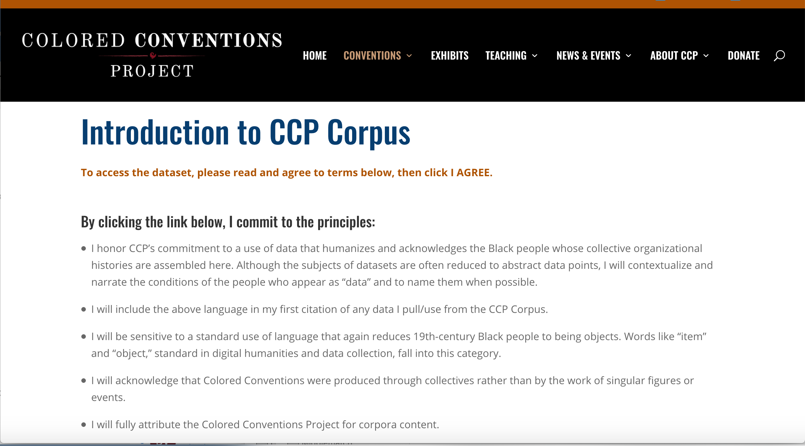

## "What Gets Counted Counts" 

  
Left to Right: Facebook  signup page 2014, 2018, and 2021.

"The ethical complexity of whether to count gender, when to count gender, and how to count gender illuminates the complexity of acts of classification against the backdrop of structural oppression. Because when it comes to data collection, and the categories that structure it, there are power imbalances up and down, side to side, and everywhere in between." (111; 15 in PDF)

## "What Gets Counted Counts" <!-- .element: class="fragment" data-fragment-index="1" -->
## <s>"What Gets Counted Counts" </s> <!-- .element: class="fragment" data-fragment-index="2" -->
## Counting what & who counts (and for whom) <!-- .element: class="fragment" data-fragment-index="3" -->

"Flawed classification systems" can be read as "symptoms of a more global condition of inequality. " (D'Ignazio and Klein 106)

- What does a category or classification system tell us about INDIVIDUALS? (Very little )
- What does a category or classification system tell us about SYSTEMS? 

- What are the things––sometimes strange things–– that result from modes of collection?  <!-- .element: class="fragment" data-fragment-index="1" -->
- What do they tell us about the modes of collection? <!-- .element: class="fragment" data-fragment-index="2" -->
- What implications does this have?  <!-- .element: class="fragment" data-fragment-index="3" -->

“Someone Clever Once Said Women Were Not Allowed Pockets,” The Pudding (2018). Visualization by Jan Diehm and Amber Thomas for The Pudding.

## The Pudding
### datasets in data journalism

https://github.com/the-pudding/data

## Mimi Onuoha's "Missing Data"

### "What Gets Counted Counts"... for whom?

 
Colored Conventions Project, introduction to corpus landing page
https://coloredconventions.org/about-records/ccp-corpus/

### Data Collection in Introduction to DH

- What orientations toward data collection would *we* like to adopt or experiment with as a class?
