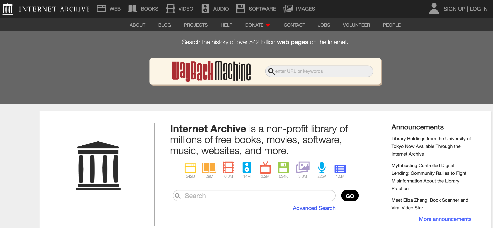
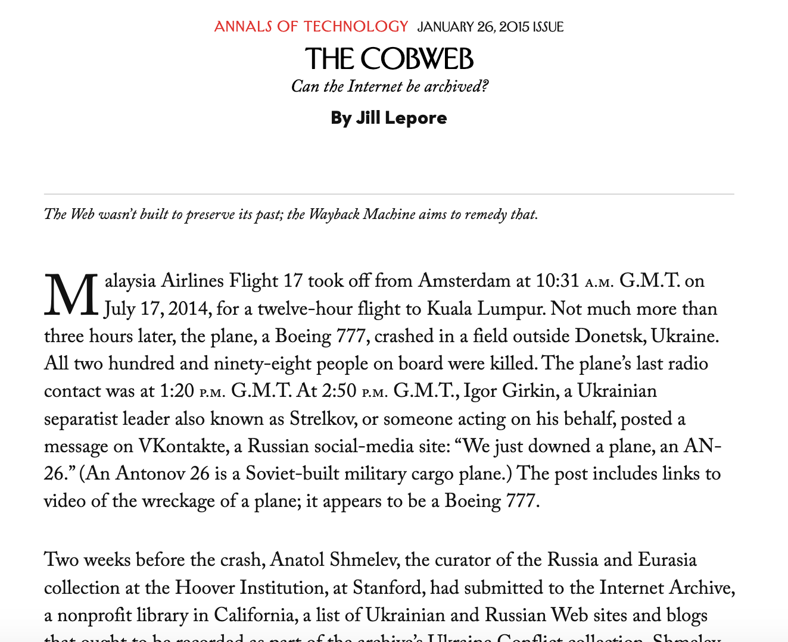
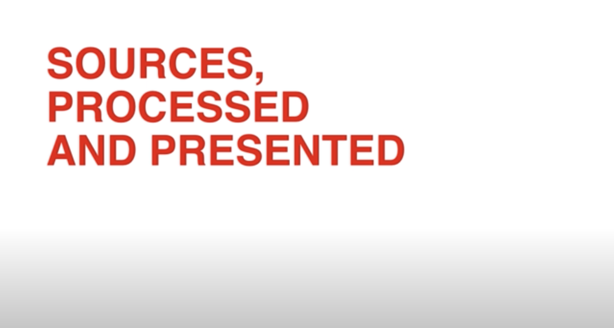

# Week 5: What is a DH Project?

## Agenda

- What is a DH Project
	- Some approaches: Reverse-engineering and Reviewing
	- Example Projects
- Introduce: Data Bibliography & DH Review Assignments
- DH RESEOURCE GUIDE
- Mini-tutorial: mapping in Python

## What is a Digital Humanities Project?

- What is a Digital Humanities 

## Preservation 

## Example Projects

Was there anything particularly striking that you found? 

Particular issues? Or interesting choices in the sources, processing or presentation methods?

## Data Biography & DH Project Review

Data Biography: Due 3/4
[https://github.com/sceckert/IntroDHSpring2021/blob/main/_assignments/data-biography-assignment.md](https://github.com/sceckert/IntroDHSpring2021/blob/main/_assignments/data-biography-assignment.md)

[https://github.com/sceckert/IntroDHSpring2021/blob/main/_datasets/datasets.md](https://github.com/sceckert/IntroDHSpring2021/blob/main/_datasets/datasets.md)

DH Project Critique
Due 3/11 2-3 pages

- Format of your DH project review: (based on  *Reviews in DH*)
	- a brief summary of the project and its purpose
	- an assessment of the humanistic claims and evidence
	- an assessment of the technology used/developed
	- an assessment of the project methods (what are their sources, processing methods, presentation methods? How is this information documented or shared? Who is involved in the project?)
	- an evaluation of the project: how does it achieve its goals (ex, engaging new audience, offer a new methodology for comparative literature, creating a new dataset–here you'll want to think about the project on its own terms)
	- a discussion of interesting, outstanding or problematic issues in the project

## DH RESOURCE GUIDE

[https://docs.google.com/document/d/1wlaNrM2EcraY3Qqh_Uxr3RI53e01iH_GtAmFnZyMHJY/edit#](https://docs.google.com/document/d/1wlaNrM2EcraY3Qqh_Uxr3RI53e01iH_GtAmFnZyMHJY/edit#)

## Mini-Tutorial: Make simple data visualizations in python