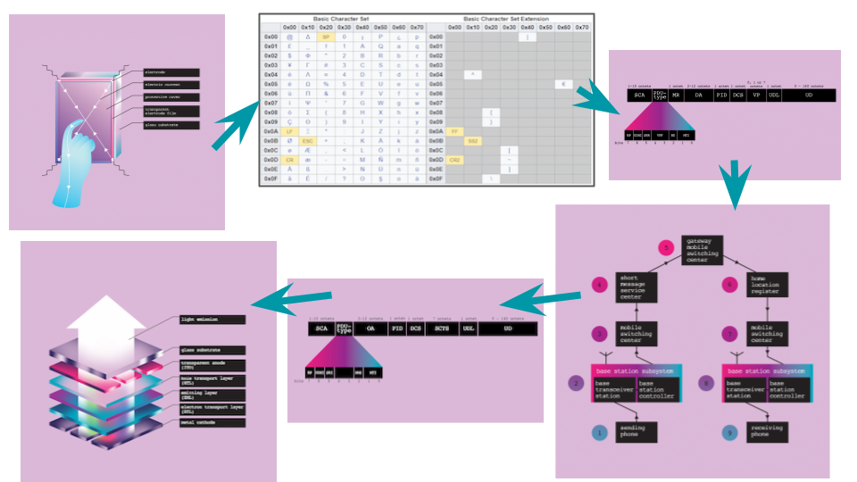
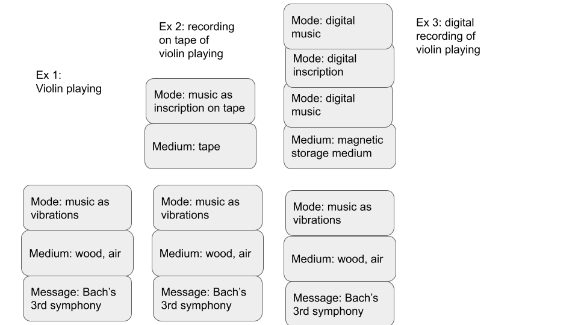

# Week 6

## Analog, Digital
**John Haugland, "Analog and Analog" (1981)**

Examples of "digital devices"": Arabic numerals, abacuses, alphabets, electrical switches, musical notation, poker chips and (digital) computers.

"All digital devices involve some form of *writing* and then *reading*..."  
(Haugland 214) 

“the write procedure produce a token and the read procedure correctly identify that token” (Haugland 215 )<!-- .element: class="fragment" data-fragment-index="1" -->

### The Materiality of Information

"The information we want to represent is intimately linked to how it is stored. We can no longer separate the two." 
-- Aditya Mukerjee, "I Can Text You A Pile of Poo, But I Can’t Write My Name"

## Universal Language
Ramon Llul, 14th c. Catalan mystic & philosopher

 
Figure X. Ars compendiosa inveniendi veritatem XV Century. Palma, BP, 1031. Digital version Biblioteca Virtual del Patrimonio Bibliográfico. Spain. Ministerio de Educación, Cultura y Deporte.

First Figure. Ars brevis XVIII Century. Palma de Mallorca BP MS998. Digital version Biblioteca Virtual del Patrimonio Bibliográfico. Spain. Ministerio de Educación, Cultura y Deporte.

### Materiality of Textual Artifacts
**N. Katherine Hayles, "Print is Flat, Code is Deep: The Importance of Media-Specific Analysis " (2004)**

Media-specific analysis of analog AND digital texts

"[Materiality] is not merely an inert collection of physical properties but a dynamic quality that emerges from the interplay between the text as a physical artifact, its conceptual content, and the interpretive activities of readers and writers. Materiality thus cannot be specified in advance; rather, it occupies a borderland—or better, performs as connective tissue—joining the physical and mental, the artifact and the user."
-- N. Katherine Hayles, "Print is Flat, Code is Deep"

### Medium, Mode, Message

## Where does materiality stop?
#### From Scott Weingart's "The Route of a Text Message"
"In displaying everything but my wife’s text message, and letting me read it in the gaps, my phone succinctly betrays the lie at the heart of the information age: that communication is simple. **Speed and ease hide a mountain of mediation**."

"And that mediation isn’t just technical. My wife’s text wouldn’t have reached me had I not paid the phone bill on time, had there not been a small army of workers handling financial systems behind the scenes. Technicians keep the phone towers in working order, which they reach via a network of roads partially subsidized by federal taxes collected from hundreds of millions of Americans across 50 states. Because so many transactions still occur via mail, if the U.S. postal system collapsed tomorrow, my phone service would falter. Exploited factory workers in South America and Asia assembled parts in both our phones, and exhausted programmers renting expensive Silicon Valley closets are as-you-read-this pushing out code ensuring our phones communicate without interruption."

Ex: Kate Crawford and Vladan Joler, "Anatomy of an AI System" (2018) https://anatomyof.ai/
