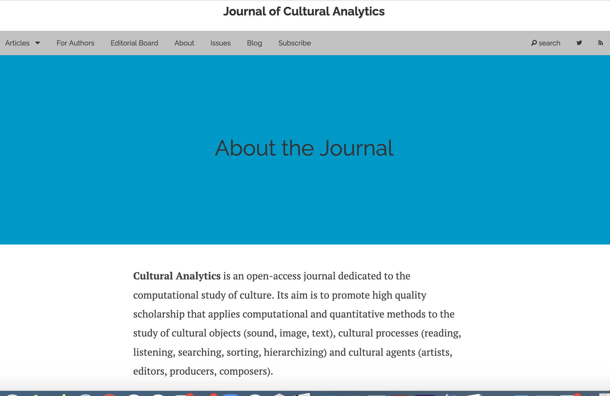
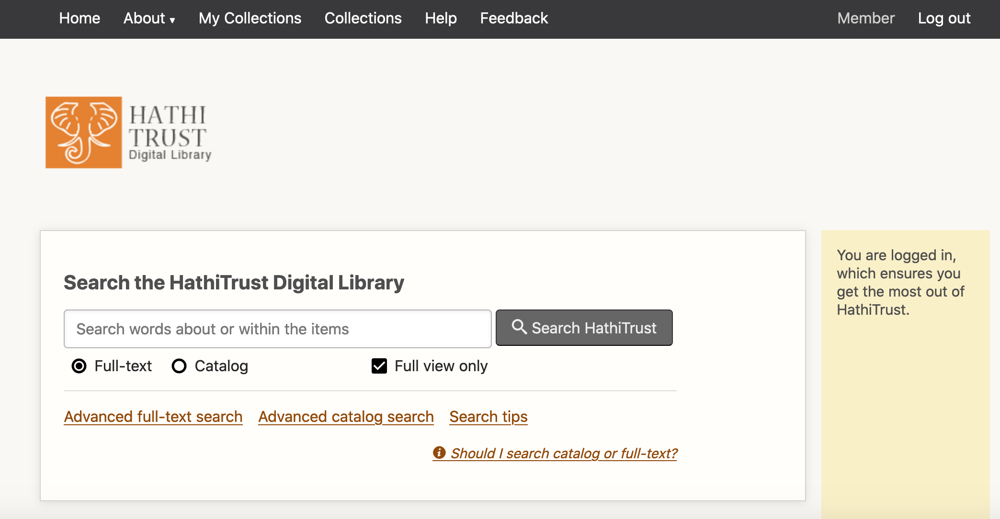
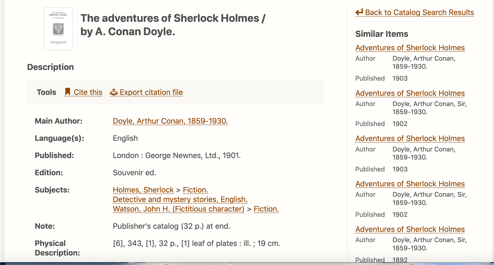

# Week 8

## Agenda

- What is cultural analytics? What is distant reading? What is text analysis 
- Discuss various methods of text analysis  
- Discuss Ted Underwood concept of "perspectival modeling"
- Discuss the "Life of Genres" -- what we thought worked/didn't work
- Go over the guidelines on Final Project Proposals

### What is Cultural Analytics? 

## What is "Distant Reading"?

Distant reading = in early 2000s, used to describe methods of canon recovery (a way to study the works now unread) and as a way to study world literature (by reading works of secondary criticism on, say, the novel in Italy, the novel in Nigeria)

"Distant reading is simply a new scale of description." (Underwood xvii)<!-- .element: class="fragment" data-fragment-index="1" -->

"The point of distant reading is not to recover a complete archive of all published works but to understand the contrast between samples drawn from different periods or social contexts" (Underwood xx)<!-- .element: class="fragment" data-fragment-index="2" -->

### What is Text Analysis?

(From Underwood, "Seven Ways Humanists are Using Computers to Understand Texts" (2015))

1. Visualize a single text (ex: Randall Munroe's infographics of movie plots)<!-- .element: class="fragment" data-fragment-index="1" -->
2. Choose a few features or words (ex: Google Ngram Viewer)<!-- .element: class="fragment" data-fragment-index="2" -->
3. Identify distinctive vocabulary (ex: Matt Lavin's use of tf-idf to study the most distinctive words in a collection of  NYTimes historic obituaries)<!-- .element: class="fragment" data-fragment-index="3" -->
4. Find or visualize relationships between works (ex: Natalie Houston's networks of connections between poets and publishing houses, maps visualizing references to places or places of publication)<!-- .element: class="fragment" data-fragment-index="4" -->
5. Model literary forms or genres [supervised] (ex: Francesca Benatti and Justin Tonra's stylistics analysis of anonymous authored 19th-century literary reviews)<!-- .element: class="fragment" data-fragment-index="5" -->
6. Model social boundaries [supervised] models (ex: Ted Underwood and Jordan Seller's model of what poetry was reviewed in elite periodicals)<!-- .element: class="fragment" data-fragment-index="6" -->
7. Unsupervised models (ex: Micki Kaufman's use of topical modeling algorithms to organize the text of Kissinger papers by finding clusters or patterns of words that appear together.)<!-- .element: class="fragment" data-fragment-index="7" -->

https://tedunderwood.com/2015/06/04/seven-ways-humanists-are-using-computers-to-understand-text/

### Text Analysis in DH

Let's turn to Underwood's "Preface" to *Distant Horizons*

- What is "perspectival modeling"?
-  How does it compare to other ways of thinking about humanities data? 

### Text Analysis in DH

- What is Underwood's argument in "The Life Spans of Genres"? <!-- .element: class="fragment" data-fragment-index="1" -->
- How does he layout his analysis?<!-- .element: class="fragment" data-fragment-index="1" -->
-  What findings does he describe? <!-- .element: class="fragment" data-fragment-index="2" -->
-  What text analysis method does he use? <!-- .element: class="fragment" data-fragment-index="3" -->
-  Did you find his argument compelling or not? <!-- .element: class="fragment" data-fragment-index="4" -->

### Perspectives on "perspectival modeling"

### Or: Decolonizing Distant Reading

- Think back to Roopika Risam's essay we read last week on the digital cultural record. How might Risam's point about the uneven distribution of digital cultural record complicate some of these methods?

In small groups, discuss the short excerpt from Katherine Bode's review of *Distant Horizons*: 
- Link to excerpt: https://bit.ly/31wSUJz
- How does Bode's approach to "perspective" compare to Underwood's? What other points does she bring up?
- Do we agree with her argument?

### Final Project Proposal 

The final project proposal is the first stage of the project. It will take the form of a short write-up that will clearly and concretely describe your questions, data, methods and plan for the next few weeks.

- What are your initial research questions?
- What scholarship does your research draw upon and further? (This could be digital humanities scholarship, or broader questions in relevant humanities fields)
- How you will translate your research questions into hypotheses?
- Which methods and datasets do you plan to use?
- How do you plan to communicate your results? 

This write-up should be **2-3 pages** and should lay the groundwork for the project, including a **timeline** to completion and **how you plan to divide the work** required to make the project.

NOTE: "Project" is deliberately left open-ended. Your project's "results" could be preliminary exploratory data analysis and your communication forum could be a visualization or a poster (or a simple GitHub website). We'll be learning how to set up and use git-hub for doing collaborative analytical work on your projects and for sharing your results.