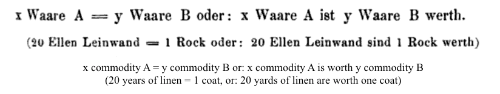
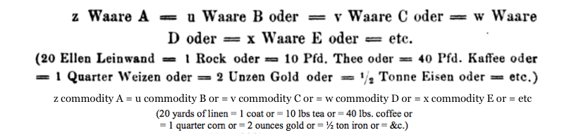
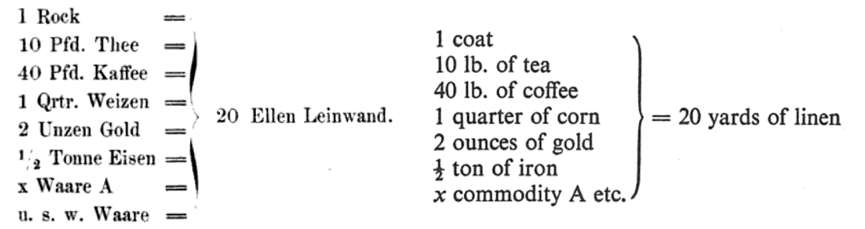
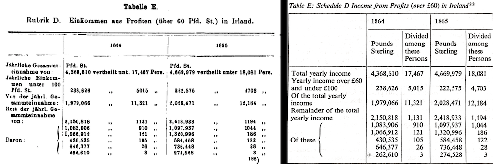

 

 Marx's Gothic Data

Sierra Eckert  
Columbia University  

---

x commodity A = y commodity B (139)  
  
 

M-C-M and C-M-C (248)  
  
 
  

Working Day I: A——B-C  
Working Day II: A——B—C  
Working Day III:A——B——C (342)  

---
 
The social statistics of Germany and the rest of Continental Western Europe, are, in comparison with those of England, quite wretched. But they raise the veil just enough to let us catch a glimpse of the Medusa’s head behind it.  We should be appalled at our own circumstances, if, as in England, our governments and parliaments periodically appointed commissions of inquiry into economic conditions; if these commissions were armed with the same plenary powers to get at the truth; if it was possible to find for this purpose men as competent, as free from partisanship and respect of persons as are England's factory-inspectors, her medical reporters on public health, her commissioners of inquiry into the exploitation of women and children, into the conditions of housing and nourishment, and so on.  Perseus wore a magic cap so that the monsters he hunted down might not see him. We draw the magic cap down over our own eyes and ears so as to deny that there are any monsters. (91)  

---

  
Fig. 1: "Form D: The Money Form" *Das Kapital* (1872) 46, *Capital* 162

---

  
Form A  *Das Kapital* (1872) and *Capital* 

   
Form B  *Das Kapital* (1872) and *Capital* 

---

  
Form C: "The General Form of Value." *Das Kapital* (1872) 41, *Capital* 157

   
Form D: "The Money Form" *Das Kapital* (1872) 46, *Capital* 162 

---

  
Housing data from Langstroff *Das Kapital* (1872) 46, *Capital* 162

---

  
Table E: Schedule D Income from Profits (over 60 £) in Ireland” *DK* 735, *C* 859

---

These slides were made using [reveal.js](https://github.com/hakimel/reveal.js/) by Hakim El Hattab.

---

## References ##

 Cvetkovich, Ann. “Marx’s Capital and the Mystery of the Commodity.” *Mixed Feelings: Feminism, Mass Culture, and Victorian Sensationalism*. New Brunswick, N.J: Rutgers University Press, 1992. Print. 

Derrida, Jacques. *Specters of Marx: The State of the Debt, the Work of Mourning and the New International.* London: Routledge, 2012. Print.

Drucker, Johanna. “Graphesis: Visual Knowledge Production and Representation.” *paj:The Journal of the Initiative for Digital Humanities, Media, and Culture* 2.1 (2010): 1‚€50. Print.

Halberstam, Judith. *Skin Shows: Gothic Horror and the TechnologyŠ of Monsters*. Duke University Press, 1995. Print.

Harvey, David. *A Companion to Marx’s Capital*. London‚€; New York: Verso, 2010. Print.

Jameson, Fredric. *Representing Capital: A Reading of Volume One*. London, England‚€; New York:Verso, 2014. Print.

Malthus, Thomas Robert. *An Essay on the Principle of Population*. Ed. Philip Appleman. New York:W WNorton & Co, 2003. Print.

Marx, Karl. *Capital: A Critique of Political Economy.* Trans. Ben Fowkes. Reprint edition. Vol. 1. London‚€; New York, N.Y: Penguin Classics, 1992. Print. 3 vols.

—. *Das kapital: Kritik der politischen oekonomic.*Volume 1. Hamburg: Verlag von OttoMeissnar, 1872. Print. 3 vols. 

Poovey, Mary. *A History of the Modern Fact: Problems of Knowledge in the Sciences of Wealth and Society.* Chicago: University of Chicago Press, 1998. Print.

Smith, Adam. *The Wealth of Nations.* Ed. Andrew Skinner. Harmondsworth, Middlesex; New York, N.Y.: Penguin Classics, 1982. Print.

Williams, Raymond. *Politics and Letters: Interviews with New Leftˆ Review.* London; New York: Verso, 1981. Print.

