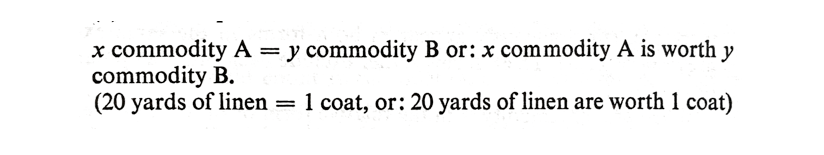

 

 Marx's Gothic Data

 

Sierra Eckert  
Columbia University  
@sierraeckert | sierra.eckert@columbia.edu  
NAVSA/AVSA NYU/Purdue 2017, Florence, Italy

---

x commodity A = y commodity B   
  
 

M-C-M and C-M-C  
  
 
  

Working Day I: A——B-C  
Working Day II: A——B—C  
Working Day III: A——B——C 
  
 

Karl Marx, *Capital*, Vol.1, (1867) 

---

This section incorporates, in my view, a lot of boring material that can
all too easily mask the significance of the argument being made. Marx
sometimes puts on, as I pointed out earlier, an accountant's hat, and
the result is a form of exposition that can be tedious in the extreme:
when this equals that and that equals this and this costs three pence
and this fifteen, then the result is that something else is equivalent to . .
. and so it goes, with the help of all manner of numerical illustrations to
follow.

 

David Harvey,, *A Companion to Marx's* Capital, 30 (referring to *Capital*, chapter 1, section 3: The Value-Form)

---
 
The social statistics of Germany and the rest of Continental Western Europe, are, in comparison with those of England, quite wretched. But they raise the veil just enough to let us catch a glimpse of the Medusa’s head behind it.  We should be appalled at our own circumstances, if, as in England, our governments and parliaments periodically appointed commissions of inquiry into economic conditions; if these commissions were armed with the same plenary powers to get at the truth; if it was possible to find for this purpose men as competent, as free from partisanship and respect of persons as are England's factory-inspectors, her medical reporters on public health, her commissioners of inquiry into the exploitation of women and children, into the conditions of housing and nourishment, and so on.  Perseus wore a magic cap so that the monsters he hunted down might not see him. We draw the magic cap down over our own eyes and ears so as to deny that there are any monsters.  
  
 

 Karl Marx, "Preface to the First Edition," *Capital*, Vol.1, 1867 (trans. Ben Fowkes), 91.

---

  
Marx, "Form A: The Simple, Isolated, or Accidental Form of Value"  
Top to bottom: *Capital* Vol.1, 139;  *Das Kapital* (1872), 23

---

   
Marx, "Form D: The Money Form"  
Left to right: *Capital* Vol.1, 162, *Das Kapital* (1872) 46

---

  
   
       
Top to bottom:  A (Simple), B (Total), C (General), and D (Money) Form of Value, *Capital* vol. 1, 139, 154-5,157, 162

---

  
   
       
Top to bottom: A (Einfache), B (Totale), C (Allgemeine), and D (Geld) Werthform, *Das Kapital* vol. 1, 23, 38, 41, 46

---

  
   
       
Top to bottom:  A (Simple), B (Total), C (General), and D (Money) Form of Value, *Capital* vol. 1, 139, 154-5,157, 162

---

  
Marx, "Form A: The Simple, Isolated, or Accidental Form of Value"  
Top to bottom: *Capital* Vol.1, 139;  *Das Kapital* (1872), 23

---

  
Marx, "Form B: The Total or Expanded Form of Value"  
Top to bottom: *Capital* Vol.1, 154-155; *Das Kapital* (1872), 38

---

   
Marx, "Form C: The General Form of Value"  
Left to right: *Capital* Vol. 1, 157, *Das Kapital* (1872), 41

    
Marx, "Form D: The Money Form"  
Left to right: *Capital* Vol.1, 162, *Das Kapital* (1872), 46 

---

  
Marx, Housing data  
Top, left to right: Lincolnshire, *Das Kapital*  722, *Capital* Vol.1,  846-847  
Bottom: Kent *Das Kapital*  722, *Capital* Vol.1,  846-847

---

  
Marx,  *Das Kapital*  721-722

---

  
"Table E: Schedule D Income from Profits (over 60 £) in Ireland"
Left to right : *Das Kapital* 735, *Capital* Vol.1,  859

---

We saw from Table E that during 1864, out of a total profit of 4,368,610, three money-grubbers pocketed only 262,610. 
[...] But the lion's share of the yearly national rental which an inconceivably small number of land magnates in England, Scotland, and Ireland swallow up is so monstrous that English statesmanship finds it inappropriate to afford the same statistical materials about the distribution of rents as about the distribution of profits. Lord Dufferin is one of those land magnates. The rent-rolls and profits can ever be 'excessive' or that the plethora of rent-rolls and profits is in any way connected with the plethora of popular miseries, is of course, an idea as 'disreputable' as it is unsound'. 
  
 

 Marx, *Capital* Vol.1, 868

---

  
Marx, *Capital* Vol.1, 869

---

And, as appetite grows with eating, Rent Roll's eyes will soon discover that Ireland with 3 1/2 millions, still continues to be miserable, miserable because she is overpopulated.  

 

 Marx, *Capital* Vol.1, 869 

---

These slides were made using [reveal.js](https://github.com/hakimel/reveal.js/) by Hakim El Hattab.

---

## References ##

 Cvetkovich, Ann. “Marx’s Capital and the Mystery of the Commodity.” *Mixed Feelings: Feminism, Mass Culture, and Victorian Sensationalism*. New Brunswick, N.J: Rutgers University Press, 1992. Print. 

Derrida, Jacques. *Specters of Marx: The State of the Debt, the Work of Mourning and the New International.* London: Routledge, 2012. Print.

Drucker, Johanna. “Graphesis: Visual Knowledge Production and Representation.” *paj:The Journal of the Initiative for Digital Humanities, Media, and Culture* 2.1 (2010): 1‚€50. Print.

Halberstam, Judith. *Skin Shows: Gothic Horror and the TechnologyŠ of Monsters*. Duke University Press, 1995. Print.

Harvey, David. *A Companion to Marx’s Capital*. London‚€; New York: Verso, 2010. Print.

Jameson, Fredric. *Representing Capital: A Reading of Volume One*. London, England‚€; New York:Verso, 2014. Print.

Malthus, Thomas Robert. *An Essay on the Principle of Population*. Ed. Philip Appleman. New York:W WNorton & Co, 2003. Print.

Marx, Karl. *Capital: A Critique of Political Economy.* Trans. Ben Fowkes. Reprint edition. Vol. 1. London‚€; New York, N.Y: Penguin Classics, 1992. Print. 3 vols.

—. *Das kapital: Kritik der politischen oekonomic.*Volume 1. Hamburg: Verlag von OttoMeissnar, 1872. Print. 3 vols. 

Poovey, Mary. *A History of the Modern Fact: Problems of Knowledge in the Sciences of Wealth and Society.* Chicago: University of Chicago Press, 1998. Print.

Smith, Adam. *The Wealth of Nations.* Ed. Andrew Skinner. Harmondsworth, Middlesex; New York, N.Y.: Penguin Classics, 1982. Print.

Williams, Raymond. *Politics and Letters: Interviews with New Leftˆ Review.* London; New York: Verso, 1981. Print.

