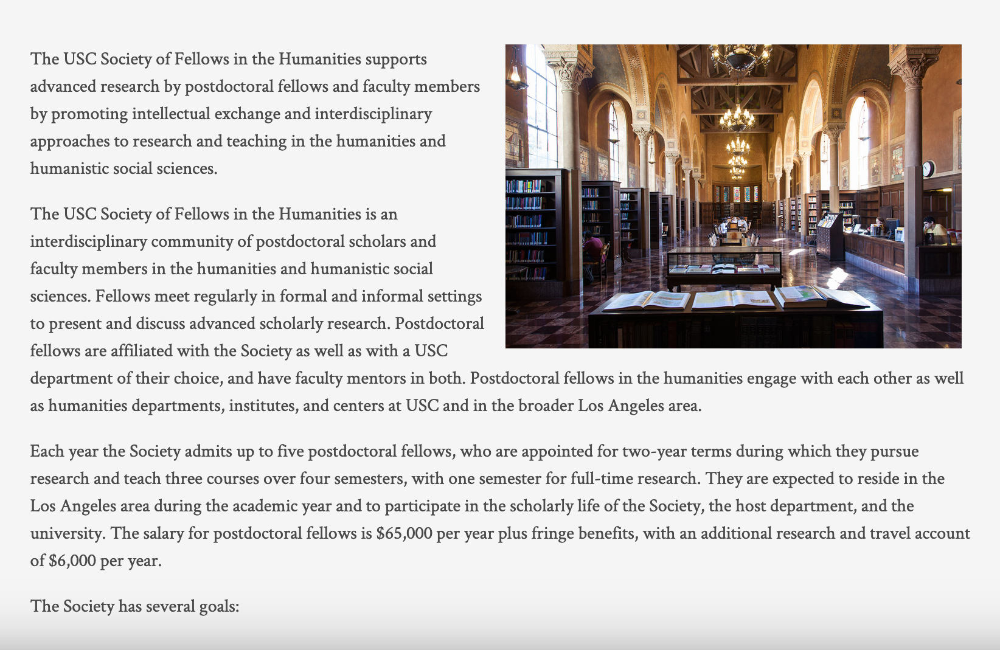
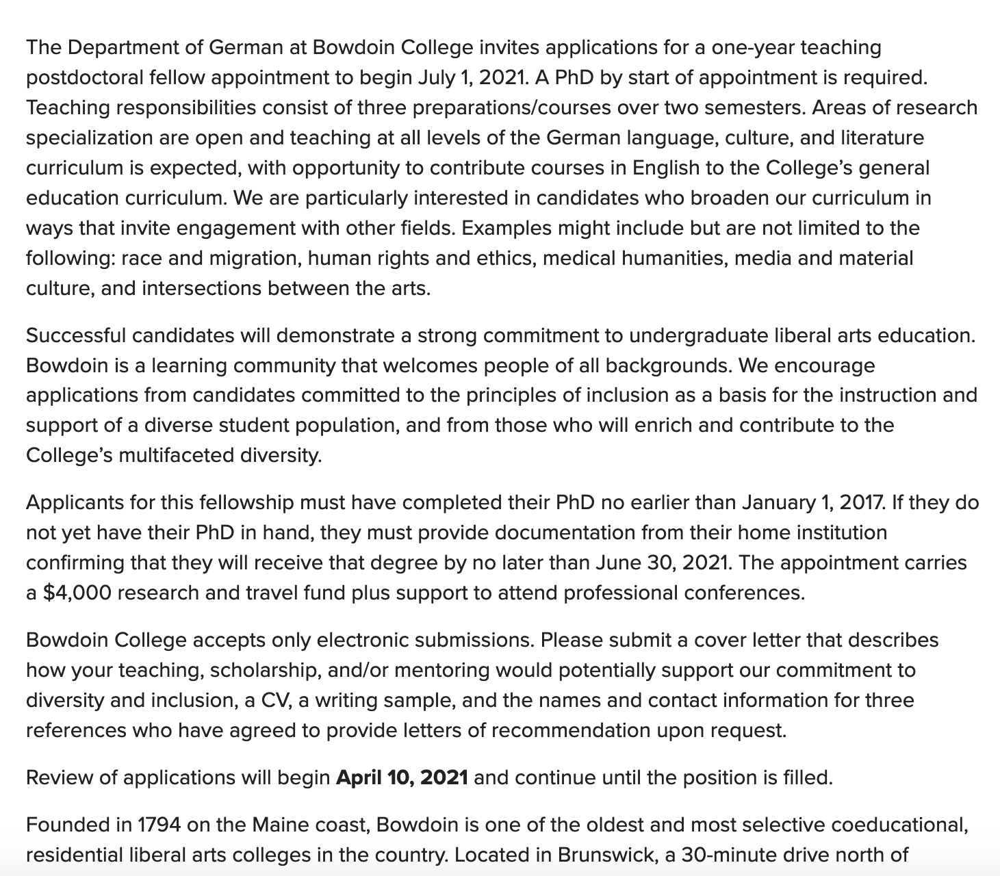
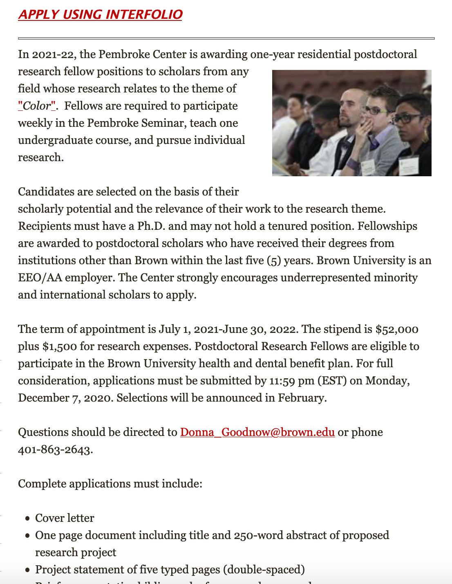
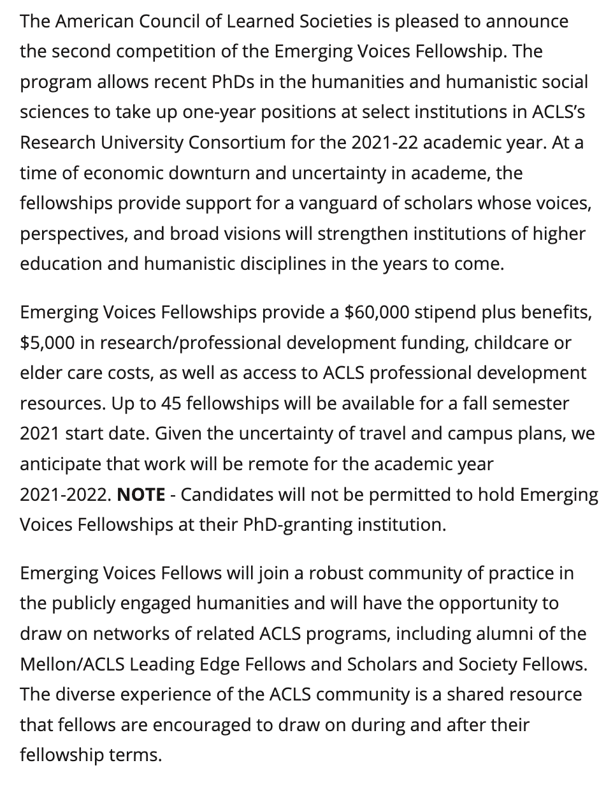
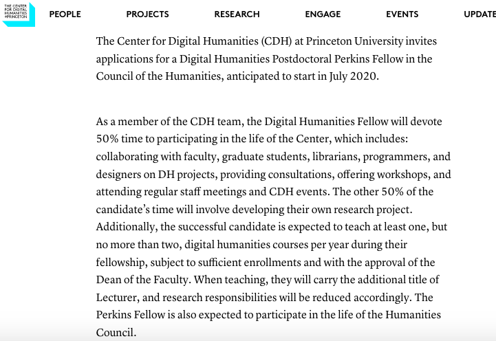

##  Postdoc chat

## Types of Postdocs

1. Society (Columbia, Princeton, Michigan, etc)
2. Institution specific postdocs
	- Dept-based
	- Institute/multi-department based
3. Diversity Initiave Postdocs
4. National Postdocs: Ford, ACLS, AAUW, NEH, CLIR
5. Teaching-centered postdocs (eg, "teaching postdoc", "postdoctoral instructor", or signaled by a heavy teaching empahsis in ad)

## Examples

### Society of Fellows

### Institution-specific - Department

### Institution-specific - Institute

### National

### Teaching

## When to apply?

Start *early* -- the timeline for postdocs begins as early as July!

## Where to find postdocs

- [The Humanities and Soc. Sciences wiki](https://academicjobs.wikia.org/wiki/Humanities_and_Social_Sciences_Postdocs_2020-2021)
- General job search websites (tip: set your parameters wide, not just to "Literature ")
	- MLA Jobs List (Filter for "postdocs"") 
	- https://www.h-net.org/jobs/
	- https://www.higheredjobs.com
	- https://careers.insidehighered.com
	- https://jobs.chronicle.com/
	- https://academicjobsonline.org
- Mailing lists (eg. book history, DH-specific)
- Libraries & cultural heritage institutions (Getty, NYPL, American Philosophical Society, HathiTrust, Max Planck Society)

## The Application

### Includes:

- Cover Letter and/or proposal
- Letters of recommendation
- Writing Sample

### Occasionally includes: 

- Dissertation abstract
- Teaching/Research/Diversity statements (Ex: Chicago's SoF I= a lesson plan for one of their core texts)
- Sample syllabi or description

### Very occasionally includes:

- Mentor or reference letter (see: Cornell's SoF)
- Bibliography

## What to expect

Postdoc applications increasingly look like TT jobs

- Application
- Interview
- Campus Visit (w/ job talk or extended interview)

Note:
- What you can expect
	- The application process for multi-year postdocs increasingly look like TT jobs
- What I applied for: 43
	- Multi-year postdocs: 6 (I did not apply for any)
	- Interdisciplinary institution specific : initiative
	- My teaching load is 1-0.
	- 50% research; 50% teaching + consultations with faculty, staff, librarians on DH projects
	- What I emphasized: my work is between literary studies, print culture and material studies, and critical work on data
	- Documents to be prepared for:
		- Cover letter (SHOW)
		- Writing sample
		- Syllabi (SHOW)
		- letters of rec
		- Multiple interview stages
			- Interview materials
			- Job Talk: mine was 30 minutes
	- For me, the process looked like:
		- Cover letter (10 drafts -- this was at the end of aver having developing my cover letter and proposals in other applications)
		- Initial application
		- Zoom interview w/ committee (4 people)
		- Campus visit + project talk --> which became a pre-recorded job talk and a day of Zoom interviews (Which was its own stressful genre, I'm happy to talk about what that looks like)
			- interview w/ curricular committee
			- with developers
			- with director and 2 search ommitee members
			- with current postdocs
			- w/ assistant director
		- Happy to talk about any of this in the Q and A

## Tips for Applying for Interdisciplinary postdocs

### Tailor the Cover Letter

- Tailor it to the job description
- **Avoid boilerplate**! 
- Match the ad's emphasis on research/teaching/public humanities
	- Close read the ad AND the mission statement/values of the institute or department
	- For interdisciplinary postdocs: think about what depts will you be working with
- For institution-specific postdocs: you should plan to include at least 1.5 paragraphs directly tailored

## Tailor the Proposal (if required)

- Difference between postdoc proposal and research statement:
	- Postdoc proposal will often be a lot more focused.

- What it should look like:
	- Project snapshot
	- Clear hook
	- Clear sense of your objects, context, time period
	- Clear sense of your argument and intervention/scholarly contribution
	- Your prior research
	- Very quick chapter summaries
	- A reasonable and concrete timeline of the research work you will do at that institution/with that fellowship (beyond "I will add one more chapter")

### Get to know the institution/center/initiative that you're applying for

- This means: looking at job ad language, mission statements, recent projects, updates, and lists partnerships
- What kind of language do they use to describe themselves?
- *Who* is involved? Is researchers? Researchers and teachers? Who else might you be working with? Librarians? Practitioners? Arts? Designers? Developers?
- Are there patterns of emphasis? Is there a new perspective you  might bring?

#### Sample ad

### Pitch your project's stakes at its biggest level

Note:
Eileen Gillooly talks a lot about the fact that historians tend to win a lot of the Columbia SoF positions, because they're good at situating the stakes of their project in ways that are legible as larger scale concepts or concerns.

### Be explicit and concrete about your interdisciplinarity

- **Tag** your methodologies: “I bring literary critical, historical, and quantitative methods to bear on…”
- **Explain** how your position (as a literary scholar, cultural historian, specialist in the x century…) shapes your approach to y interdisciplinary topic/concern/problem 

Note:
- Pitching to an interdisciplinary search committee does NOT mean giving up your unique methodology, or discipline-specific perspective
		- Instead: it means making that legible to people outside your discipline
		- Identify conceptual problem and why it matters for other disciplines (and areas of work adjacent to other poem)

### Match your syllabus to the institutional calendar

