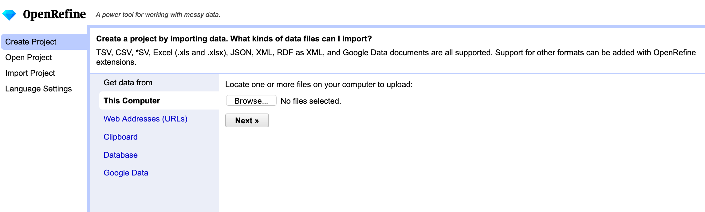

### Special Collections as Data:
### Studying Print Culture Using Digital Tools

#### Dr. Sierra Eckert
##### April 1, 2021
##### Center for Digital Humanities
##### Princeton University

---

###### Rare Book Working Group Workshop Series 
###### Princeton University Libraries | Center for Digital Humanities

## Making special collections data

#### 

## What we'll learn

- Building a book historical dataset,<!-- .element: class="fragment" data-fragment-index="1" -->
	- extracting data from catalog records 
	- cleaning data generated from digitized book facsimiles and catalog records
- Transforming bibliographic data <!-- .element: class="fragment" data-fragment-index="2" -->
- Practical exercises <!-- .element: class="fragment" data-fragment-index="3" -->

## Setting up

#### 
-  Download Zotero +  browser plugin : https://www.zotero.org/download/

#### 
- Download OpenRefine: https://openrefine.org/download.html

## What is a book historical data?

## Exercise 1: 

Source: http://libweb2.princeton.edu/rbsc2/parrish/04-Brontes.pdf

Group 1: 

Group 2: 

## Where can I find book historical data?

## Method 1: Data in existing digital humanities projects

- The Early Novels Database (Rachel Buurma and Jon Shaw)
- Collections as Data at Pitt, University of Pittsburgh Library System (PIs Tyrica Terry Kapral ) https://cadatpitt.github.io/. https://github.com/CaDatPitt/data-layers
- MSU Library Comics Art Collection, "Comics as Data: North America" https://github.com/ktopham/comics-as-data
- 19th Century American Children's Book Trade Directory, American Antiquarian Society, https://repository.upenn.edu/mead/28/ 
- University of Miami Libraries Collections as Data https://github.com/UMiamiLibraries/collections-as-data/tree/master/LaGaceta
- The Modernist Journals Project (https://sourceforge.net/p/mjplab/home/Home/) https://web.archive.org/web/20181105123239/ http://cds.library.brown.edu/projects/mjplab/documentation/about.spreadsheets.html. https://modjourn.org/visualisations/

## Method 2: Library Catalog MARC data

1. The Princeton Library Catalog  
2. American Antiquarian Society Catalog  
3. HathiTrust

Note: 
One of the reasons I recommend working with Zotero is that not every library catalog has an easy-to export to MARC option.

## Extracting data from Princeton library catalogs

1. Navigate to the Princeton library catalog: https://catalog.princeton.edu/

2. Search "Morris parrish"

3. Click on the second entry, "Morris L. Parrish collection of Victorian novelists, 1806-1958" 

4. From the record, click on the collector name "Parrish, Morris Longstreth, 1867-1944" 

You should now see a search page with all the cataloged volumes in the Morris Parrish collection.

6. From the top menu, change the results per page from 20 to 100

7. On the top righthand menu, click on the "Bookmark all" button

8. Navigate to the next page and do the same, until you've bookmarked 248 entries

9. Open Zotero desktop app

10. Now, in the web browsers 

## What is OpenRefine?

Note:
OpenRefine as a way to clean, sort and explore your data. It's not quite as powerful as Pandas and Python, for sorting and analyzing data but it does allow you to interact with a more user-friendly interface.

What can you do with Open Refine?

You can filter text (show text filter)

You can facet (show facet)

And it can be REALLY handy for collecting data that is stored in webpages.

## Using OpenRefine to clean a dataset

## Exercise 2: American Antiquarian Society

1. Open up this webpage: https://www.americanantiquarian.org/books-and-pamphlets

2. Click on "Cookbooks"

3. Scroll down to the Access section, and click on the link "fully cataloged online"

4. Select the checkbox next too "all"

5. Click Export

6. For the export format, select "Raw MARC (Unicode character set)", and save it on your Desktop

7. Navigate to Zotero

8. For the "File" menu, select "Import." Click Continue, and select your exported Marc file.

