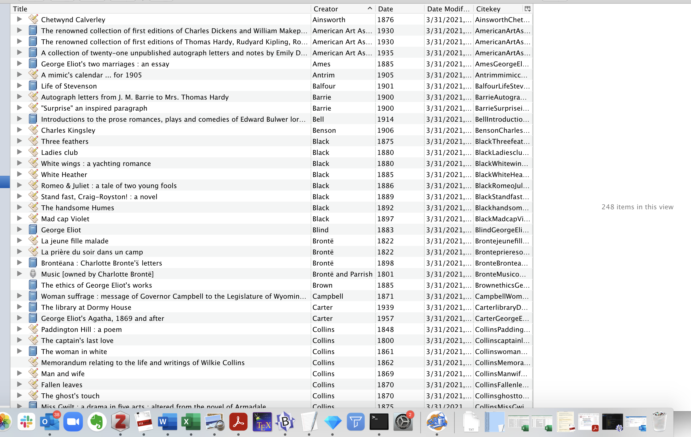

### Special Collections as Data:
### Studying Print Culture Using Digital Tools

#### Dr. Sierra Eckert
##### April 1, 2021
##### Center for Digital Humanities
##### Princeton University

---

###### Rare Book Working Group Workshop Series 
###### Princeton University Libraries | Center for Digital Humanities

## Making special collections data

#### 

## What we'll learn

- Building a book historical dataset <!-- .element: class="fragment" data-fragment-index="1" -->
	- extracting data from catalog records <!-- .element: class="fragment" data-fragment-index="2" -->
	- cleaning data generated from digitized book facsimiles and catalog records <!-- .element: class="fragment" data-fragment-index="3" -->
- Transforming bibliographic data <!-- .element: class="fragment" data-fragment-index="4" -->
- Practical exercises <!-- .element: class="fragment" data-fragment-index="5" -->

## Setting up

-  Download Zotero +  browser plugin : https://www.zotero.org/download/

- Download OpenRefine: https://openrefine.org/download.html

## What is book historical data?

Note:
While book historians and humanists aren't used to thinking about the primary sources we work with as "data", we do work with data. Maybe you're a book historian who's working to develop a collection in quarantine. Consider this facsimile of Charlotte Brontë's Jane Eyre, stored in HathiTrust. If we were interested

Note:
While we can't glean as much as we could glean from examining a copy in person, this object gives us access to other kinds of book historical data. If we zoom in closer, we can see the watermark. Bibliographic descriptions becomes more complicated when we think about the status of this document. 

Jane Eyre: An Autobiography
https://catalog.hathitrust.org/Record/100123406.marc  
https://babel.hathitrust.org/cgi/pt?id=dul1.ark:/13960/t2d80k91c&view=1up&seq=7 

Note:
There are other forms. This is the MARC record--machine readable catalog record for Jane Eyre in HathiTrust. MARC contains a lot of rich biographic data that you can extract from a text like this. Notice how the catalog record captures some, but not the same data that we noticed examining the facimsilme. 

*The library of Morris L. Parrish: A Catalogue in typescript of the collection as of October 20, 1944*, photocopy

The library of Morris L. Parrish: A Catalogue in typescript of the collection as of October 20, 1944 ; xeroxed from the original, May 1978, page 56, http://libweb2.princeton.edu/rbsc2/parrish/04-Brontes.pdf

Note:
And there's a third form of book historical data:  bibliographic description is probably the most intensive and specialized form: notice how these catalog entries differ from the sorts of material captured in a MARC record. We can think about the usefulness of each different category

## Making bibliographic data "machine-readable"

| Call_number | Title | Place | Publisher |
| ---: | :---: | :--- | ---: | 
| HS2725.P5 P37 1939 | Events in the life of a club | Philadelphia | Philadelphia Club |

| Call_number | Title | Place | Publisher |
| ---: | :---: | :--- | ---: | 
| HS2725.P5 P37 1939 | Events in the life of a club | Philadelphia | Philadelphia Club |

Note:
Why make bibliographic data machine readable? Because it allows us to ask questions across a wide swath of a print collection. does the way that we encode data matter so much? Think about the sort of research questions that you want

## Exercise 1: 

Source: https://tinyurl.com/je9xrjf7

Group 1: https://bit.ly/3wn46a2   
Group 2: https://bit.ly/3ubK7Jm  
Group 3: https://bit.ly/39yULlI 

Working in groups, draft the set of fields you would use for encoding this 1944 book catalogue. Think about:

- Can we encode information about how the authorship appears on the text?
- What are the different ways you could encode the bibliographic descriptions?
- How would you encode the catalog source itself?

## Machine Readable Catalog (MARC) records

Jane Eyre: An Autobiography
https://catalog.hathitrust.org/Record/100123406.marc  
https://babel.hathitrust.org/cgi/pt?id=dul1.ark:/13960/t2d80k91c&view=1up&seq=7 

Note:
This is the MARC record--machine readable catalog record for Jane Eyre in HathiTrust. MARC contains a lot of rich bliographic data that you can extract from a text like this. There are programs that you can use, like MARC edit, but for the purposes of this workshop, it helps to 

## Where can I find book historical data?

## Method 1: Encode data from bibliographies or facsimiles

Note:
Resources for select Princeton collections catalogs, exhibition catalogs and manuscript lists here: http://libweb2.princeton.edu/rbsc2/

## Method 2: Data in existing digital humanities projects

- The Early Novels Database 
	- https://github.com/earlynovels/end-dataset
- The Modernist Journals Project 
	- https://sourceforge.net/p/mjplab/home/Home/
- Collections as Data @ Pitt, U of Pittsburgh Libraries
	- https://cadatpitt.github.io/. 
- 19th Century American Children's Book Trade Directory, American Antiquarian Society, 
	- https://repository.upenn.edu/mead/28/ 

Note:
Additional resources include:

- University of Miami Libraries, MSU Library, hosted on GitHub
- MSU Library Comics Art Collection, "Comics as Data: North America"
	-  https://github.com/ktopham/comics-as-data
 The Modernist Journals Project (https://sourceforge.net/p/mjplab/home/Home/) https://web.archive.org/web/20181105123239/ http://cds.library.brown.edu/projects/mjplab/documentation/about.spreadsheets.html. https://modjourn.org/visualisations/

## Method 3: Library Catalog MARC data

1. The Princeton Library Catalog  
2. American Antiquarian Society Catalog  
3. HathiTrust
4. Internet Archive

Note: 
One of the reasons I recommend working with Zotero is that not every library catalog has an easy-to export to MARC option.

## Extracting data from Princeton library catalogs

1. Navigate to the Princeton library catalog: https://catalog.princeton.edu/
2. Search "Morris parrish"
3. Click on the second entry, "Morris L. Parrish collection of Victorian novelists, 1806-1958" 

4. From the record, click on the collector name "Parrish, Morris Longstreth, 1867-1944"  
You should now see a search page with all the cataloged volumes in the Morris Parrish collection.

6. From the top menu, change the results per page from 20 to 100

7. On the top righthand menu, click on the "Bookmark all" button

8. Navigate to the next page and do the same, until you've bookmarked 248 entries

9. Open Zotero desktop app

10. Now, in the web browser, click on the Zotero plugin icon in the righthand side 
(It should appear as a little folder)

11. In the dialogue window, click "Select All" and press "OK"

13.  Repeat this process for each page of your bookmarks
14. Now, navigate to your Zotero Desktop app. You should see your items!

## Cleaning MARC Data

Note:
Now, we could stop here, but notice, the MARC export isn't perfect. (Look at the publisher and place fields).
 We want to be able to analyze and visualize our bibliographic data. This is where OpenRefine comes in.  

### What is OpenRefine?

Note:
OpenRefine as a way to clean, sort and explore your data. It's not quite as powerful as Pandas and Python, for sorting and analyzing data but it does allow you to interact with a more user-friendly interface.

What can you do with Open Refine?

You can filter text (show text filter)

You can facet (show facet)

And it can be REALLY handy for getting a sense of the shape of your dataset

## Exercise 2: Collect, clean and analyze dataset 

15. Select all the items, or select the folder you've saved them in, right click. 
16. Select "Export Items" (or "Export Collection") and select CSV. 
 

17. As format, select "CSV". Make sure that you've checked the box to export notes
18. Select the Character Econding as UTF-8. Click OK

19. Open the CSV Excel (or GoogleSheets) and save it as a "tab separated values". (Either TSV or TXT)
20. We're now ready to export this file to OpenRefine

## What we will use OpenRefine for

1. Separate out "Publisher" and "Place" data
2. Facet so that we can look at the counts of various values 
	- (Places of Publication, Author, etc)
3. Filter text to search for terms within columns

Note:
Possible text filter searches: gift and presentation

## Further experiments with print cultural data:

1. Use OpenRefine to analyze the metadata to analyze the distribution of genres in *Poetry Magazine* (1912-1922) in the Modernist Journal Project ([download link](https://sourceforge.net/projects/mjplab/files/Poetry%20Magazine/Poetry_2.everytitle.txt/download))

2. Extract the MARC American Antiquarian Society cookbook collection:
[https://www.americanantiquarian.org/books-and-pamphlets](https://www.americanantiquarian.org/cookbooks) and analyze in OpenRefine

## Questions?

### Part 2: April 7th
### Thank you!

For more resources, please write your name in the chat

Sierra Eckert  
@sceckert on GitHub
