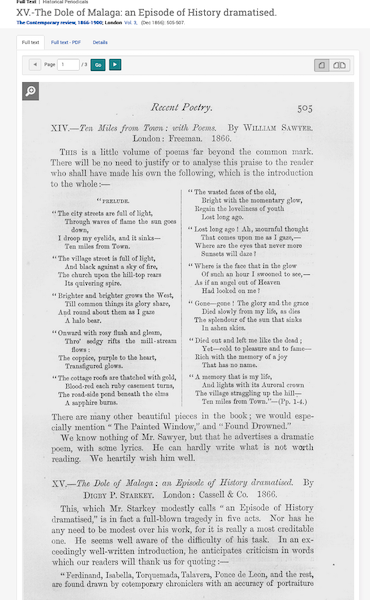

### Special Collections as Data:
### From Book HIstorical Data to Research Projects

#### Dr. Sierra Eckert
##### April 7, 2021
##### Center for Digital Humanities
##### Princeton University

---

###### Rare Book Working Group Workshop Series 
###### Princeton University Libraries | Center for Digital Humanities

## What we'll learn

- Best practices for developing book history digital humanities projects <!-- .element: class="fragment" data-fragment-index="1" -->
- We’ll learn some out of the box tools for visualizing and analyzing data <!-- .element: class="fragment" data-fragment-index="2" -->
- Practical exercises <!-- .element: class="fragment" data-fragment-index="3" -->

## What makes a good research research question?

- Descriptive: What authors were published in Modernist journals (like Poetry, The Egoist or Atlantic Montth? (still at the descriptive stage?) <!-- .element: class="fragment" data-fragment-index="1" -->
	- Better: Is there a notable difference between the range of writers published in the “little journals”? <!-- .element: class="fragment" data-fragment-index="2" -->
- Descriptive: What were the section heading used to categorize book reviews in 19th-century monthly journals? <!-- .element: class="fragment" data-fragment-index="3" -->
	- Better: Are there notable differences between the kinds of words that tend to cluster together in different sections of book reviews? How distinct, for instance, is the language the reviews of books in the section “General Literature” and books reviewed under the section heading “Poetry”? <!-- .element: class="fragment" data-fragment-index="4" -->

### Tip #1

Don’t let your tool dictate your research method.

### Tip #2

Use categories from book history to motivate your research

### Tip #3

Bigger is not better

## Tip #4: 

Recursively move from data analysis to your research question

Note:
https://nbviewer.jupyter.org/github/sceckert/periodical-project/blob/master/Periodical-Project.ipynb

## Tip #5: 

Document your project

## Tip #6: 

Plan for the afterlife of your project

## What is Palladio?

## Creating visualizations 

1. Download zip file of workshop data here: https://bit.ly/3sUs8H4 (We'll be working with  "periodical-project-metadata.csv")
3. Navigate to https://hdlab.stanford.edu/palladio-app/#/upload and drag "periodical-project-metadata.csv" into the Load data window

4. Verify your data
5. Click on the "Table" tab
	- Select "generated" for the rows
	- Click and select as many fields as you would like to be able to work with

6. At the bottom of the table, Click on the "Facet"

Note:
- Open Facet. We're going to look at creators. Note the distribution
- Let's also look at genres and journal titles and volumes
- What if we wanted to look at the number of advertisements in Poetry and the Egoist? 
- Open up timelineDo we think that would be increase
- Now,w e're not done yet: we could go further and convert the page range into a number of pages. 
- What if we wanted to trace connections? Open up Graphs

## Exercise: Working with Palladio

1. Navigate to Palladio
2. Create a new project using the "Poetry_and-Egoist-everytitle.txt" file
3. OR create a new project using your own datafile

Recommended:

- Use the "Graph" tab (and the Facet) to explore what authors (the "creator" field in this dataset) were shared in across the dataset 
- Use the "Table" table and the timeline table to investigate whether there are gaps in our data
- Use the "Facet" tab to investigate what the top genres are for each journal. How does the distribution of genres change over time?

## Wrapping up

## Questions?

For more resources, please write your name in the chat

Sierra Eckert  
@sceckert on GitHub
